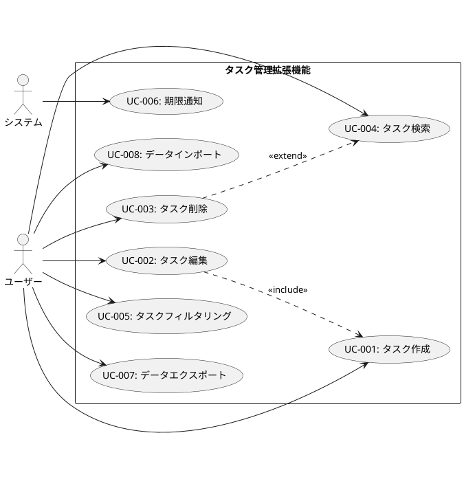
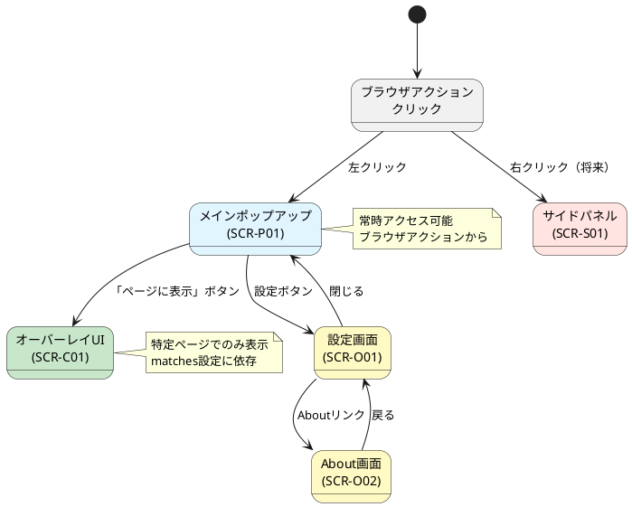

# Chrome拡張機能ドキュメント階層: 要件定義から実装まで

## 推奨ドキュメント階層（完全版）

```
docs/
├── requirements/                          # 要件定義（上位抽象度）
│   ├── 01-business-requirements.md       # ビジネス要求
│   ├── 02-functional-requirements.md     # 機能要件
│   ├── 03-non-functional-requirements.md # 非機能要件
│   ├── 04-user-stories.md                # ユーザーストーリー
│   ├── 05-use-cases.md                   # ユースケース
│   ├── 06-chrome-specific-requirements.md # Chrome拡張機能固有要件
│   └── diagrams/
│       ├── use-case-diagram.puml         # ユースケース図
│       ├── user-journey.puml             # ユーザージャーニー
│       └── context-diagram.puml          # コンテキスト図
│
├── design/                                # 基本設計書
│   ├── 00-overview.md                     # システム概要と技術スタック
│   ├── 01-architecture.md                 # Clean Architecture + Chrome拡張機能マッピング
│   ├── 02-domain-layer.md                 # エンティティ、値オブジェクト、ビジネスルール
│   ├── 03-application-layer.md            # ユースケースとオーケストレーション
│   ├── 04-interface-adapters.md           # コントローラー、プレゼンター、ゲートウェイ
│   ├── 05-infrastructure.md               # Chrome API、IndexedDB、外部サービス
│   ├── 06-entrypoints.md                  # WXTエントリーポイント設定
│   ├── 07-data-schema.md                  # IndexedDBスキーマとマイグレーション
│   ├── 08-constraints-matrix.md           # Chrome拡張機能制約リファレンス
│   ├── adr/                               # アーキテクチャ決定記録
│   │   ├── 001-use-clean-architecture.md
│   │   ├── 002-wxt-framework.md
│   │   └── 003-indexeddb-storage.md
│   └── screens/                           # 画面仕様（基本設計の一部）
│       ├── 00-screen-list.md             # 画面一覧とナビゲーション
│       ├── popup/
│       │   ├── main-popup.md             # メインポップアップ画面仕様
│       │   └── components.md             # ポップアップ共通コンポーネント
│       ├── options/
│       │   ├── settings.md               # 設定画面仕様
│       │   └── about.md                  # About画面仕様
│       ├── content/
│       │   ├── overlay-ui.md             # コンテンツスクリプトオーバーレイUI
│       │   └── inline-widget.md          # インライン挿入ウィジェット
│       ├── sidepanel/
│       │   └── main-panel.md             # サイドパネル仕様
│       └── components/
│           ├── common-components.md      # 共通UIコンポーネント
│           └── forms.md                  # フォームコンポーネント
│
├── diagrams/                              # アーキテクチャ図
│   ├── architecture-overview.puml
│   ├── domain-model.puml
│   ├── sequence-flows.puml
│   └── data-schema.puml
│
├── mockups/                               # 画面モックアップ・ワイヤーフレーム
│   ├── popup/
│   │   ├── main-popup-wireframe.png
│   │   └── main-popup-final.png
│   ├── options/
│   │   └── settings-wireframe.png
│   └── content/
│       └── overlay-wireframe.png
│
├── api/                                   # API仕様（外部連携がある場合）
│   ├── external-api-spec.md
│   └── chrome-api-usage.md
│
└── traceability/                          # トレーサビリティマトリクス
    └── requirements-to-implementation.md  # 要件→設計→実装の対応表
```

## 各ドキュメントの詳細説明

### 1. 要件定義ディレクトリ（requirements/）

#### 01-business-requirements.md

**目的:** なぜこの拡張機能を開発するのか、誰のために、どんな価値を提供するのかを明確化

**テンプレート構成:**

```markdown
# ビジネス要求定義書

## プロジェクト概要

### プロジェクト名
[Chrome拡張機能の名称]

### 目的
[この拡張機能を開発する目的]

### 背景
[開発に至った背景、現状の課題]

### ステークホルダー
| ステークホルダー | 役割 | 期待する価値 |
|----------------|------|-------------|
| エンドユーザー（開発者） | 利用者 | 作業効率の向上 |
| プロジェクト管理者 | 意思決定者 | チーム生産性の向上 |

## ビジネス目標

### 主要目標
1. [目標1: 例）ユーザーの作業時間を30%削減]
2. [目標2: 例）月間アクティブユーザー1000人獲得]
3. [目標3: 例）Chrome Web Storeで平均評価4.5以上]

### 成功指標（KPI）
| 指標 | 目標値 | 測定方法 |
|-----|-------|---------|
| ユーザー数 | 1,000 MAU | Google Analytics |
| 利用頻度 | 週3回以上 | 拡張機能内トラッキング |
| ユーザー満足度 | NPS 50以上 | アプリ内アンケート |

## ターゲットユーザー

### プライマリペルソナ
**名前:** 田中太郎（仮名）
**属性:** 
- 職業: フロントエンド開発者
- 年齢: 28歳
- 技術レベル: 中級〜上級
- 利用環境: Chrome、VS Code、GitHub

**課題:**
- 複数のツール間を行き来するのが面倒
- 作業コンテキストの切り替えに時間がかかる
- 繰り返し作業の自動化ができていない

**期待する価値:**
- ブラウザ上で作業を完結できる
- ワンクリックで繰り返し作業を実行
- 他のツールとシームレスに連携

### セカンダリペルソナ
[必要に応じて追加]

## スコープ

### 対象範囲（In Scope）
- [ ] 機能A: [具体的な機能]
- [ ] 機能B: [具体的な機能]
- [ ] Chrome Web Store公開

### 対象外（Out of Scope）
- [ ] Firefox対応（将来的に検討）
- [ ] モバイルブラウザ対応
- [ ] Enterpriseプラン機能

## 制約条件

### 技術的制約
- Chrome Manifest V3に準拠
- Chrome最新版から2つ前のバージョンまでサポート
- オフライン動作は限定的

### ビジネス的制約
- 開発期間: 3ヶ月
- 予算: [記載する場合]
- リソース: 個人開発（ポートフォリオ目的）

### 法的・コンプライアンス制約
- ユーザーデータは全てローカルに保存（GDPR準拠）
- Chrome Web Storeポリシー準拠
- オープンソースライセンス: MIT

## リスクと対応策

| リスク | 影響度 | 発生確率 | 対応策 |
|-------|-------|---------|--------|
| Chrome APIの仕様変更 | 高 | 中 | Chrome開発者向けニュースを定期チェック |
| 競合製品の出現 | 中 | 高 | 独自機能で差別化 |
| ユーザー獲得難 | 中 | 中 | SNSでのマーケティング |
```

#### 02-functional-requirements.md

**目的:** システムが「何をすべきか」を機能レベルで定義

**テンプレート構成:**

```markdown
# 機能要件定義書

## 機能一覧

### 機能分類
| カテゴリ | 機能ID | 機能名 | 優先度 | 実装フェーズ |
|---------|-------|--------|--------|------------|
| コア機能 | F-001 | タスク管理 | 必須 | Phase 1 |
| コア機能 | F-002 | データ同期 | 必須 | Phase 1 |
| 拡張機能 | F-003 | レポート生成 | 推奨 | Phase 2 |
| 付加機能 | F-004 | テーマカスタマイズ | オプション | Phase 3 |

## 詳細機能要件

### F-001: タスク管理機能

**概要:**
ユーザーがタスクを作成、編集、削除、完了できる機能

**機能詳細:**

#### F-001-1: タスク作成
**説明:** 新規タスクを作成する
**入力:** 
- タスク名（必須、最大100文字）
- 説明（任意、最大1000文字）
- 優先度（高/中/低、デフォルト: 中）
- 期限（任意）

**処理:**
1. 入力値のバリデーション
2. 一意のタスクIDを生成
3. 作成日時を記録
4. IndexedDBに保存
5. UIに反映

**出力:**
- 作成成功時: タスク一覧に追加表示
- 作成失敗時: エラーメッセージ表示

**ビジネスルール:**
- 同名のタスクは作成可能（IDで区別）
- 優先度「高」のタスクは赤色で表示
- 期限切れタスクは警告表示

**非機能要件:**
- レスポンス時間: 200ms以内
- 同時作成可能数: 制限なし（ただしストレージ上限に依存）

**要件トレーサビリティ:**
- 関連ビジネス要求: BR-001（作業効率化）
- 関連ユーザーストーリー: US-001
- 関連画面: popup/main-popup.md

**受け入れ基準:**
- [ ] タスク名のみで作成可能
- [ ] 全項目を入力して作成可能
- [ ] 必須項目未入力時にエラー表示
- [ ] 文字数制限を超えるとエラー表示
- [ ] 作成後すぐに一覧に表示される

#### F-001-2: タスク編集
[同様の形式で記述]

#### F-001-3: タスク削除
[同様の形式で記述]

#### F-001-4: タスク完了
[同様の形式で記述]

### F-002: データ同期機能
[同様の形式で記述]

## Chrome拡張機能固有の機能要件

### 権限要求
| 権限 | 目的 | ユーザーへの説明 |
|-----|------|----------------|
| storage | タスクデータの保存 | 「タスクデータをブラウザに保存します」 |
| notifications | タスク期限通知 | 「期限が近いタスクを通知します」 |

### コンテキストメニュー統合
- 右クリックメニューから「タスクとして追加」オプション
- 選択テキストをタスク名として使用

### ショートカットキー
| キー | 機能 |
|-----|------|
| Ctrl+Shift+T | ポップアップを開く |
| Ctrl+Shift+N | 新規タスク作成 |

## 機能の優先順位付け（MoSCoW分析）

### Must Have（必須）
- タスクCRUD操作
- ローカルストレージ
- 基本的なUI

### Should Have（推奨）
- タスクフィルタリング
- 優先度設定
- 期限通知

### Could Have（あれば良い）
- タグ機能
- カテゴリ分類
- 検索機能

### Won't Have（今回は対象外）
- クラウド同期
- チーム共有機能
- モバイルアプリ連携
```

#### 03-non-functional-requirements.md

**目的:** パフォーマンス、セキュリティ、ユーザビリティ等の品質要件を定義

**テンプレート構成:**

```markdown
# 非機能要件定義書

## パフォーマンス要件

### レスポンス時間
| 操作 | 目標時間 | 最大許容時間 | 測定条件 |
|-----|---------|------------|---------|
| ポップアップ表示 | 100ms | 200ms | タスク数100件 |
| タスク作成 | 50ms | 100ms | - |
| タスク一覧読み込み | 150ms | 300ms | タスク数1000件 |
| 検索実行 | 100ms | 200ms | タスク数1000件 |

### リソース使用量
| リソース | 目標値 | 最大許容値 |
|---------|-------|----------|
| メモリ使用量 | 50MB | 100MB |
| IndexedDB使用量 | 5MB | 10MB |
| CPU使用率（アイドル時） | 0% | 1% |

### スケーラビリティ
- タスク数: 10,000件まで動作保証
- 同時オープン可能なポップアップ: 制限なし
- データ保存上限: Chrome制限に準拠（通常5〜10MB）

## セキュリティ要件

### データ保護
- **保存データの暗号化:** 機密データは保存前に暗号化（該当する場合）
- **データ保存場所:** すべてローカル（chrome.storage.local、IndexedDB）
- **外部送信:** ユーザーデータの外部送信は一切行わない
- **アクセス制御:** 拡張機能内でのみデータアクセス可能

### 権限管理
| 権限 | 必要性 | セキュリティ影響 | 軽減策 |
|-----|-------|---------------|--------|
| storage | 必須 | 低 | データは全てローカル |
| notifications | 推奨 | 低 | 通知内容に機密情報を含めない |
| activeTab | 必須 | 中 | タブ情報の読み取りのみ |

### Chrome Web Store要件準拠
- Content Security Policy準拠
- インラインスクリプト不使用
- eval()等の動的コード実行禁止
- 最小権限の原則

## ユーザビリティ要件

### アクセシビリティ
- WCAG 2.1 Level AA準拠
- キーボード操作のみで全機能利用可能
- スクリーンリーダー対応
- カラーコントラスト比4.5:1以上

### 多言語対応
- 初期リリース: 日本語、英語
- chrome.i18n APIを使用した国際化対応
- 言語切り替え機能（設定画面）

### レスポンシブデザイン
- ポップアップサイズ: 最小400x600px、最大800x800px
- 異なる画面解像度に対応
- ダークモード対応

## 互換性要件

### ブラウザサポート
| ブラウザ | 最小バージョン | 備考 |
|---------|-------------|------|
| Google Chrome | 110 | メインターゲット |
| Microsoft Edge | 110 | Chromiumベース |
| Brave | 1.50 | Chromiumベース |

### OS互換性
- Windows 10以降
- macOS 11以降
- Linux（主要ディストリビューション）

### 後方互換性
- マイナーバージョンアップ時: データ構造の互換性を維持
- メジャーバージョンアップ時: マイグレーション機能を提供

## 信頼性要件

### 可用性
- ターゲット稼働率: 99.9%（ブラウザが動作している限り）
- ダウンタイム: Chrome再起動時のみ

### エラーハンドリング
- すべてのエラーは適切にキャッチし、ユーザーフレンドリーなメッセージを表示
- 致命的エラー時もデータ損失を防ぐ
- エラーログをローカルに保存（デバッグ用、オプトイン）

### データ整合性
- トランザクション処理の保証（IndexedDB）
- データバックアップ機能
- データ復元機能

## 保守性要件

### コード品質
- TypeScript strict modeで開発
- ESLint、Prettierによるコードフォーマット
- テストカバレッジ80%以上

### ドキュメント
- すべての公開APIにJSDocコメント
- README.mdに開発環境セットアップ手順
- CONTRIBUTING.mdにコントリビューションガイドライン

### 更新性
- 自動更新機能（Chrome標準機能）
- バージョン管理（semver準拠）
- 変更履歴の管理（CHANGELOG.md）

## テスト要件

### テストレベル
| テストタイプ | カバレッジ目標 | ツール |
|------------|-------------|--------|
| ユニットテスト | 80% | Jest |
| 統合テスト | 主要フロー | Jest |
| E2Eテスト | クリティカルパス | Puppeteer |

### テスト環境
- Chrome最新版
- Chrome最新版-2バージョン
- CI/CDパイプライン（GitHub Actions）

## コンプライアンス要件

### プライバシー
- GDPR準拠（該当する場合）
- プライバシーポリシーの提供
- データ収集の最小化

### ライセンス
- ソースコード: MITライセンス
- 使用ライブラリ: ライセンス互換性確認済み
- 商標権侵害なし

### Chrome Web Storeポリシー
- 単一目的の原則
- 許可された広告のみ（広告を含む場合）
- プライバシーポリシーの提供
```

#### 04-user-stories.md

**目的:** ユーザー視点での機能要求をストーリー形式で記述

```markdown
# ユーザーストーリー

## テンプレート
```
As a [ユーザーの役割]
I want to [やりたいこと]
So that [達成したい目的/得られる価値]
```

## Epic 1: タスク管理

### US-001: タスクを素早く作成したい
**As a** 開発者
**I want to** ブラウザ上でワンクリックでタスクを作成する
**So that** 作業中断を最小限にしてタスクを記録できる

**受け入れ基準:**
- [ ] ポップアップからタスク名だけで作成可能
- [ ] 作成後すぐに一覧に表示される
- [ ] 作成時間が200ms以内

**優先度:** 高
**ストーリーポイント:** 5
**関連機能要件:** F-001-1

---

### US-002: 優先度でタスクを管理したい
**As a** プロジェクトマネージャー
**I want to** タスクに優先度（高/中/低）を設定する
**So that** 重要なタスクを見落とさない

**受け入れ基準:**
- [ ] 作成時に優先度を選択可能
- [ ] 優先度で色分け表示
- [ ] 優先度でフィルタリング可能

**優先度:** 中
**ストーリーポイント:** 3
**関連機能要件:** F-001-5

---

### US-003: 完了したタスクを整理したい
**As a** ユーザー
**I want to** 完了したタスクをアーカイブする
**So that** タスク一覧を整理された状態に保てる

**受け入れ基準:**
- [ ] タスクを完了済みにマーク可能
- [ ] 完了タスクは別表示
- [ ] 完了タスクの一括削除が可能

**優先度:** 中
**ストーリーポイント:** 3
**関連機能要件:** F-001-4

## Epic 2: 通知機能

### US-004: タスクの期限を通知してほしい
**As a** 締め切りを守りたいユーザー
**I want to** 期限が近いタスクの通知を受け取る
**So that** 期限を忘れずに対応できる

**受け入れ基準:**
- [ ] 期限1日前に通知
- [ ] 期限当日に通知
- [ ] 通知設定のON/OFF可能

**優先度:** 中
**ストーリーポイント:** 8
**関連機能要件:** F-003

## Epic 3: データ管理

### US-005: データを失いたくない
**As a** ユーザー
**I want to** データを自動的にバックアップする
**So that** ブラウザ再インストール時もデータを復元できる

**受け入れ基準:**
- [ ] データをエクスポート可能（JSON形式）
- [ ] エクスポートしたデータをインポート可能
- [ ] インポート時にデータマージ可能

**優先度:** 高
**ストーリーポイント:** 5
**関連機能要件:** F-002

## ストーリーマッピング

```
                 Epic 1: タスク管理
                        |
        +---------------+----------------+
        |               |                |
    US-001          US-002            US-003
   (作成)        (優先度管理)       (完了管理)
      |               |                |
   Phase 1         Phase 1          Phase 2

                 Epic 2: 通知機能
                        |
                    US-004
                  (期限通知)
                        |
                    Phase 2

                Epic 3: データ管理
                        |
                    US-005
                (バックアップ)
                        |
                    Phase 1
```
```

#### 05-use-cases.md

**目的:** システムとユーザーの相互作用を詳細に記述

```markdown
# ユースケース定義書

## ユースケース図



## ユースケース詳細

### UC-001: タスク作成

**概要:** ユーザーが新しいタスクを作成する

**アクター:** 
- プライマリ: ユーザー
- セカンダリ: なし

**事前条件:**
- 拡張機能がインストールされている
- ポップアップが開かれている

**事後条件:**
- 新しいタスクがIndexedDBに保存されている
- タスク一覧に新しいタスクが表示されている

**基本フロー:**
1. ユーザーがポップアップを開く
2. ユーザーが「新規タスク」ボタンをクリック
3. システムがタスク作成フォームを表示
4. ユーザーがタスク名を入力
5. ユーザーが優先度を選択（オプション）
6. ユーザーが期限を設定（オプション）
7. ユーザーが説明を入力（オプション）
8. ユーザーが「作成」ボタンをクリック
9. システムが入力値をバリデーション
10. システムが一意のIDを生成
11. システムがタスクをIndexedDBに保存
12. システムがタスク一覧を更新
13. システムが成功メッセージを表示

**代替フロー:**

**A1: バリデーションエラー（ステップ9）**
9a. システムがバリデーションエラーを検出
9b. システムがエラーメッセージを表示
9c. ユーザーが入力を修正
9d. ステップ8に戻る

**A2: ストレージ容量超過（ステップ11）**
11a. システムがストレージ容量超過を検出
11b. システムがエラーメッセージを表示
11c. ユーザーが古いタスクを削除するか、キャンセル
11d. ユースケース終了

**例外フロー:**

**E1: ネットワークエラー（該当しない - ローカル処理のみ）**

**E2: IndexedDBアクセスエラー**
- システムがエラーログを記録
- システムが「データ保存に失敗しました」メッセージを表示
- ユーザーに再試行を促す

**非機能要件:**
- レスポンス時間: 100ms以内（ステップ9-12）
- 使いやすさ: キーボードのみで操作可能（Tab、Enter）

**UI要素:**
- タスク名入力フィールド（テキスト、必須）
- 優先度選択（ドロップダウン、オプション）
- 期限選択（日付ピッカー、オプション）
- 説明入力フィールド（テキストエリア、オプション）
- 作成ボタン
- キャンセルボタン

**関連:**
- 機能要件: F-001-1
- ユーザーストーリー: US-001
- 画面仕様: screens/popup/main-popup.md
- シーケンス図: diagrams/sequence-create-task.puml

---

### UC-002: タスク編集
[同様の形式で記述]

### UC-003: タスク削除
[同様の形式で記述]
```

#### 06-chrome-specific-requirements.md

**目的:** Chrome拡張機能特有の要件を明確化

```markdown
# Chrome拡張機能固有要件

## Manifest V3要件

### 必須設定
```json
{
  "manifest_version": 3,
  "name": "[拡張機能名]",
  "version": "1.0.0",
  "description": "[説明]",
  "permissions": ["storage", "notifications"],
  "host_permissions": [],
  "action": {
    "default_popup": "popup.html",
    "default_icon": {
      "16": "icons/icon16.png",
      "48": "icons/icon48.png",
      "128": "icons/icon128.png"
    }
  }
}
```

## 権限要求の正当化

### storage
**目的:** タスクデータの永続化
**代替手段の検討:** なし（必須機能）
**ユーザーへの説明:** 「タスクデータを保存するために必要です」

### notifications
**目的:** タスク期限通知
**代替手段の検討:** なし（コア機能）
**ユーザーへの説明:** 「タスクの期限が近づいた際に通知します」
**オプトアウト:** 設定画面で無効化可能

## コンテキスト別の制約

### Background Service Worker
**制約:**
- 30秒間非アクティブで終了
- DOM/windowオブジェクトアクセス不可
- localStorageアクセス不可

**設計への影響:**
- 永続化はchrome.storage.local使用
- 長時間タイマーはchrome.alarms使用
- データはIndexedDBに保存

### Content Scripts
**制約:**
- Isolated worldで実行
- 制限されたChrome API
- ページJavaScriptへの直接アクセス不可

**設計への影響:**
- DOM操作のみに使用
- Chrome API操作はbackgroundにメッセージ
- ページコンテキストとはwindow.postMessage

### Popup
**制約:**
- ポップアップを閉じると状態がリセット
- 短命なライフサイクル

**設計への影響:**
- 状態はchrome.storage.localで永続化
- 計算結果のキャッシング

## セキュリティポリシー

### Content Security Policy
```
script-src 'self'; object-src 'self'
```

**影響:**
- インラインスクリプト禁止
- eval()禁止
- 外部スクリプト読み込み禁止

**対応:**
- すべてのJavaScriptを外部ファイル化
- 動的コード生成を使用しない

## プライバシー要件

### データ収集
**収集するデータ:** なし（すべてローカル）
**外部送信:** なし
**アナリティクス:** 使用しない（または匿名化されたイベントのみ）

### プライバシーポリシー
- Chrome Web Store掲載時に提供
- 拡張機能内からアクセス可能

## パフォーマンス最適化

### リソース使用量
- Lazy loading実装
- 不要なPermissionは要求しない
- バックグラウンド処理の最小化

### 起動時間
- 初回起動: 500ms以内
- ポップアップ表示: 200ms以内

## 配布要件

### Chrome Web Store
- アイコン: 16x16、48x48、128x128
- スクリーンショット: 最低1枚、推奨5枚（1280x800または640x400）
- プロモーション用タイル（オプション）: 440x280
- 詳細な説明文
- プライバシーポリシーURL

### バージョニング
- semver準拠（major.minor.patch）
- 自動更新対応
```

### 2. 設計書ディレクトリ（design/）

基本設計書のディレクトリ構成は既存の提案を維持しつつ、**screens/**サブディレクトリを追加します。

#### screens/ - 画面仕様ディレクトリ

##### 00-screen-list.md

**目的:** 全画面の一覧と画面間ナビゲーションを俯瞰

```markdown
# 画面一覧とナビゲーション

## 画面一覧

| 画面ID | 画面名 | タイプ | エントリーポイント | 優先度 | 実装状況 |
|-------|--------|-------|------------------|--------|---------|
| SCR-P01 | メインポップアップ | Popup | popup/index.html | 必須 | 実装済 |
| SCR-O01 | 設定画面 | Options | options/index.html | 必須 | 実装済 |
| SCR-O02 | About画面 | Options | options/about.html | 推奨 | 未実装 |
| SCR-C01 | オーバーレイUI | Content | content.ts | 必須 | 実装済 |
| SCR-C02 | インラインウィジェット | Content | content.ts | オプション | 未実装 |
| SCR-S01 | サイドパネル | Side Panel | sidepanel/index.html | 推奨 | 計画中 |

## 画面遷移図



## ナビゲーション仕様

### グローバルナビゲーション
- **ブラウザアクション:** すべての画面の起点
- **設定へのアクセス:** すべてのポップアップから設定アイコン経由
- **ヘルプ:** すべての画面にヘルプアイコン（オプション）

### 戻るボタンの扱い
- Options画面: ブラウザの戻るボタンで履歴を辿れる
- Popup: 戻るボタンなし（閉じて再オープン）

### ディープリンク
- chrome-extension://[extension-id]/options.html#settings
- chrome-extension://[extension-id]/options.html#about

## 共通UI要素

### ヘッダー
- ロゴ/アイコン
- タイトル
- 設定アイコン（該当画面のみ）

### フッター
- バージョン情報
- プライバシーポリシーリンク
- フィードバックリンク
```

##### popup/main-popup.md

**目的:** メインポップアップ画面の詳細仕様

```markdown
# メインポップアップ画面仕様

## 画面情報

| 項目 | 内容 |
|-----|------|
| 画面ID | SCR-P01 |
| 画面名 | メインポップアップ |
| エントリーポイント | entrypoints/popup/index.html |
| 画面タイプ | Popup（Browser Action） |
| サイズ | 幅400px × 高さ600px |
| レスポンシブ | いいえ（固定サイズ） |

## 目的
ユーザーがタスクを素早く作成・確認・管理するためのメイン画面

## 関連要件
- 機能要件: F-001（タスク管理）
- ユーザーストーリー: US-001, US-002, US-003
- ユースケース: UC-001, UC-002, UC-003, UC-004

## 画面レイアウト

### ワイヤーフレーム
```
┌────────────────────────────────────┐
│ ┌──┐ タスク管理         [⚙] [✕]  │ ← ヘッダー
│ └──┘                              │
├────────────────────────────────────┤
│ [➕ 新規タスク]  [🔍]  [▼フィルタ] │ ← ツールバー
├────────────────────────────────────┤
│ ┌────────────────────────────┐    │
│ │ □ タスク1（高）        [編集] │
│ │   期限: 2024-12-01            │    │
│ └────────────────────────────┘    │
│ ┌────────────────────────────┐    │
│ │ □ タスク2（中）        [編集] │    │ ← タスクリスト
│ │   期限: なし                │    │   （スクロール可能）
│ └────────────────────────────┘    │
│ ┌────────────────────────────┐    │
│ │ ☑ タスク3（完了）      [削除] │    │
│ └────────────────────────────┘    │
│                                    │
│              ...                   │
├────────────────────────────────────┤
│ 全3件（完了: 1件）        v1.0.0  │ ← フッター
└────────────────────────────────────┘
```

### モックアップ
[スクリーンショット配置: docs/mockups/popup/main-popup-final.png]

## UI要素仕様

### ヘッダー
| 要素 | 種類 | 説明 | インタラクション |
|-----|------|------|---------------|
| ロゴアイコン | Image | 24x24pxアイコン | クリック不可 |
| タイトル | Text | "タスク管理" | - |
| 設定アイコン | Button | 歯車アイコン | クリック→設定画面を開く |
| 閉じるボタン | Button | ×アイコン | クリック→ポップアップを閉じる |

**レイアウト:**
```css
header {
  display: flex;
  justify-content: space-between;
  align-items: center;
  padding: 12px 16px;
  border-bottom: 1px solid #e0e0e0;
}
```

### ツールバー
| 要素 | 種類 | 説明 | インタラクション |
|-----|------|------|---------------|
| 新規タスクボタン | Button | "➕ 新規タスク" | クリック→タスク作成モーダル表示 |
| 検索ボタン | IconButton | 🔍アイコン | クリック→検索入力フィールド表示 |
| フィルタボタン | DropdownButton | "▼ フィルタ" | クリック→フィルタメニュー表示 |

**新規タスクボタン:**
```typescript
interface NewTaskButton {
  label: string;
  icon: string;
  variant: 'primary';
  size: 'medium';
  onClick: () => void; // タスク作成モーダルを開く
  disabled: boolean; // ストレージ上限時にtrue
}
```

**フィルタメニュー:**
- すべて
- 未完了のみ
- 完了済みのみ
- 優先度: 高
- 優先度: 中
- 優先度: 低
- 期限あり
- 期限切れ

### タスクリスト
| 要素 | 種類 | 説明 | インタラクション |
|-----|------|------|---------------|
| タスクアイテム | Component | 個別タスク表示 | クリック→詳細表示/編集 |
| チェックボックス | Checkbox | 完了状態 | クリック→完了/未完了切り替え |
| タスク名 | Text | タスクのタイトル | - |
| 優先度バッジ | Badge | 高/中/低 | - |
| 期限表示 | Text | 期限日時 | - |
| 編集ボタン | IconButton | 鉛筆アイコン | クリック→編集モーダル表示 |
| 削除ボタン | IconButton | ゴミ箱アイコン | クリック→削除確認ダイアログ |

**タスクアイテムコンポーネント:**
```typescript
interface TaskItemProps {
  task: {
    id: string;
    title: string;
    priority: 'high' | 'medium' | 'low';
    dueDate?: Date;
    completed: boolean;
  };
  onToggleComplete: (id: string) => void;
  onEdit: (id: string) => void;
  onDelete: (id: string) => void;
}
```

**優先度の視覚表現:**
- 高: 赤色バッジ（#f44336）、左ボーダー4px
- 中: 黄色バッジ（#ff9800）、左ボーダー2px
- 低: 青色バッジ（#2196f3）、左ボーダーなし

**期限の視覚表現:**
- 期限切れ: 赤色テキスト
- 期限24時間以内: オレンジ色テキスト
- 期限1週間以内: グレーテキスト
- 期限なし: 表示なし

### フッター
| 要素 | 種類 | 説明 |
|-----|------|------|
| 統計情報 | Text | "全X件（完了: Y件）" |
| バージョン | Text | "v1.0.0" |

## 状態管理

### 画面状態
```typescript
interface PopupState {
  tasks: Task[];
  filter: FilterType;
  isLoading: boolean;
  error: string | null;
  selectedTaskId: string | null;
  isTaskModalOpen: boolean;
  modalMode: 'create' | 'edit';
}
```

### データフロー
```
1. Popup表示
   ↓
2. useEffect() → IndexedDBからタスク取得
   ↓
3. BackgroundにgetAllTasks()メッセージ送信
   ↓
4. Backgroundがタスク配列を返す
   ↓
5. Stateを更新
   ↓
6. UIレンダリング
```

## インタラクション仕様

### タスク作成フロー
```
1. ユーザーが「新規タスク」ボタンをクリック
   ↓
2. モーダルダイアログを表示
   ↓
3. ユーザーがタスク情報を入力
   ↓
4. 「作成」ボタンをクリック
   ↓
5. バリデーション実行
   ↓
6. Backgroundにメッセージ送信
   ↓
7. Background: CreateTaskUseCaseを実行
   ↓
8. Background: IndexedDBに保存
   ↓
9. Background: 成功レスポンスを返す
   ↓
10. Popup: タスクリストを再取得
   ↓
11. Popup: モーダルを閉じる
   ↓
12. Popup: 成功トーストを表示
```

### タスク完了切り替えフロー
```
1. ユーザーがチェックボックスをクリック
   ↓
2. 楽観的UIアップデート（即座に表示を変更）
   ↓
3. Backgroundにメッセージ送信
   ↓
4. Background: UpdateTaskUseCaseを実行
   ↓
5. 成功時: そのまま
6. 失敗時: UIをロールバック、エラー表示
```

## アクセシビリティ

### キーボード操作
| キー | 動作 |
|-----|------|
| Tab | フォーカス移動 |
| Enter | 選択中の要素を実行 |
| Space | チェックボックスの切り替え |
| Esc | モーダル/ドロップダウンを閉じる |
| ↑/↓ | タスクリスト内を移動 |
| Ctrl+N | 新規タスク作成 |

### スクリーンリーダー
- すべてのボタンにaria-label
- タスクアイテムにaria-describedby
- モーダルにaria-modal="true"
- フォーカストラップをモーダル内に実装

### カラーコントラスト
- テキストと背景: 4.5:1以上
- アイコンと背景: 3:1以上
- ダークモード対応

## パフォーマンス要件

### 初期表示
- 目標: 150ms以内
- タスク100件での測定値

### スクロール
- 60fps維持
- 仮想スクロール実装（タスク1000件以上）

### メモリ使用量
- 初期: 20MB以下
- タスク1000件: 50MB以下

## エラーハンドリング

### データ取得エラー
表示: 「タスクの取得に失敗しました」
アクション: [再試行]ボタン

### データ保存エラー
表示: 「タスクの保存に失敗しました」
アクション: [再試行] [キャンセル]

### ストレージ容量超過
表示: 「ストレージ容量が不足しています。古いタスクを削除してください」
アクション: [完了タスクを削除] [キャンセル]

## テスト項目

### ユニットテスト
- [ ] タスクリストコンポーネントのレンダリング
- [ ] フィルタリングロジック
- [ ] ソートロジック

### 統合テスト
- [ ] Background通信
- [ ] IndexedDB読み書き
- [ ] 状態管理

### E2Eテスト
- [ ] タスク作成フロー
- [ ] タスク編集フロー
- [ ] タスク削除フロー
- [ ] フィルタリング
- [ ] 検索

## 実装ファイル

### コンポーネント
- `entrypoints/popup/App.tsx` - メインコンポーネント
- `entrypoints/popup/components/TaskList.tsx`
- `entrypoints/popup/components/TaskItem.tsx`
- `entrypoints/popup/components/TaskModal.tsx`
- `entrypoints/popup/components/FilterMenu.tsx`

### スタイル
- `entrypoints/popup/styles/main.css`
- `entrypoints/popup/styles/task-item.css`

### 状態管理
- `entrypoints/popup/hooks/useTasks.ts`
- `entrypoints/popup/hooks/useFilter.ts`

### ユーティリティ
- `entrypoints/popup/utils/messaging.ts`
- `entrypoints/popup/utils/date-formatter.ts`

## 変更履歴

| 日付 | バージョン | 変更内容 | 担当者 |
|-----|----------|---------|--------|
| 2024-11-08 | 1.0 | 初版作成 | - |
```

##### options/settings.md

**目的:** 設定画面の詳細仕様

```markdown
# 設定画面仕様

## 画面情報

| 項目 | 内容 |
|-----|------|
| 画面ID | SCR-O01 |
| 画面名 | 設定画面 |
| エントリーポイント | entrypoints/options/index.html |
| 画面タイプ | Options（フルページ） |
| サイズ | ブラウザウィンドウ全体 |
| レスポンシブ | はい |

## 目的
拡張機能の各種設定を行う画面

## 関連要件
- 機能要件: F-004（設定管理）
- 非機能要件: ユーザビリティ、アクセシビリティ

## 設定項目

### 一般設定
| 設定項目 | 種類 | デフォルト値 | 説明 |
|---------|------|------------|------|
| 言語 | ドロップダウン | ブラウザ言語 | UI表示言語 |
| テーマ | ラジオボタン | ライト | ライト/ダーク/システム |
| タスクソート順 | ドロップダウン | 作成日時（新→古） | デフォルトソート |

### 通知設定
| 設定項目 | 種類 | デフォルト値 | 説明 |
|---------|------|------------|------|
| 通知を有効化 | トグル | ON | 通知機能の有効/無効 |
| 期限通知 | チェックボックス | ON | 期限が近いタスクの通知 |
| 通知タイミング | ドロップダウン | 1日前 | 期限何日前に通知するか |
| デスクトップ通知 | トグル | ON | OSネイティブ通知を使用 |

### データ管理
| 設定項目 | 種類 | デフォルト値 | 説明 |
|---------|------|------------|------|
| 自動バックアップ | トグル | OFF | 定期的な自動バックアップ |
| バックアップ頻度 | ドロップダウン | 週1回 | 自動バックアップの頻度 |

### プライバシー
| 設定項目 | 種類 | デフォルト値 | 説明 |
|---------|------|------------|------|
| 使用統計送信 | トグル | OFF | 匿名使用統計の送信 |

## 画面レイアウト

### ワイヤーフレーム
```
┌─────────────────────────────────────────────────┐
│ ← 設定                                  [✕]     │ ← ヘッダー
├─────────────────────────────────────────────────┤
│ ┌──────────┐ ┌─────────────────────────────┐  │
│ │一般設定  │ │ 言語                         │  │
│ ├──────────┤ │ [日本語 ▼]                   │  │
│ │通知      │ │                              │  │
│ ├──────────┤ │ テーマ                       │  │
│ │データ管理│ │ ○ ライト ○ ダーク ○ システム│  │
│ ├──────────┤ │                              │  │
│ │プライバシー│ │ タスクソート順               │  │
│ ├──────────┤ │ [作成日時（新→古）▼]         │  │
│ │About     │ │                              │  │
│ └──────────┘ └─────────────────────────────┘  │
├─────────────────────────────────────────────────┤
│                [変更を保存]  [キャンセル]       │ ← フッター
└─────────────────────────────────────────────────┘
```

## インタラクション仕様

### 設定変更フロー
```
1. ユーザーが設定を変更
   ↓
2. 変更内容をStateに反映
   ↓
3. フォームのdirtyフラグをON
   ↓
4. 「変更を保存」ボタンを有効化
   ↓
5. ユーザーが「変更を保存」をクリック
   ↓
6. バリデーション実行
   ↓
7. chrome.storage.sync.set()で保存
   ↓
8. 成功トースト表示
   ↓
9. dirtyフラグをOFF
```

### ページ離脱時の確認
```
1. ユーザーがブラウザの戻るボタンをクリック
   ↓
2. dirtyフラグをチェック
   ↓
3. dirtyの場合: 確認ダイアログ表示
   「保存していない変更があります。破棄しますか?」
   [破棄] [キャンセル]
```

## 実装ファイル

- `entrypoints/options/App.tsx`
- `entrypoints/options/components/SettingsSection.tsx`
- `entrypoints/options/components/ToggleSwitch.tsx`
- `entrypoints/options/hooks/useSettings.ts`
```

##### content/overlay-ui.md

**目的:** コンテンツスクリプトで表示するオーバーレイUIの仕様

```markdown
# オーバーレイUI仕様

## 画面情報

| 項目 | 内容 |
|-----|------|
| 画面ID | SCR-C01 |
| 画面名 | オーバーレイUI |
| エントリーポイント | entrypoints/content.ts |
| 画面タイプ | Content Script（インジェクトされるUI） |
| 表示対象サイト | matches設定に準拠 |

## 目的
特定のWebページ上に拡張機能のUIを表示し、ページコンテンツと連携

## 表示条件
- URLが`https://example.com/*`にマッチ
- ユーザーが設定でオーバーレイ表示を有効化
- ページDOM読み込み完了後

## UIコンポーネント

### フローティングボタン
**位置:** 右下固定
**サイズ:** 56x56px（FAB）
**内容:** 拡張機能アイコン
**動作:** クリックでオーバーレイパネルを展開

### オーバーレイパネル
**位置:** 右下、フローティングボタンの上
**サイズ:** 320x400px
**背景:** 半透明白（rgba(255,255,255,0.95)）
**影:** box-shadow

## 制約事項

### Content Script制約
- ページのCSSに影響されないようにShadow DOMを使用
- ページJavaScriptとの直接やり取りはwindow.postMessage経由
- Chrome API操作はBackgroundにメッセージ送信

### z-index管理
- フローティングボタン: z-index: 2147483647（最大値）
- オーバーレイパネル: z-index: 2147483646

## 実装ファイル

- `entrypoints/content.ts` - メインロジック
- `entrypoints/content/components/OverlayPanel.tsx`
- `entrypoints/content/components/FloatingButton.tsx`
- `entrypoints/content/styles/overlay.css`
```

### 3. トレーサビリティディレクトリ（traceability/）

#### requirements-to-implementation.md

**目的:** 要件から設計、実装への追跡可能性を確保

```markdown
# 要件トレーサビリティマトリクス

## ビジネス要求 → 機能要件

| ビジネス要求ID | 機能要件ID | 関連度 |
|--------------|-----------|-------|
| BR-001: 作業効率化 | F-001, F-002, F-003 | 高 |
| BR-002: ユーザー獲得 | F-004, F-005 | 中 |

## 機能要件 → ユーザーストーリー

| 機能要件ID | ユーザーストーリーID | 実装優先度 |
|-----------|-------------------|----------|
| F-001: タスク管理 | US-001, US-002, US-003 | Phase 1 |
| F-002: データ同期 | US-005 | Phase 1 |
| F-003: 期限通知 | US-004 | Phase 2 |

## ユーザーストーリー → ユースケース

| ユーザーストーリーID | ユースケースID |
|-------------------|--------------|
| US-001 | UC-001 |
| US-002 | UC-005 |
| US-003 | UC-003 |

## ユースケース → 画面仕様

| ユースケースID | 画面ID | 実装コンポーネント |
|--------------|--------|------------------|
| UC-001: タスク作成 | SCR-P01 | TaskModal.tsx |
| UC-002: タスク編集 | SCR-P01 | TaskModal.tsx |
| UC-003: タスク削除 | SCR-P01 | TaskItem.tsx |

## 機能要件 → 設計（Clean Architecture層）

| 機能要件ID | ドメイン層 | アプリケーション層 | インフラ層 |
|-----------|----------|-----------------|----------|
| F-001 | Task Entity | CreateTaskUseCase | IndexedDBRepository |
| F-002 | - | SyncDataUseCase | ChromeStorageService |

## 機能要件 → テストケース

| 機能要件ID | ユニットテスト | 統合テスト | E2Eテスト |
|-----------|-------------|-----------|----------|
| F-001 | Task.test.ts | CreateTaskUseCase.test.ts | create-task.e2e.ts |

## 非機能要件 → 実装

| 非機能要件ID | 実装箇所 | 検証方法 |
|------------|---------|---------|
| NFR-001: レスポンス時間 | 全コンポーネント | パフォーマンステスト |
| NFR-002: アクセシビリティ | 全画面 | axe-core, 手動テスト |
```

## ドキュメント管理のベストプラクティス

### 1. ドキュメント作成順序

```
Phase 0: プロジェクト初期化
  → README.md作成

Phase 1: 要件定義（1〜2週間）
  → requirements/01-business-requirements.md
  → requirements/02-functional-requirements.md
  → requirements/03-non-functional-requirements.md
  → requirements/04-user-stories.md
  → requirements/05-use-cases.md
  → requirements/06-chrome-specific-requirements.md

Phase 2: 基本設計（2〜3週間）
  → design/00-overview.md
  → design/01-architecture.md
  → design/08-constraints-matrix.md
  → design/screens/00-screen-list.md
  → design/screens/[各画面仕様]
  → design/02-domain-layer.md
  → design/03-application-layer.md
  → design/04-interface-adapters.md
  → design/05-infrastructure.md
  → design/06-entrypoints.md
  → design/07-data-schema.md

Phase 3: 詳細設計・実装
  → トレーサビリティマトリクス作成
  → 実装開始
```

### 2. ドキュメント更新フロー

```
機能追加・変更時:
1. 要件ドキュメントを更新（該当する場合）
2. 設計ドキュメントを更新
3. トレーサビリティマトリクスを更新
4. 実装
5. テスト
6. ドキュメントレビュー
```

### 3. バージョン管理

各ドキュメントのヘッダーに以下を含める:

```markdown
---
document_version: 1.2.0
last_updated: 2024-11-08
author: [担当者名]
reviewers: [レビュアー名]
status: draft | review | approved
---
```

### 4. AIツール向けのメタデータ

`.cursorrules`や`.clinerules`に以下を追加:

```markdown
## ドキュメント参照順序

新機能実装時は以下の順序でドキュメントを参照:
1. @docs/requirements/02-functional-requirements.md - 機能要件を確認
2. @docs/requirements/04-user-stories.md - ユーザーストーリーを確認
3. @docs/design/screens/[該当画面].md - 画面仕様を確認
4. @docs/design/01-architecture.md - アーキテクチャを確認
5. @docs/design/08-constraints-matrix.md - Chrome制約を確認
6. 実装開始

## トレーサビリティ維持

新規実装時は必ず:
1. 機能要件IDを割り当て
2. 関連するユーザーストーリーIDを記載
3. 実装ファイルにコメントで要件IDを記載
4. トレーサビリティマトリクスを更新
```

## 画面仕様の粒度について

### 適切な粒度の判断基準

**1画面1ファイルが適切なケース:**
- ユーザーが独立して認識する画面単位
- 異なるエントリーポイント（popup vs options）
- 異なるユースケースを担当

**コンポーネント単位で分けるべきケース:**
- 複数画面で再利用されるコンポーネント
- 複雑で独立したロジックを持つコンポーネント
- モーダル、ダイアログなど画面上に重なるUI

### 推奨構成

```
screens/
├── 00-screen-list.md              # 画面一覧（必須）
├── popup/
│   ├── main-popup.md             # メイン画面
│   └── components.md             # 共通コンポーネント
├── options/
│   ├── settings.md               # 設定画面
│   └── about.md                  # About画面
├── content/
│   ├── overlay-ui.md             # オーバーレイ
│   └── inline-widget.md          # インラインウィジェット
└── components/
    ├── common-components.md      # 全画面共通コンポーネント
    └── forms.md                  # フォームコンポーネント集
```

## まとめ

この階層構成により:

✅ **要件から実装までの追跡が可能**
- 各要件がどの設計・実装に対応しているか明確

✅ **適切な抽象度の分離**
- 要件定義: WHY（なぜ）
- 基本設計: WHAT（何を）
- 画面仕様: HOW（どのように）

✅ **AI支援開発に最適**
- 自己完結型のドキュメント
- 明確なファイル命名規則
- トレーサビリティによる文脈の提供

✅ **Chrome拡張機能特有の要件を明確化**
- 権限、セキュリティ、パフォーマンス要件が明示的
- 実行コンテキスト制約が文書化

✅ **スプレッドシート移行が容易**
- テーブル形式での記述
- CSVエクスポート可能な構造
