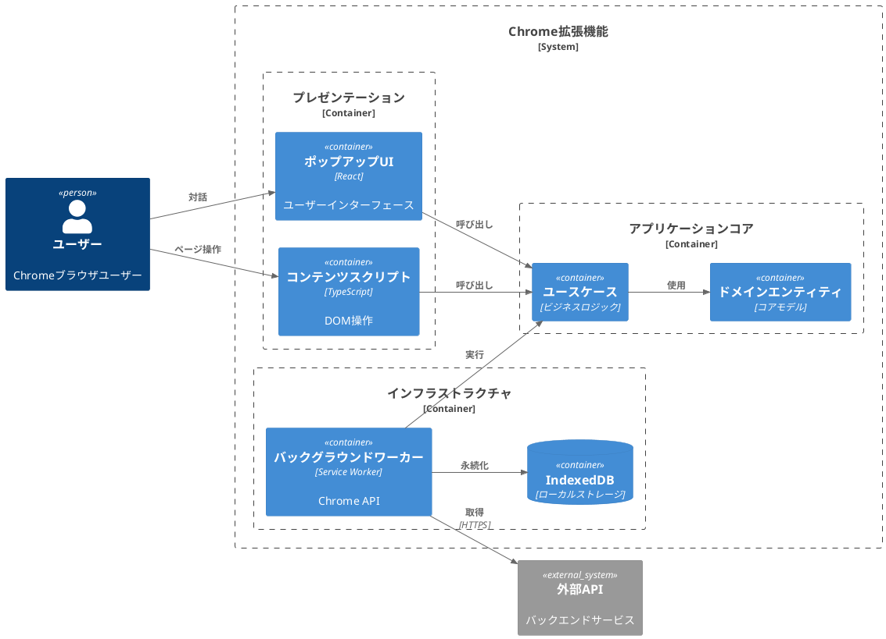
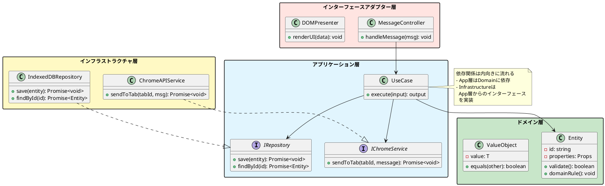
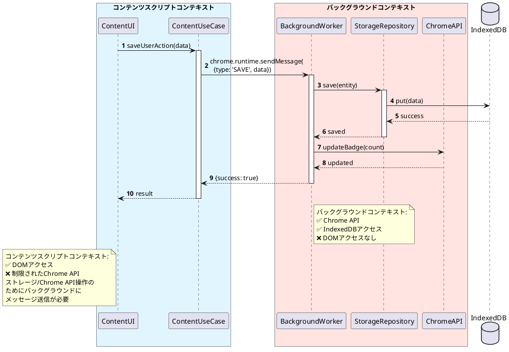
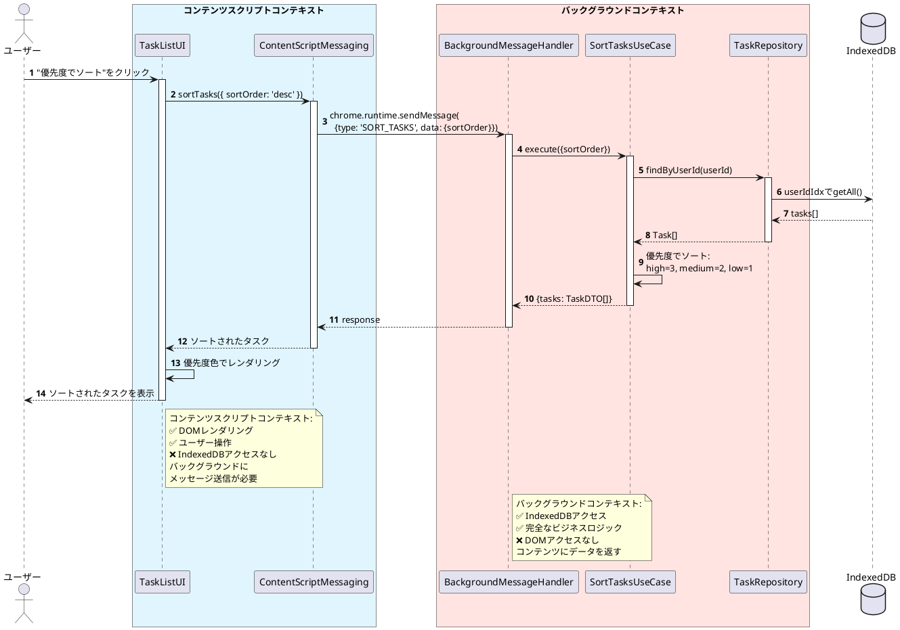
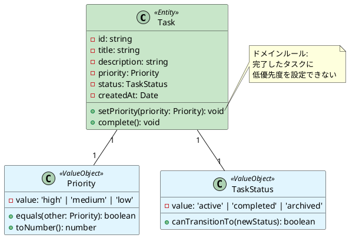

# Chrome拡張機能設計ドキュメント: WXTフレームワークとClean ArchitectureのAI支援開発のためのベストプラクティス

## 主要な調査結果

WXTフレームワークとClean Architectureで構築されたChrome拡張機能の設計ドキュメントには、従来のソフトウェア設計ドキュメントでは見落とされがちな**ブラウザ固有の制約を明示的に文書化**する必要があります。最も重要な発見は、バックグラウンドサービスワーカーとコンテンツスクリプトが根本的に異なる機能を持っているという点です。これらを事前に文書化する必要があります。background.tsは完全なChrome APIアクセスを持ちますがDOMアクセスはなく、一方content.tsはDOMアクセスを持ちますが、Chrome APIは大幅に制限されています。Claude CodeのようなAIコーディングツールが正しい実装を生成するためには、設計ドキュメントでどの層がどの操作を処理するか、そしてその理由を明示的に記述する必要があります。

最適な形式は、**構造のためのMarkdownとアーキテクチャ図のためのPlantUMLを組み合わせ**、コードと一緒にバージョン管理に保存するアプローチです。このアプローチにより、AIツールがドキュメントをコンテキストとして解析できると同時に、人間の可読性も維持できます。日本のソフトウェアエンジニアリング実践では、包括的なテーブルベースの仕様書（基本設計書）が重視されており、これはChrome拡張機能ドキュメントのニーズ、特に権限マトリクス、制約テーブル、データスキーマに適しています。

## Chrome拡張機能のアーキテクチャ制約は直感的ではない

従来のWebアプリケーションには、Chrome拡張機能ほど厳格な実行コンテキストの境界がありません。設計ドキュメントでは、**バックグラウンドサービスワーカーが非アクティブ後30秒で終了**し、DOMやwindowオブジェクトにアクセスできず、localStorageの代わりにchrome.storageを使用しなければならないことを明示的に文書化する必要があります。一方、**コンテンツスクリプトは「isolated worlds（隔離された世界）」で実行**され、DOMは見えますがページのJavaScript変数は見えません。これらの制約はClean Architectureの層の決定に直接影響します。データベースアクセスをInfrastructureに配置するだけでは、どのChrome拡張機能コンテキストから実行されるかを考慮しない限り、どの層からでも動作することは期待できません。

## ドキュメントアーキテクチャテンプレート構造

設計ドキュメントは、Clean Architectureの層とChrome拡張機能のコンテキストの両方を反映した階層構造に従う必要があります。システム概要から始めてアーキテクチャの基盤を確立し、次に各Clean Architecture層をChrome拡張機能コンポーネントへの明示的なマッピングとともに文書化します。重要な革新は、どのコンテキストでどの操作が可能かを示す**制約マトリクス**を追加することです。これにより、AIツールがブラウザのセキュリティ境界に違反するコードを生成することを防ぎます。

### 推奨ドキュメント階層

```
docs/
├── design/
│   ├── 00-overview.md                  # システム概要と技術スタック
│   ├── 01-architecture.md              # Clean Architecture + Chrome拡張機能マッピング
│   ├── 02-domain-layer.md              # エンティティ、値オブジェクト、ビジネスルール
│   ├── 03-application-layer.md         # ユースケースとオーケストレーション
│   ├── 04-interface-adapters.md        # コントローラー、プレゼンター、ゲートウェイ
│   ├── 05-infrastructure.md            # Chrome API、IndexedDB、外部サービス
│   ├── 06-entrypoints.md               # WXTエントリーポイント設定
│   ├── 07-data-schema.md               # IndexedDBスキーマとマイグレーション
│   ├── 08-constraints-matrix.md        # Chrome拡張機能制約リファレンス
│   └── adr/                            # アーキテクチャ決定記録
│       ├── 001-use-clean-architecture.md
│       ├── 002-wxt-framework.md
│       └── 003-indexeddb-storage.md
└── diagrams/
    ├── architecture-overview.puml
    ├── domain-model.puml
    ├── sequence-flows.puml
    └── data-schema.puml
```

## 中核となる設計ドキュメントのセクション

### システム概要 (00-overview.md)

このドキュメントは基盤を確立します。拡張機能の目的、対象ユーザー、主要機能を最初に文書化します。特定のバージョンを含む完全な技術スタック（WXTフレームワークのバージョン、対象Chromeバージョン、TypeScript設定）を含めます。AIツールは互換性のあるコードを生成するためにこのコンテキストが必要です。

**必須要素:**
- 拡張機能のマニフェストバージョン（V3）と必要な権限
- Clean Architecture採用の根拠
- 開発環境のセットアップ（Node.jsバージョン、パッケージマネージャー）
- ビルドとデプロイプロセスの概要
- テスト戦略の概要

### アーキテクチャマッピング (01-architecture.md)

これは最も重要なドキュメントです。Clean Architectureの4つの層とChrome拡張機能の実行コンテキストの間のマッピングを作成します。DomainとApplicationの層は**backgroundとcontentの両方のコンテキストで実行**される（純粋なビジネスロジックであるため）ことを明示的に文書化し、一方でInfrastructureの実装はコンテキストによって異なります。

**層からコンテキストへのマッピングテーブル:**

| Clean Architecture層 | Background.ts | Content.ts | Popup/Options |
|-------------------------|---------------|------------|---------------|
| Domain（エンティティ） | ✅ 共有 | ✅ 共有 | ✅ 共有 |
| Application（ユースケース） | ✅ 共有 | ✅ 共有 | ✅ 共有 |
| Interface Adapters | ✅ ChromeAdapter | ✅ DOMAdapter | ✅ UIAdapter |
| Infrastructure | ✅ StorageImpl、APIImpl | ✅ ContentAPIImpl | ✅ UIStorageImpl |

**依存関係ルールの強制:** 依存関係は内向きに流れることを文書化します。InfrastructureはApplicationに依存し、ApplicationはDomainに依存しますが、その逆はありません。PlantUMLを使用して内向きの矢印でこれを視覚化します。

### Chrome拡張機能制約マトリクス (08-constraints-matrix.md)

このドキュメントは、最も一般的なAIコード生成エラーを防ぎます。各コンテキストで何ができて何ができないかを示す包括的なテーブルを作成します。

**バックグラウンドサービスワーカーの機能:**

| 操作 | 許可 | 制約 | 代替手段 |
|-----------|---------|------------|-------------|
| Chrome API (tabs、storage、alarms) | ✅ はい | フルアクセス | - |
| DOM操作 | ❌ いいえ | window/documentなし | コンテンツスクリプトを使用 |
| localStorage | ❌ いいえ | サービスワーカーの制限 | chrome.storageを使用 |
| 長時間タイマー | ❌ いいえ | 30秒非アクティブ=終了 | chrome.alarmsを使用 |
| ネットワークリクエスト | ✅ はい | host_permissionsでCORSなし | - |
| グローバル変数 | ❌ いいえ | 再起動時にリセット | chrome.storageを使用 |

**コンテンツスクリプトの機能:**

| 操作 | 許可 | 制約 | 代替手段 |
|-----------|---------|------------|-------------|
| DOMアクセス | ✅ はい | フルアクセス | - |
| chrome.tabs API | ❌ いいえ | 制限されたAPIサーフェス | バックグラウンドにメッセージ |
| chrome.storage API | ✅ はい | 共有ストレージ | - |
| ページのJavaScript変数 | ❌ いいえ | 隔離された世界 | window.postMessageを使用 |
| CORSバイパス | ❌ いいえ | ページのCSPに従う | fetchのためにバックグラウンドにメッセージ |
| chrome.runtime.sendMessage | ✅ はい | 通信のみ | - |

### WXTエントリーポイントドキュメント (06-entrypoints.md)

WXTはエントリーポイントにファイルベースのルーティングを使用します。AIツールがファイルを作成する場所を知る必要があるため、エントリーポイント構造を明示的に文書化します。

**ファイル命名規則:**

```
entrypoints/
├── background.ts              → バックグラウンドサービスワーカー
├── content.ts                → デフォルトコンテンツスクリプト（全サイト）
├── content-specific.ts       → 名前付きコンテンツスクリプト（特定サイト）
├── popup/
│   ├── index.html           → ポップアップUIエントリーポイント
│   └── main.ts              → ポップアップロジック
└── options/
    ├── index.html           → オプションページ
    └── main.ts              → オプションロジック
```

**各エントリーポイントの設定パターン:**

```typescript
// entrypoints/background.ts
export default defineBackground({
  type: 'module',
  persistent: false,
  
  main() {
    // バックグラウンドロジック
    // アクセス可能: すべてのChrome API
    // アクセス不可: DOM、window、document
    // 状態: サービスワーカー再起動時にリセット
  }
});

// entrypoints/content.ts
export default defineContentScript({
  matches: ['*://*.example.com/*'],
  runAt: 'document_idle',
  world: 'ISOLATED',
  
  main(ctx) {
    // コンテンツスクリプトロジック
    // アクセス可能: DOM、制限されたChrome API
    // アクセス不可: ほとんどのChrome API、ページJSコンテキスト
    // 通信: chrome.runtime.sendMessageでバックグラウンドへ
  }
});
```

設定オプションとその影響を文書化します。AIツールはしばしば誤った設定を生成します。`runAt: 'document_start'`はDOMの準備が整う前に実行され、`document_idle`はページ読み込み完了を待つことを明示的に記述します。

### IndexedDBスキーマドキュメント (07-data-schema.md)

IndexedDBスキーマはバージョンベースのマイグレーションが必要です。各スキーマバージョンを完全な構造とマイグレーションロジックとともに文書化します。

**スキーマドキュメントテンプレート:**

```markdown
## データベース: ExtensionDB

### バージョン1（初期スキーマ - 2024-11-08）

**オブジェクトストア:**

#### UserPreferences
- **キー設定:** keyPath: 'userId' (string)
- **目的:** ユーザー固有の設定を保存
- **インデックス:** なし
- **構造:**
  ```typescript
  interface UserPreferences {
    userId: string;          // プライマリキー
    theme: 'light' | 'dark';
    language: string;
    notifications: boolean;
    createdAt: number;       // Unixタイムスタンプ
    updatedAt: number;
  }
  ```

#### TaskHistory
- **キー設定:** autoIncrement: true
- **目的:** タスク実行履歴を保存
- **インデックス:**
  - `taskIdIdx`: keyPath 'taskId'、unique: false
  - `timestampIdx`: keyPath 'timestamp'、unique: false
- **構造:**
  ```typescript
  interface TaskHistory {
    id?: number;             // 自動生成
    taskId: string;
    status: 'pending' | 'completed' | 'failed';
    timestamp: number;
    metadata: Record<string, unknown>;
  }
  ```

### バージョン2（キャッシング追加 - 2024-12-01）

**変更点:**
- 新規オブジェクトストア追加: `APICache`
- UserPreferencesにインデックス追加: 'language'フィールドに`languageIdx`

**マイグレーションロジック:**
```typescript
case 1: {
  // v1からv2へのアップグレード
  const apiCache = db.createObjectStore('APICache', {
    keyPath: 'key'
  });
  apiCache.createIndex('expiryIdx', 'expiry', { unique: false });
  
  const prefs = transaction.objectStore('UserPreferences');
  prefs.createIndex('languageIdx', 'language', { unique: false });
}
```

**APICache構造:**
```typescript
interface APICache {
  key: string;               // APIエンドポイント + パラメータハッシュ
  data: unknown;
  expiry: number;            // Unixタイムスタンプ
  createdAt: number;
}
```
```

## Clean ArchitectureのためのPlantUML図パターン

テキストドキュメントを補完する視覚的表現を作成するためにPlantUMLを使用します。C4モデルはClean Architectureの層状アプローチと自然に整合します。

### アーキテクチャ概要図



### 依存関係フローを伴う層境界図



### クロスコンテキスト通信のシーケンス図



## AIコード生成のための記述

Claude CodeのようなAIツールはドキュメントをコンテキストウィンドウとして解析するため、構造が重要です。最大のAI理解のために以下の原則に従います。

### 明示的なコンテキストを持つ自己完結型セクション

各セクションは独立して理解可能である必要があります。AIツールがドキュメントのチャンクを取得する際、他のセクションのコンテキストが利用できない場合があります。

**悪い例（外部コンテキストに依存）:**
```markdown
### 実装
前に定義したリポジトリインターフェースを使用してエンティティを永続化します。
```

**良い例（自己完結型）:**
```markdown
### TaskRepository実装

Infrastructure層でIndexedDBを使用してITaskRepositoryインターフェースを実装します。
このリポジトリはIndexedDBアクセスが可能なbackground.tsコンテキストで実行されます。

**インターフェース（Application層より）:**
```typescript
interface ITaskRepository {
  save(task: Task): Promise<void>;
  findById(id: string): Promise<Task | null>;
  findAll(): Promise<Task[]>;
}
```

**実装場所:** `src/infrastructure/repositories/IndexedDBTaskRepository.ts`

**Chromeコンテキスト:** バックグラウンドサービスワーカー（IndexedDBアクセスあり）

**依存関係:**
- Domain: Taskエンティティ
- Infrastructure: IndexedDBクライアントラッパー

**実装要件:**
- save操作には'readwrite'モードのトランザクションを使用
- quota exceededエラーをユーザー通知で処理
- デバッグ用にchrome.storageを介したエラーログを実装
```

### 明示的な制約ドキュメント

AIツールは明示的な「可能/不可能」ステートメントから利益を得ます。AIがChrome拡張機能の制限を理解していると仮定しないでください。

```markdown
### コンテンツスクリプト通信パターン

**コンテンツスクリプトができないこと:**
❌ `chrome.tabs.query()`を直接呼び出せない（APIが利用不可）
❌ `chrome.storage.local.set()`を直接呼び出せない（制限されたAPIサーフェス）
❌ CORSバイパスされたリクエストを作成できない（ページのCSPに従う）
❌ ページJavaScriptのグローバル変数にアクセスできない（隔離された世界）

**コンテンツスクリプトが代わりにすべきこと:**
✅ Chrome API操作のためにバックグラウンドワーカーにメッセージを送信
✅ バックグラウンド通信に`chrome.runtime.sendMessage()`を使用
✅ ページコンテキスト通信に`window.postMessage()`を使用
✅ ページJSアクセスが必要な場合はページコンテキストにスクリプトを注入

**パターン例:**
```typescript
// ❌ 誤り - コンテンツスクリプトで失敗する
chrome.tabs.query({ active: true }, tabs => {
  // chrome.tabsはここでは利用できない
});

// ✅ 正しい - 代わりにバックグラウンドにメッセージ
const response = await chrome.runtime.sendMessage({
  type: 'GET_ACTIVE_TAB_INFO'
});
```
```

### 機能仕様テンプレート

新機能を文書化する際は、AIツールが機械的に従えるテンプレートを使用します。

```markdown
## 機能: [機能名]

### ビジネスコンテキスト
[なぜこの機能が存在するか、解決する問題]

### ユーザーフロー
1. 機能をトリガーするユーザーアクション
2. 期待されるシステム応答
3. ユーザーへの結果/フィードバック

### Clean Architecture層の変更

#### ドメイン層の変更
**新規エンティティ:**
- EntityName: [説明、主要なビジネスルール]

**変更されるエンティティ:**
- EntityName: [何が変更されるか、なぜ]

**新規値オブジェクト:**
- ValueObjectName: [目的、検証ルール]

#### アプリケーション層の変更
**新規ユースケース:**
- UseCaseName: [入力、出力、オーケストレーションロジック]
  - **実装ファイル:** `src/application/usecases/UseCaseName.ts`
  - **依存関係:** [必要なリポジトリ/サービスのリスト]
  - **テストケース:** [テストシナリオ]

**変更されるユースケース:**
- UseCaseName: [何が変更されるか]

**新規インターフェース:**
```typescript
interface INewRepository {
  methodName(params: Type): Promise<ReturnType>;
}
```

#### インフラストラクチャ層の変更
**Chrome拡張機能コンテキスト: [Background/Content/Both]**

**新規実装:**
- RepositoryImpl: [何をするか、どのIndexedDBストアを使うか]
  - **ファイル位置:** `src/infrastructure/repositories/RepositoryImpl.ts`
  - **Chromeコンテキスト:** [background/content]
  - **使用するChrome API:** [特定のAPIをリスト]
  - **使用するストレージ:** [IndexedDBストア名]

**制約:**
- [Chrome拡張機能固有の制限をリスト]

#### プレゼンテーション層の変更
**エントリーポイント: [background.ts/content.ts/popup/options]**

**新規コンポーネント:**
- ComponentName: [目的、場所]
  - **ファイル:** `entrypoints/[type]/ComponentName.tsx`
  - **Chromeコンテキスト:** [どの実行コンテキスト]
  - **通信:** [他の層とどう通信するか]

### データスキーマの変更

**IndexedDBバージョン:** [バージョン番号をインクリメント]

**新規オブジェクトストア:**
```typescript
interface NewStore {
  // 構造
}
```

**マイグレーションロジック:**
```typescript
case previousVersion: {
  const store = db.createObjectStore('NewStore', {
    keyPath: 'id',
    autoIncrement: true
  });
  store.createIndex('indexName', 'keyPath', { unique: false });
}
```

### テストシナリオ

**ユニットテスト（ドメイン層）:**
- [ ] エンティティ検証ルールが正しく動作する
- [ ] ビジネスロジックのエッジケースが処理される

**統合テスト（アプリケーション層）:**
- [ ] ユースケースがモックされた依存関係で正しくオーケストレーションする
- [ ] エラーハンドリングが期待通りに動作する

**E2Eテスト（フルフロー）:**
- [ ] ユーザーが完全なワークフローを完了できる
- [ ] ブラウザ再起動後もデータが正しく永続化される
- [ ] コンテキスト間の通信が動作する

### 画面遷移（該当する場合）

**画面フロー:**
[スクリーンショット用プレースホルダー]
現在の画面 → [アクション] → 次の画面

**UIモックアップの配置:**
`docs/mockups/feature-name-flow.png`
```

## 日本の設計ドキュメントの影響

日本のソフトウェアエンジニアリング実践（基本設計書アプローチ）は、包括的なテーブルベースの仕様を重視します。これはChrome拡張機能のニーズとよく整合します。

### 制約仕様テーブル（日本式）

明確さのために権限と制約を表形式で文書化します:

**拡張機能権限一覧:**

| 権限名 | 必要性 | 使用箇所 | 理由 |
|-------------------|------------------|---------------|-----------------|
| storage | 必須 | Background、Content | ユーザー設定とキャッシュの保存 |
| tabs | 必須 | Background | アクティブタブ情報の取得 |
| activeTab | 必須 | Background | タブへのメッセージ送信 |
| https://*.example.com/* | 必須 | Content | 特定サイトでのコンテンツスクリプト実行 |

**Chrome API制約マトリクス:**

| API名 | Background | Content | Popup | 制約事項 |
|------|-----------|---------|-------|---------|
| chrome.tabs | ✅ | ❌ | ✅ | Contentスクリプトからは使用不可 |
| chrome.storage | ✅ | ✅ | ✅ | 全コンテキストで使用可能 |
| chrome.alarms | ✅ | ❌ | ❌ | Backgroundのみ |
| DOM API | ❌ | ✅ | ✅ | Backgroundでは使用不可 |

### バージョン管理と承認ワークフロー（日本の実践）

日本の設計ドキュメントには詳細な変更管理が含まれます:

```markdown
## 更新履歴

| バージョン | 更新日 | 更新者 | 更新内容 | 承認者 |
|----------|--------|--------|---------|--------|
| 1.0 | 2024-11-01 | 山田太郎 | 初版作成 | 佐藤花子 |
| 1.1 | 2024-11-08 | 山田太郎 | IndexedDBスキーマ追加 | 佐藤花子 |
| 2.0 | 2024-12-01 | 鈴木一郎 | Clean Architecture層の再設計 | 佐藤花子 |

## 承認フロー
- 作成者: [名前]
- レビュアー: [名前]
- 承認者: [名前]
- 最終承認日: [日付]
```

## VSCodeワークフロー統合

PlantUMLプレビューとAIツール統合のために最適な設計ドキュメントワークフローのためにVSCodeを設定します。

### VSCode拡張機能と設定

**必要な拡張機能:**
- PlantUML (jebbs.plantuml)
- Markdown All in One
- Markdown Preview Enhanced（オプション、高度な機能のため）

**VSCode settings.json:**
```json
{
  "plantuml.server": "http://localhost:8080",
  "plantuml.render": "PlantUMLServer",
  "plantuml.exportOutDir": "docs/diagrams/exports",
  "plantuml.exportFormat": "svg",
  "plantuml.exportSubFolder": false,
  "markdown.extension.toc.levels": "2..6",
  "files.associations": {
    "*.md": "markdown",
    "*.puml": "plantuml"
  }
}
```

**PlantUMLサーバーの起動（Docker）:**
```bash
docker run -d -p 8080:8080 plantuml/plantuml-server:jetty
```

**ワークフロー:**
1. VSCodeで.pumlファイルを編集
2. Alt+D（Windows/Linux）またはOption+D（Mac）を押してプレビュー
3. Markdownへの埋め込みのためにSVGにエクスポート
4. Markdownで図を参照: ``

### AIツール統合（Cursor/Claude Code）

リポジトリルートに`.cursorrules`ファイルを作成:

```markdown
# Chrome拡張機能設計ドキュメントコンテキスト

## プロジェクトタイプ
Clean ArchitectureによるWXTフレームワークChrome拡張機能

## アーキテクチャ制約

### Chrome拡張機能実行コンテキスト
- **バックグラウンドサービスワーカー:** 完全なChrome APIアクセス、DOMなし、30秒後に終了
- **コンテンツスクリプト:** DOMアクセス、制限されたChrome API、特権操作のためにバックグラウンドへメッセージ送信が必要
- **Popup/Options:** 完全なChrome API + DOMアクセス、短命

### Clean Architecture層
- **Domain:** 純粋なビジネスロジック、外部依存なし、すべてのコンテキストで実行
- **Application:** ユースケース、Domainのみに依存、すべてのコンテキストで実行
- **Interface Adapters:** コンテキスト固有のアダプター（ChromeAdapter、DOMAdapter）
- **Infrastructure:** Chrome API実装、IndexedDB、外部サービス

### コード生成ルール
1. コードがどのChromeコンテキストで実行されるかを常に確認
2. コンテンツスクリプトでchrome.tabsやchrome.windowsを使用しない
3. バックグラウンドスクリプトからDOMを操作しない
4. localStorageではなくchrome.storageを使用
5. バックグラウンドタイマーにはsetTimeout/setIntervalではなくchrome.alarmsを使用
6. すべてのクロスコンテキスト通信はchrome.runtime.sendMessageを使用

## 参照ファイル
@docs/design/08-constraints-matrix.md
@docs/design/01-architecture.md
@docs/diagrams/architecture-overview.puml
```

このファイルは、すべてのコード生成リクエストに対してAIツールに重要なコンテキストを提供します。

## スプレッドシート形式への移行

Markdownはバージョン管理とAI解析に最適ですが、日本のビジネス慣行ではしばしばステークホルダーレビューのためのExcel成果物が必要です。

### MarkdownテーブルからExcelへの変換

**ツール:**
- Pandoc: `pandoc design.md -o design.xlsx`
- TableConvert.com: プレビュー付きオンラインコンバーター
- pandasを使用したカスタムPythonスクリプト:

```python
import pandas as pd
import re

def extract_markdown_table(markdown_text, table_name):
    """Markdownからテーブルを抽出してDataFrameに変換"""
    pattern = rf"## {table_name}.*?\n\n(.*?\n\|.*?\n)\n"
    match = re.search(pattern, markdown_text, re.DOTALL)
    
    if match:
        table_text = match.group(1)
        # DataFrameに解析
        lines = [line.strip() for line in table_text.split('\n') 
                 if line.strip() and not line.strip().startswith('|--')]
        df = pd.read_csv(pd.compat.StringIO('\n'.join(lines)), 
                        sep='|', skipinitialspace=True)
        df = df.iloc[:, 1:-1]  # パイプ区切りからの空列を削除
        return df
    return None

# 使用例
with open('design.md', 'r', encoding='utf-8') as f:
    content = f.read()

tables = {
    'ChromeAPI': extract_markdown_table(content, 'Chrome API制約マトリクス'),
    'Permissions': extract_markdown_table(content, '拡張機能権限一覧')
}

with pd.ExcelWriter('design_specs.xlsx', engine='openpyxl') as writer:
    for sheet_name, df in tables.items():
        if df is not None:
            df.to_excel(writer, sheet_name=sheet_name, index=False)
```

### デュアル形式の維持

**戦略:** Markdownを信頼できる情報源として維持し、ステークホルダーレビュー用にExcelを生成:

```bash
# package.jsonスクリプト内
{
  "scripts": {
    "docs:export": "pandoc docs/design/*.md -o exports/design-spec.docx",
    "docs:tables": "python scripts/extract_tables.py",
    "diagrams:export": "plantuml -tsvg docs/diagrams/*.puml"
  }
}
```

## 実装チェックリスト

設計ドキュメントを開始する際にこのチェックリストを使用します:

**初期セットアップ:**
- [ ] design、diagrams、adrのサブディレクトリを持つdocs/ディレクトリ構造を作成
- [ ] PlantUMLサーバー（Docker）をセットアップしVSCodeを設定
- [ ] Chrome拡張機能コンテキストで.cursorrulesファイルを作成
- [ ] ドキュメント用のバージョン管理を初期化

**コアドキュメント（第1週）:**
- [ ] 拡張機能の目的と技術スタックで00-overview.mdを作成
- [ ] 層からコンテキストへのマッピングで01-architecture.mdを作成
- [ ] architecture-overview.puml図を作成
- [ ] 機能テーブルで08-constraints-matrix.mdを作成

**層ドキュメント（第2週）:**
- [ ] エンティティでドメイン層（02-domain-layer.md）を文書化
- [ ] ユースケースでアプリケーション層（03-application-layer.md）を文書化
- [ ] インターフェースアダプター（04-interface-adapters.md）を文書化
- [ ] インフラストラクチャ（05-infrastructure.md）を文書化

**Chrome拡張機能固有事項（第3週）:**
- [ ] エントリーポイント設定（06-entrypoints.md）を文書化
- [ ] マイグレーション付きIndexedDBスキーマ（07-data-schema.md）を文書化
- [ ] クロスコンテキストフロー用のシーケンス図を作成
- [ ] 主要なアーキテクチャ決定のためのADRを作成

**AI統合:**
- [ ] Claude Codeにコードを生成させてドキュメントをテスト
- [ ] AI生成コードエラーに基づいて制約を改良
- [ ] AIが苦労した箇所により多くの例を追加
- [ ] 機能仕様テンプレートを作成

## 文書化すべき主要なアーキテクチャ決定

これらの決定をアーキテクチャ決定記録（ADR）として文書化します:

### ADRテンプレート

```markdown
# ADR-001: Chrome拡張機能開発にWXTフレームワークを使用

## ステータス
承認済み

## コンテキスト
TypeScriptでChrome拡張機能を構築するには、大量のビルド設定、マニフェスト生成、複数のエントリーポイント（background、content scripts、popup）の処理が必要です。以下をサポートするフレームワークが必要:
- 型安全なChrome APIアクセス
- 迅速な開発のためのホットモジュール置換
- 自動manifest.json生成
- 将来の拡張のためのマルチブラウザサポート

## 決定
Chrome拡張機能開発の基盤としてWXTフレームワークを使用します。

WXTが提供するもの:
- ファイルベースのエントリーポイントルーティング（background.ts、content.tsを自動検出）
- エントリーポイント設定からの自動manifest.json生成
- すぐに使えるTypeScriptサポート
- 高速リフレッシュ付き開発サーバー
- 本番用のビルド最適化

## 結果

**肯定的:**
- ボイラープレート設定の削減
- Chrome APIの型安全性
- HMRによる開発イテレーションの高速化
- 従来のファイル構造で保守が容易

**否定的:**
- ネイティブChrome APIの上の追加抽象化レイヤー
- WXTに不慣れなチームの学習曲線
- フレームワークのメンテナンスと更新への依存
- カスタムWebpack設定と比較してビルドプロセスの制御が少ない

**リスクと軽減策:**
- リスク: WXTプロジェクトがメンテナンスされなくなる
  - 軽減策: WXTはコミュニティが成長中で活発にメンテナンスされている。必要に応じてカスタムビルドに移行可能
- リスク: 高度な機能のためのフレームワーク制限
  - 軽減策: WXTはカスタムビルド設定と直接のChrome APIアクセスをサポート

## 検討した代替案
1. **バニラTypeScript + Webpack:** 完全な制御だが大きな設定オーバーヘッド
2. **Plasmoフレームワーク:** WXTに似ているがより柔軟性が低く、より独断的
3. **Viteプラグイン:** Chrome拡張機能固有の手動セットアップがより多く必要

## 参照
- WXTドキュメント: https://wxt.dev/
- Chrome拡張機能アーキテクチャ: docs/design/01-architecture.md
```

**作成すべき重要なADR:**
- ADR-001: フレームワーク選択（WXT）
- ADR-002: Clean Architectureの採用
- ADR-003: ローカルストレージ用のIndexedDB（対chrome.storage）
- ADR-004: アプリケーション層でのCQRSパターン（該当する場合）
- ADR-005: クロスコンテキスト通信のためのメッセージパッシングアーキテクチャ

## テストドキュメント戦略

AI支援テスト生成のために明示的なテストケース分類で複数レベルでテストを文書化します。

### テストドキュメント構造

```markdown
## テスト戦略

### テストピラミッド

```
            /\
           /E2E\          少数、遅い、完全なブラウザ自動化
          /------\
         /統合テ\         中程度、層の相互作用をテスト
        /--------\
       /ユニット\        多数、高速、純粋なビジネスロジック
      /----------\
```

### ドメイン層テスト（多数、高速）

**配置:** `tests/domain/`
**焦点:** 純粋なビジネスロジック、外部依存なし
**モック:** なし（純粋関数）

**テストケース:**
```typescript
// エンティティ検証
describe('Task Entity', () => {
  it('必須フィールドを検証する', () => { /* ... */ });
  it('ステータス遷移のビジネスルールを強制する', () => { /* ... */ });
  it('一意の識別子を正しく生成する', () => { /* ... */ });
});

// 値オブジェクトの不変性
describe('Email ValueObject', () => {
  it('メール形式を検証する', () => { /* ... */ });
  it('作成後は不変', () => { /* ... */ });
  it('等価比較をサポート', () => { /* ... */ });
});
```

### アプリケーション層テスト（中程度の量、モック使用）

**配置:** `tests/application/`
**焦点:** ユースケースのオーケストレーション
**モック:** リポジトリとサービスインターフェース

**テストケーステンプレート:**
```typescript
describe('CreateTaskUseCase', () => {
  let useCase: CreateTaskUseCase;
  let mockRepository: jest.Mocked<ITaskRepository>;
  let mockNotificationService: jest.Mocked<INotificationService>;
  
  beforeEach(() => {
    mockRepository = createMockRepository();
    mockNotificationService = createMockNotificationService();
    useCase = new CreateTaskUseCase(mockRepository, mockNotificationService);
  });
  
  describe('正常系', () => {
    it('タスクを作成し通知を送信する', async () => {
      const input = { title: 'テストタスク', description: 'テスト' };
      await useCase.execute(input);
      
      expect(mockRepository.save).toHaveBeenCalledTimes(1);
      expect(mockNotificationService.send).toHaveBeenCalledTimes(1);
    });
  });
  
  describe('エラーハンドリング', () => {
    it('リポジトリ保存失敗時にスローする', async () => {
      mockRepository.save.mockRejectedValue(new Error('DB Error'));
      await expect(useCase.execute({...})).rejects.toThrow();
    });
  });
  
  describe('バリデーション', () => {
    it('無効な入力を拒否する', async () => {
      await expect(useCase.execute({ title: '' })).rejects.toThrow('Title required');
    });
  });
});
```

### Chrome拡張機能コンテキストテスト

**バックグラウンドスクリプトテスト:**
```typescript
// Chrome APIをモック
global.chrome = {
  runtime: {
    sendMessage: jest.fn(),
    onMessage: {
      addListener: jest.fn()
    }
  },
  storage: {
    local: {
      get: jest.fn(),
      set: jest.fn()
    }
  }
} as any;

describe('Background Worker', () => {
  it('コンテンツスクリプトからのメッセージを処理する', async () => {
    // chrome.runtime.onMessageリスナーをテスト
  });
  
  it('chrome.storageにデータを永続化する', async () => {
    // ストレージ操作をテスト
  });
});
```

**コンテンツスクリプトテスト:**
```typescript
// DOMをモック
document.body.innerHTML = `
  <div id="app">
    <button id="trigger">クリック</button>
  </div>
`;

describe('Content Script', () => {
  it('ページDOMにUIを注入する', () => {
    // DOM操作をテスト
  });
  
  it('ユーザーアクション時にバックグラウンドにメッセージを送信する', async () => {
    // chrome.runtime.sendMessage呼び出しをテスト
  });
});
```

### E2Eテスト（少数、重要なパス）

Chrome拡張機能テストサポート付きのPuppeteerまたはPlaywrightを使用:

```typescript
import puppeteer from 'puppeteer';
import path from 'path';

describe('Extension E2E', () => {
  let browser: puppeteer.Browser;
  let page: puppeteer.Page;
  
  beforeAll(async () => {
    const extensionPath = path.resolve(__dirname, '../dist');
    browser = await puppeteer.launch({
      headless: false,
      args: [
        `--disable-extensions-except=${extensionPath}`,
        `--load-extension=${extensionPath}`
      ]
    });
  });
  
  it('完全なユーザーワークフローを完了する', async () => {
    page = await browser.newPage();
    await page.goto('https://example.com');
    
    // ユーザー操作をテスト
    await page.click('#extension-trigger');
    await page.waitForSelector('#extension-popup');
    
    // データ永続化を検証
    const data = await page.evaluate(() => {
      return new Promise(resolve => {
        chrome.storage.local.get(['key'], resolve);
      });
    });
    
    expect(data).toMatchObject({ key: expectedValue });
  });
});
```
```

## 例: 完全な機能仕様

すべてのドキュメント要素を一緒に示す完全な例:

```markdown
# 機能: タスク優先度管理

## 概要
視覚的インジケーターとソート機能を備えた優先度レベル（高/中/低）をタスクに追加します。

## ビジネスコンテキスト
ユーザーは高価値の作業に最初に焦点を当てるためにタスクに優先順位を付ける必要があります。現在のシステムはすべてのタスクを平等に扱っており、緊急なアイテムを識別することが困難です。

## Clean Architectureへの影響

### ドメイン層の変更

**変更されるエンティティ: Task**
```typescript
// ファイル: src/domain/entities/Task.ts

type Priority = 'high' | 'medium' | 'low';

interface TaskProps {
  id: string;
  title: string;
  description: string;
  priority: Priority;  // 新規
  status: TaskStatus;
  createdAt: Date;
}

class Task extends Entity<TaskProps> {
  get priority(): Priority {
    return this.props.priority;
  }
  
  setPriority(priority: Priority): void {
    // ドメインルール: 完了したタスクをダウングレードできない
    if (this.props.status === 'completed' && priority === 'low') {
      throw new DomainError('完了したタスクに低優先度を設定できません');
    }
    this.props.priority = priority;
  }
}
```

**テストケース:**
```typescript
describe('Task.setPriority', () => {
  it('アクティブなタスクの優先度変更を許可する', () => {
    const task = Task.create({ priority: 'medium', status: 'active' });
    task.setPriority('high');
    expect(task.priority).toBe('high');
  });
  
  it('完了したタスクの低へのダウングレードを防ぐ', () => {
    const task = Task.create({ priority: 'high', status: 'completed' });
    expect(() => task.setPriority('low')).toThrow(DomainError);
  });
});
```

### アプリケーション層の変更

**新規ユースケース: SortTasksByPriority**
```typescript
// ファイル: src/application/usecases/SortTasksByPriority.ts

interface SortTasksInput {
  userId: string;
  sortOrder: 'asc' | 'desc';
}

interface SortTasksOutput {
  tasks: TaskDTO[];
}

class SortTasksByPriorityUseCase {
  constructor(
    private taskRepository: ITaskRepository
  ) {}
  
  async execute(input: SortTasksInput): Promise<SortTasksOutput> {
    const tasks = await this.taskRepository.findByUserId(input.userId);
    
    const priorityOrder = { high: 3, medium: 2, low: 1 };
    const sorted = tasks.sort((a, b) => {
      const scoreA = priorityOrder[a.priority];
      const scoreB = priorityOrder[b.priority];
      return input.sortOrder === 'asc' ? scoreA - scoreB : scoreB - scoreA;
    });
    
    return { tasks: sorted.map(TaskMapper.toDTO) };
  }
}
```

**変更されるユースケース: CreateTask**
```typescript
// デフォルト値付きの優先度パラメータを追加
async execute(input: CreateTaskInput): Promise<CreateTaskOutput> {
  const task = Task.create({
    ...input,
    priority: input.priority || 'medium'  // 新規: デフォルトは中
  });
  
  await this.taskRepository.save(task);
  await this.notificationService.notify(`${task.priority}優先度でタスクが作成されました`);
  
  return TaskMapper.toDTO(task);
}
```

### インフラストラクチャ層の変更

**Chromeコンテキスト:** Background + Content
**理由:** IndexedDB操作にはバックグラウンドコンテキストが必要。UI更新にはコンテンツコンテキストが必要

**変更されるリポジトリ: IndexedDBTaskRepository**
```typescript
// ファイル: src/infrastructure/repositories/IndexedDBTaskRepository.ts
// コンテキスト: バックグラウンドサービスワーカー

async findByPriority(userId: string, priority: Priority): Promise<Task[]> {
  const db = await this.openDB();
  const tx = db.transaction(['tasks'], 'readonly');
  const store = tx.objectStore('tasks');
  
  // 既存のuserIdIdxを使用、優先度でメモリ内フィルタリング
  const tasks = await store.index('userIdIdx').getAll(userId);
  return tasks
    .filter(task => task.priority === priority)
    .map(TaskMapper.toDomain);
}
```

**IndexedDBスキーマ変更:**
```markdown
### バージョン3 → バージョン4（優先度インデックス追加）

**変更点:**
- 'tasks'オブジェクトストアにインデックス'priorityIdx'を追加
- データマイグレーション不要（フィールドはデフォルト'medium'で既存）

**マイグレーションコード:**
```typescript
case 3: {
  const taskStore = transaction.objectStore('tasks');
  taskStore.createIndex('priorityIdx', 'priority', { unique: false });
}
```
```

**コンテンツスクリプト更新: TaskListUI**
```typescript
// ファイル: entrypoints/content/components/TaskListUI.tsx
// コンテキスト: コンテンツスクリプト（DOM操作）

function TaskListUI() {
  const [tasks, setTasks] = useState<TaskDTO[]>([]);
  const [sortOrder, setSortOrder] = useState<'asc' | 'desc'>('desc');
  
  const loadTasks = async () => {
    // ソートのためにバックグラウンドにメッセージ送信
    const response = await chrome.runtime.sendMessage({
      type: 'SORT_TASKS_BY_PRIORITY',
      data: { userId, sortOrder }
    });
    setTasks(response.tasks);
  };
  
  return (
    <div>
      <button onClick={() => {
        setSortOrder(sortOrder === 'asc' ? 'desc' : 'asc');
        loadTasks();
      }}>
        ソート順を切り替え
      </button>
      
      {tasks.map(task => (
        <TaskItem 
          key={task.id} 
          task={task}
          priorityColor={getPriorityColor(task.priority)}
        />
      ))}
    </div>
  );
}
```

**バックグラウンドメッセージハンドラー:**
```typescript
// ファイル: entrypoints/background.ts
// コンテキスト: バックグラウンドサービスワーカー

chrome.runtime.onMessage.addListener((message, sender, sendResponse) => {
  if (message.type === 'SORT_TASKS_BY_PRIORITY') {
    const useCase = new SortTasksByPriorityUseCase(taskRepository);
    useCase.execute(message.data)
      .then(result => sendResponse(result))
      .catch(error => sendResponse({ error: error.message }));
    return true; // 非同期レスポンス
  }
});
```

### Chrome拡張機能制約

**コンテンツスクリプトの制限:**
- ❌ IndexedDBに直接アクセスできない（isolated worldでchrome.storage.local.getなし）
- ❌ バックグラウンドの助けなしでタスクをソートできない（データはバックグラウンドコンテキストに保存）
- ✅ UIをレンダリングしてユーザー操作を処理できる
- ✅ データ操作のためにバックグラウンドにメッセージを送信できる

**通信パターン:**
```
ユーザーがソートボタンをクリック（コンテンツスクリプト）
  → バックグラウンドにchrome.runtime.sendMessage
    → バックグラウンドがSortTasksByPriorityUseCaseを実行
      → IndexedDBから取得
      → アプリケーション層でソート
      → ソートされたデータを返す
  ← ソートされたタスクのレスポンス
← コンテンツスクリプトが新しい順序でUIを更新
```

## PlantUML図

### 優先度機能シーケンス図



### 更新されたドメインモデル



### テストカバレッジ

**ユニットテスト:**
- [ ] Task.setPriority()がドメインルールを検証する
- [ ] Priority.toNumber()が正しいソート値を返す
- [ ] SortTasksByPriorityUseCaseが正しくソートする（asc/desc）

**統合テスト:**
- [ ] 優先度フィルタ付きIndexedDBクエリが正しいタスクを返す
- [ ] コンテンツとバックグラウンド間のメッセージパッシングが動作する
- [ ] UIが正しい優先度色でレンダリングする

**E2Eテスト:**
- [ ] ユーザーが優先度でタスクリストをソートできる
- [ ] 優先度がブラウザ再起動後も永続化される
- [ ] 完了したタスクを低優先度にダウングレードできない

### 画面遷移

**現在の状態 → アクション → 新しい状態:**
[スクリーンショットプレースホルダー: `docs/mockups/priority-sort-before.png`]
ソートされていないタスクリスト
↓ ユーザーが"優先度でソート（高→低）"をクリック
[スクリーンショットプレースホルダー: `docs/mockups/priority-sort-after.png`]
視覚的優先度インジケーター付きでソートされたタスクリスト（赤=高、黄=中、青=低）

### ロールアウト計画

**フェーズ1: バックエンドインフラストラクチャ（第1週）**
- ドメインモデルに優先度フィールドを追加
- マイグレーション付きでIndexedDBスキーマを更新
- ソートユースケースを実装

**フェーズ2: UI統合（第2週）**
- タスクリストUIにソートボタンを追加
- 優先度視覚的インジケーターを実装
- タスク作成フォームに優先度セレクターを追加

**フェーズ3: テストと改良（第3週）**
- ユニットおよび統合テストを完了
- 実際のChrome拡張機能でE2Eテスト
- 大規模タスクリストでのパフォーマンステスト

### 成功指標
- ユーザーが優先度でタスクを正常にソートできる
- 1000以上のタスクでパフォーマンス低下なし
- データマイグレーション失敗ゼロ
- テストカバレッジが80%以上を維持
```

この完全な例は、Chrome拡張機能の制約とWXTフレームワークパターンを明示的に処理しながら、すべてのClean Architecture層にわたって機能を文書化する方法を示しています。

## 要約と推奨事項

Clean ArchitectureによるChrome拡張機能の設計ドキュメント構築には、**実行コンテキスト境界の明示的な文書化**が必要です。従来のソフトウェア設計ドキュメントは統一された実行環境を前提としていますが、Chrome拡張機能は異なる機能を持つ隔離されたコンテキスト間でコードを分割します。設計ドキュメントでは、Clean Architecture層をChrome拡張機能コンテキスト（background、content、popup）にマッピングし、各コンテキストでどの操作が可能かを文書化する必要があります。

主な形式として**Markdown + PlantUML**を使用します。ドキュメントをコードと一緒にバージョン管理に保存し、AIツールがコンテキストウィンドウを介してアクセスできるようにします。高レベルアーキテクチャにはPlantUMLのC4モデル、クロスコンテキスト通信にはシーケンス図、ドメインモデルにはクラス図を使用します。Markdownへの埋め込みのためにSVGに図をエクスポートします。

**AIツールが独立して解析できる自己完結型セクション**でドキュメントを構造化します。各セクションには完全なコンテキスト、明示的な制約、具体的な例を含める必要があります。「できること」と同じくらい明示的に「できないこと」を文書化します。これにより、AIツールがブラウザのセキュリティ境界に違反するコードを生成することを防ぎます。

制約ドキュメントには**日本の設計ドキュメント実践を採用**します。権限、API可用性、実行コンテキストを示す包括的なテーブルは明確な参照資料を提供します。チームやビジネスコンテキストで作業する場合は、バージョン管理と承認ワークフローを含めます。

**AIツールにコードを生成させてドキュメントをテスト**します。生成されたコードがChrome拡張機能の制約やClean Architectureの原則に違反する場合は、より明示的な例と制約でドキュメントを改良します。ドキュメントの品質は、AIツールがそれだけから正しい実装を生成できるかどうかで測定されます。
