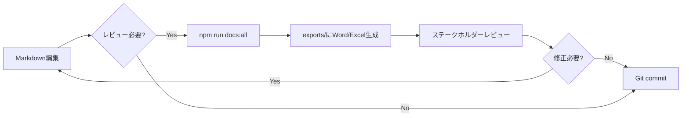
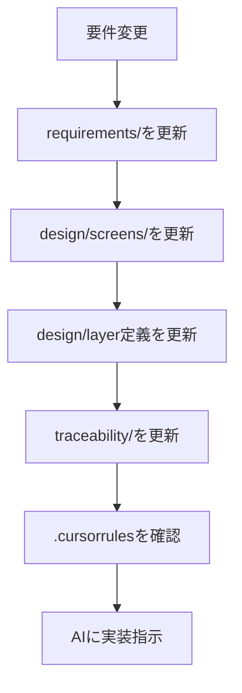
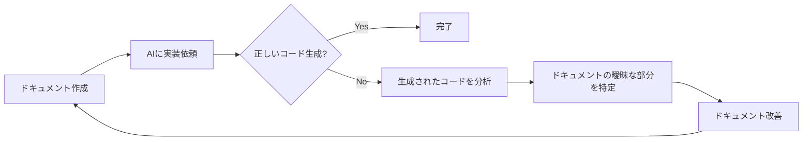

# Chrome拡張機能開発ドキュメント完全ガイド v2.0

**作成日:** 2025-11-09  
**対象:** WXT + Clean Architecture + AI支援開発

---

## 目次

1. [ドキュメント体系の全体像](#ドキュメント体系の全体像)
2. [方式設計と基本設計・詳細設計の関係](#方式設計と基本設計詳細設計の関係)
3. [ドキュメント構成の判断基準](#ドキュメント構成の判断基準)
4. [ディレクトリ構造](#ディレクトリ構造)
5. [Phase 0: プロジェクト初期化](#phase-0-プロジェクト初期化)
6. [Phase 1: 要件定義](#phase-1-要件定義)
7. [Phase 2: 方式設計・基本設計](#phase-2-方式設計基本設計)
8. [Phase 3: 詳細設計](#phase-3-詳細設計)
9. [Phase 4: トレーサビリティ](#phase-4-トレーサビリティ)
10. [AI支援開発のためのベストプラクティス](#ai支援開発のためのベストプラクティス)

---

## ドキュメント体系の全体像

### ドキュメントの階層構造

```
【抽象度：高】
┌─────────────────────────────────────┐
│ 要件定義（WHY・WHAT）                │
│ - なぜ作るのか                       │
│ - 何を作るのか                       │
│ - 誰のために作るのか                 │
└─────────────────────────────────────┘
             ↓ 具体化
┌─────────────────────────────────────┐
│ 方式設計・基本設計（WHAT・HOW）      │
│ - どのように実現するか               │
│ - アーキテクチャパターン             │
│ - 技術選定と制約                     │
│ - 機能の全体像                       │
└─────────────────────────────────────┘
             ↓ 具体化
┌─────────────────────────────────────┐
│ 詳細設計（HOW）                      │
│ - クラス・関数の詳細                 │
│ - データ構造の詳細                   │
│ - 実装の具体的指針                   │
└─────────────────────────────────────┘
             ↓ 実装
┌─────────────────────────────────────┐
│ コード（Implementation）             │
└─────────────────────────────────────┘
【抽象度：低】
```

### プロジェクト規模別の推奨構成

| 規模 | 方式設計 | 基本設計 | 詳細設計 | 備考 |
|------|---------|---------|---------|------|
| **小規模**<br>(1-2機能、1-2週間) | 基本設計に統合 | 必須 | README + 簡易図のみ | このガイドの推奨 |
| **中規模**<br>(3-10機能、1-3ヶ月) | 独立ドキュメント | 必須 | 機能ごとに作成 | 複数の方式が混在する場合 |
| **大規模**<br>(10+機能、3ヶ月+) | 独立ドキュメント | 必須 | 詳細に作成 | チーム開発・長期保守 |

**あなたのプロジェクト（小-中規模）の場合：**
- ✅ 方式設計は基本設計の一部として「00-overview.md」に統合
- ✅ background.ts/content.tsの分離パターンは「01-architecture.md」に記載
- ✅ 機能ごとの詳細設計は画面仕様に統合

---

## 方式設計と基本設計・詳細設計の関係

### 方式設計とは何か

**方式設計 = アーキテクチャパターン + 技術選定の根拠 + 実装方針**

具体例：
- WXTフレームワークを採用する理由
- background.ts/content.tsの肥大化防止策（リスナー分離パターン）
- メッセージングライブラリ（@webext-core/messaging）の採用
- Clean Architectureの層分割方針
- IndexedDBの採用理由とスキーマ設計方針

### 基本設計との違い

| 観点 | 方式設計 | 基本設計 |
|------|---------|---------|
| **目的** | 技術的な実現方法の方針決定 | 機能の具体化 |
| **対象** | プロジェクト全体に影響する決定 | 個別機能 |
| **粒度** | アーキテクチャレベル | モジュールレベル |
| **例** | 「リスナーは別ファイルに分離する」 | 「PopupはこのUseCaseを呼ぶ」 |

### 詳細設計との違い

| 観点 | 基本設計 | 詳細設計 |
|------|---------|---------|
| **抽象度** | データフロー、モジュール間関係 | クラス・関数の引数・戻り値 |
| **読者** | 設計者、実装者 | 実装者のみ |
| **例** | 「RewriteRuleをIndexedDBに保存する」 | `SaveRewriteRuleUseCase.execute(rule: RewriteRule): Promise<Result<void, Error>>` |

---

## ドキュメント構成の判断基準

### 「機能単位」vs「モジュール単位」の選択

**結論：ハイブリッド方式を推奨**

```
docs/
├── design/
│   ├── 【横断】方式設計・アーキテクチャ
│   │   ├── 00-overview.md
│   │   ├── 01-architecture.md
│   │   └── 08-constraints-matrix.md
│   │
│   ├── 【縦割り】機能単位
│   │   └── screens/
│   │       ├── popup/
│   │       │   └── 01-rewrite-rule-management.md
│   │       │       ├── 画面仕様
│   │       │       ├── 関連UseCase
│   │       │       ├── データフロー図
│   │       │       └── 変更されるテーブル
│   │       └── options/
│   │           └── 01-settings.md
│   │
│   └── 【横割り】モジュール単位
│       ├── 02-domain-layer.md（全Entity）
│       ├── 03-application-layer.md（全UseCase）
│       ├── 04-interface-adapters.md（全Presenter/Controller）
│       ├── 05-infrastructure.md（全Repository）
│       └── 07-data-schema.md（全テーブル）
```

### 使い分けのルール

| 状況 | 参照ドキュメント | 理由 |
|------|----------------|------|
| **新機能開発** | `screens/配下` | その機能に必要な要素が全て記載されている |
| **共通機能修正** | `layer別ドキュメント` | 影響範囲が分かる |
| **テーブル変更** | `07-data-schema.md` | 全テーブル定義が一元管理されている |
| **AI支援開発** | 状況に応じて両方 | 機能開発なら画面仕様、共通ならlayer定義 |

### 記述の重複について

**基本方針：必要な重複は許容する**

#### 重複してよいもの
- **UseCase名**：画面仕様と03-application-layer.mdの両方に記載
- **テーブル名**：画面仕様と07-data-schema.mdの両方に記載
- **データフロー**：画面仕様に簡易版、詳細設計に完全版

#### 重複させないもの（参照で済ませる）
- **UseCaseの引数・戻り値の詳細**：03-application-layer.mdのみに記載、画面仕様からは「→ [UC-001]参照」
- **テーブルのカラム詳細**：07-data-schema.mdのみに記載、画面仕様からは「→ [DB-001]参照」

---

## ディレクトリ構造

### 完全なディレクトリツリー

```
project-root/
├── docs/
│   ├── requirements/          # Phase 1: 要件定義
│   │   ├── 01-business-requirements.md
│   │   ├── 02-functional-requirements.md
│   │   ├── 03-non-functional-requirements.md
│   │   ├── 04-user-stories.md
│   │   ├── 05-use-cases.md
│   │   ├── 06-chrome-specific-requirements.md
│   │   └── diagrams/
│   │       ├── user-journey.puml
│   │       └── use-case-diagram.puml
│   │
│   ├── design/                # Phase 2-3: 設計
│   │   ├── 【方式設計・基本設計】
│   │   ├── 00-overview.md              # ★プロジェクト概要・方式設計
│   │   ├── 01-architecture.md          # ★アーキテクチャ詳細
│   │   ├── 08-constraints-matrix.md    # Chrome拡張の制約
│   │   │
│   │   ├── 【詳細設計：モジュール単位】
│   │   ├── 02-domain-layer.md          # Domain層の全Entity
│   │   ├── 03-application-layer.md     # Application層の全UseCase
│   │   ├── 04-interface-adapters.md    # Presenter/Controller
│   │   ├── 05-infrastructure.md        # Repository/Gateway
│   │   ├── 06-entrypoints.md           # background.ts/content.ts/popup.ts
│   │   ├── 07-data-schema.md           # IndexedDBスキーマ
│   │   │
│   │   ├── screens/           # 【基本設計：機能単位】
│   │   │   ├── 00-screen-list.md
│   │   │   ├── popup/
│   │   │   │   ├── 01-rewrite-rule-management.md
│   │   │   │   └── 02-rule-list.md
│   │   │   ├── options/
│   │   │   │   └── 01-settings.md
│   │   │   ├── content/
│   │   │   │   └── 01-dom-manipulation.md
│   │   │   ├── sidepanel/
│   │   │   │   └── 01-history-view.md
│   │   │   └── components/    # 共通コンポーネント仕様
│   │   │       └── 01-rule-form.md
│   │   │
│   │   └── adr/               # Architecture Decision Records
│   │       ├── 001-use-wxt-framework.md
│   │       ├── 002-listener-separation-pattern.md
│   │       └── 003-use-webext-core-messaging.md
│   │
│   ├── diagrams/              # PlantUML図
│   │   ├── architecture-overview.puml
│   │   ├── clean-architecture-layers.puml
│   │   ├── background-content-messaging.puml
│   │   └── data-flow/
│   │       ├── save-rewrite-rule.puml
│   │       └── apply-rewrite-rule.puml
│   │
│   ├── traceability/          # Phase 4: トレーサビリティ
│   │   └── requirements-to-implementation.md
│   │
│   └── api/                   # 外部API仕様（必要に応じて）
│       └── chrome-api-usage.md
│
├── .cursorrules               # AI支援開発設定
└── README.md                  # プロジェクトトップ
```

---

## Phase 0: プロジェクト初期化

### ステップ1: ディレクトリ作成

```bash
mkdir -p docs/{requirements/diagrams,design/{adr,screens/{popup,options,content,sidepanel,components}},diagrams/data-flow,traceability,api}
```

### ステップ2: README.md作成

```markdown
# [プロジェクト名] - Chrome Extension

## 概要
[拡張機能の簡単な説明]

## 技術スタック
- **フレームワーク**: WXT
- **言語**: TypeScript
- **アーキテクチャ**: Clean Architecture
- **メッセージング**: @webext-core/messaging
- **ストレージ**: IndexedDB

## ドキュメント
- [要件定義](docs/requirements/)
- [設計書](docs/design/)
- [トレーサビリティ](docs/traceability/)

## 開発環境
- Node.js 18+
- pnpm 8+

## セットアップ
\`\`\`bash
pnpm install
pnpm dev
\`\`\`
```

### ステップ3: PlantUML環境セットアップ

#### Docker版PlantUMLサーバー（推奨）

```bash
# Docker Composeで起動
cat > docker-compose.yml << 'EOF'
version: '3'
services:
  plantuml:
    image: plantuml/plantuml-server:jetty
    ports:
      - "8080:8080"
    restart: unless-stopped
EOF

docker-compose up -d
```

#### VSCode拡張機能

1. **PlantUML拡張機能をインストール**
   - 拡張機能ID: `jebbs.plantuml`

2. **settings.jsonに設定追加**

```json
{
  "plantuml.server": "http://localhost:8080",
  "plantuml.render": "PlantUMLServer",
  "plantuml.exportFormat": "svg",
  "plantuml.exportOutDir": "docs/diagrams/exports"
}
```

3. **使い方**
   - VSCodeで`.puml`ファイルを編集
   - `Alt+D`（Windows/Linux）または`Option+D`（Mac）でプレビュー
   - SVGエクスポートでMarkdownに埋め込み可能

#### Markdownへの図の埋め込み

```markdown
## アーキテクチャ概要


詳細は [architecture-overview.puml](../diagrams/architecture-overview.puml) 参照。
```

---

### ステップ4: .cursorrules作成

```markdown
# プロジェクトコンテキスト

このプロジェクトはWXTフレームワークを使ったChrome拡張機能です。
Clean Architectureを採用しています。

## 重要なドキュメント

コード生成前に以下を必ず参照してください：

1. **方式設計・アーキテクチャ**
   - `docs/design/00-overview.md` - プロジェクト全体像
   - `docs/design/01-architecture.md` - Clean Architecture詳細
   - `docs/design/08-constraints-matrix.md` - Chrome拡張の制約

2. **機能仕様（新規機能開発時）**
   - `docs/design/screens/[画面種別]/[機能名].md`

3. **詳細設計（既存機能修正時）**
   - `docs/design/02-domain-layer.md` - Entity定義
   - `docs/design/03-application-layer.md` - UseCase定義
   - `docs/design/07-data-schema.md` - DB定義

## コーディング規約

### 依存関係の方向
- Domain層 → 依存なし
- Application層 → Domain層のみ
- Infrastructure層 → Domain層, Application層
- Presentation層 → Application層（UseCaseのみ）

### ファイル配置
- `entrypoints/background/` - Background Script
- `entrypoints/content/` - Content Script
- `entrypoints/popup/` - Popup UI
- `domain/` - Entity, ValueObject
- `application/` - UseCase, Repository Interface
- `infrastructure/` - Repository実装, IndexedDB
- `presentation/` - Presenter, ViewModel

### 命名規則
- Entity: `XxxEntity.ts`
- UseCase: `XxxUseCase.ts`
- Repository: `IXxxRepository.ts` (interface), `XxxRepository.ts` (impl)

## Chrome拡張特有の制約

### 実行コンテキスト
- **Background**: DOMアクセス不可、Chrome API全て利用可
- **Content**: DOMアクセス可、Chrome API制限あり
- **Popup**: DOMアクセス可、Chrome API全て利用可

### メッセージング
- `@webext-core/messaging`を使用
- `entrypoints/background/messages/`にハンドラーを配置
- if文連鎖を避け、型安全なメッセージングを実現

詳細は `docs/design/08-constraints-matrix.md` 参照。
```

---

## Phase 1: 要件定義

*(以前のドキュメントから継承。内容は同じなので省略)*

要件定義の詳細は以下を参照：
- 01-business-requirements.md
- 02-functional-requirements.md
- 03-non-functional-requirements.md
- 04-user-stories.md
- 05-use-cases.md
- 06-chrome-specific-requirements.md

---

## Phase 2: 方式設計・基本設計

### 00-overview.md（★方式設計統合）

```markdown
# プロジェクト概要・方式設計書

## 1. プロジェクト基本情報

### プロジェクト名
[Chrome拡張機能名]

### 開発期間
- 開始: 2025-XX-XX
- リリース目標: 2025-XX-XX

### 技術スタック
| 分類 | 技術 | バージョン | 採用理由 |
|------|------|-----------|---------|
| フレームワーク | WXT | 0.19+ | Viteベース、HMR、TypeScript完全サポート |
| 言語 | TypeScript | 5.0+ | 型安全性、IDE支援 |
| アーキテクチャ | Clean Architecture | - | 保守性、テスタビリティ |
| メッセージング | @webext-core/messaging | 1.0+ | 型安全、if文排除 |
| ストレージ | IndexedDB | - | 大容量、構造化データ |
| テスト | Vitest | 1.0+ | Vite互換、高速 |

---

## 2. 方式設計

### 2.1 アーキテクチャ方針

#### Clean Architectureの採用

**採用理由:**
1. Chrome拡張特有の制約（background/content分離）に対応しやすい
2. ビジネスロジックとChrome APIの依存を分離
3. テストが書きやすい
4. 将来的なFirefox対応も視野

**層構造:**
```
┌─────────────────────────────────────┐
│  Presentation (UI)                  │
│  - Popup, Options, Content Scripts  │
└──────────────┬──────────────────────┘
               │ 依存
┌──────────────▼──────────────────────┐
│  Application (UseCase)              │
│  - ビジネスロジック                 │
└──────────────┬──────────────────────┘
               │ 依存
┌──────────────▼──────────────────────┐
│  Domain (Entity)                    │
│  - ビジネスルール                   │
└─────────────────────────────────────┘
               ▲
               │ 実装
┌──────────────┴──────────────────────┐
│  Infrastructure                     │
│  - Repository実装, IndexedDB        │
└─────────────────────────────────────┘
```

**依存関係ルール:**
- 外側の層は内側の層に依存できる
- 内側の層は外側の層に依存してはいけない
- Infrastructure層はInterfaceを通じてDomain/Application層と連携

---

### 2.2 Chrome拡張特有の方式設計

#### 2.2.1 background.ts/content.tsの肥大化防止策

**課題:**
- メッセージハンドラーが増えるとif文連鎖が発生
- ファイルが数百行に膨れ上がる

**採用パターン: リスナー分離パターン**

**構造:**
```
entrypoints/
├── background/
│   ├── index.ts          # エントリーポイント（薄く保つ）
│   └── messages/         # メッセージハンドラー
│       ├── SaveRewriteRuleHandler.ts
│       ├── GetRewriteRulesHandler.ts
│       └── DeleteRewriteRuleHandler.ts
│
└── content/
    ├── index.ts          # エントリーポイント（薄く保つ）
    └── handlers/         # DOM操作ハンドラー
        ├── ApplyRewriteRuleHandler.ts
        └── HighlightElementHandler.ts
```

**エントリーポイントの役割:**
```typescript
// entrypoints/background/index.ts
import { SaveRewriteRuleHandler } from './messages/SaveRewriteRuleHandler';
import { GetRewriteRulesHandler } from './messages/GetRewriteRulesHandler';

export default defineBackground(() => {
  // ハンドラーの登録のみ
  SaveRewriteRuleHandler.register();
  GetRewriteRulesHandler.register();
});
```

**ハンドラーの実装例:**
```typescript
// entrypoints/background/messages/SaveRewriteRuleHandler.ts
import { defineExtensionMessaging } from '@webext-core/messaging';

const { onMessage } = defineExtensionMessaging();

export class SaveRewriteRuleHandler {
  static register() {
    onMessage('saveRewriteRule', async ({ data }) => {
      // UseCaseを呼び出す
      const useCase = new SaveRewriteRuleUseCase(/* ... */);
      return await useCase.execute(data);
    });
  }
}
```

**メリット:**
1. ✅ 1ファイル1責任
2. ✅ if文連鎖の排除
3. ✅ テストが書きやすい
4. ✅ 新しいハンドラーの追加が容易

**ADR参照:** `docs/design/adr/002-listener-separation-pattern.md`

---

#### 2.2.2 メッセージングライブラリの選定

**採用: @webext-core/messaging**

**理由:**
| 項目 | 評価 |
|------|------|
| 型安全性 | ◎ TypeScript完全対応 |
| if文排除 | ◎ ハンドラー登録方式 |
| WXT互換性 | ◎ WXT公式推奨 |
| ドキュメント | ○ 英語のみだが充実 |

**代替案との比較:**
- chrome.runtime.sendMessage: ❌ 型安全性なし、if文必須
- @webext-core/proxy-service: △ RPC風だが学習コスト高
- trpc-chrome: △ 過剰（APIサーバーとの通信向け）

**ADR参照:** `docs/design/adr/003-use-webext-core-messaging.md`

---

#### 2.2.3 ストレージ戦略

**採用: IndexedDB + Repository Pattern**

| ストレージ | 用途 | 理由 |
|-----------|------|------|
| IndexedDB | メインデータ（RewriteRule等） | 大容量、検索可能 |
| chrome.storage.local | 設定値（軽量） | シンプルAPI |
| chrome.storage.sync | ユーザー設定（同期） | 複数デバイス対応 |

**Repository Pattern:**
```typescript
// application/repositories/IRewriteRuleRepository.ts
export interface IRewriteRuleRepository {
  save(rule: RewriteRuleEntity): Promise<void>;
  findAll(): Promise<RewriteRuleEntity[]>;
  delete(id: string): Promise<void>;
}

// infrastructure/repositories/IndexedDBRewriteRuleRepository.ts
export class IndexedDBRewriteRuleRepository implements IRewriteRuleRepository {
  // IndexedDB実装
}
```

**メリット:**
1. ストレージ変更時の影響を局所化
2. テスト時にMockに差し替え可能

---

### 2.3 ディレクトリ構成

```
src/
├── entrypoints/            # WXT Entrypoints
│   ├── background/
│   │   ├── index.ts        # ★薄く保つ
│   │   └── messages/       # ★ハンドラー分離
│   ├── content/
│   │   ├── index.ts        # ★薄く保つ
│   │   └── handlers/       # ★ハンドラー分離
│   ├── popup/
│   │   └── main.tsx
│   └── options/
│       └── main.tsx
│
├── domain/                 # Domain層
│   ├── entities/
│   └── value-objects/
│
├── application/            # Application層
│   ├── usecases/
│   └── repositories/       # Interface定義
│
├── infrastructure/         # Infrastructure層
│   ├── repositories/       # Repository実装
│   └── db/
│       └── IndexedDBManager.ts
│
└── presentation/           # Presentation層
    ├── popup/
    │   ├── components/
    │   └── hooks/
    └── options/
        ├── components/
        └── hooks/
```

---

## 3. 開発フロー

### 3.1 新機能開発の流れ

1. **要件定義**
   - `docs/requirements/`を更新
   - User Storyを追加

2. **基本設計**
   - `docs/design/screens/`に画面仕様を作成
   - データフロー図を作成（PlantUML）

3. **詳細設計**
   - 必要なら`docs/design/03-application-layer.md`にUseCaseを追加
   - 必要なら`docs/design/07-data-schema.md`にテーブルを追加

4. **実装**
   - `.cursorrules`に基づいてAIに指示
   - Domain → Application → Infrastructure → Presentation の順

5. **テスト**
   - UseCase単体テスト
   - E2Eテスト（必要に応じて）

---

## 4. ブランチ戦略

### Git Flow（簡易版）

```
main          ────●────────●──────●─────→ (プロダクション)
               ↗        ↗        ↗
develop    ───●───●───●───●───●───●───→ (開発中)
             ↗   ↗   ↗   ↗   ↗   ↗
feature   ─●   ●   ●   ●   ●   ●
```

- `main`: リリース用
- `develop`: 開発中
- `feature/xxx`: 機能開発

---

## 5. AI支援開発の方針

### 5.1 ドキュメント参照ルール

Claude Code/Clineを使用する際、以下を必ず参照させる：

**新機能開発時:**
1. `docs/design/00-overview.md`（このファイル）
2. `docs/design/01-architecture.md`
3. `docs/design/screens/[画面]/[機能].md`

**既存修正時:**
1. `docs/design/00-overview.md`（このファイル）
2. 該当するlayer定義（02-domain-layer.md等）
3. `docs/design/08-constraints-matrix.md`

### 5.2 プロンプトテンプレート

```
以下のドキュメントを読んでから、[機能名]を実装してください：
- docs/design/00-overview.md
- docs/design/01-architecture.md
- docs/design/screens/popup/01-rewrite-rule-management.md

制約：
- Clean Architectureの依存関係ルールを守る
- background.tsは薄く保ち、ハンドラーは別ファイルに分離
- @webext-core/messagingを使用
```

---

## 付録: ADR (Architecture Decision Record)

重要な技術判断は`docs/design/adr/`に記録します。

### ADR一覧
- [001-use-wxt-framework.md](adr/001-use-wxt-framework.md)
- [002-listener-separation-pattern.md](adr/002-listener-separation-pattern.md)
- [003-use-webext-core-messaging.md](adr/003-use-webext-core-messaging.md)
```

---

### 01-architecture.md（アーキテクチャ詳細）

```markdown
# アーキテクチャ設計書

## 1. Clean Architecture 層別詳細

### 1.1 Domain層

**責務:**
- ビジネスルールの定義
- Entityの定義
- Value Objectの定義

**依存:**
- なし（完全に独立）

**ファイル配置:**
```
src/domain/
├── entities/
│   ├── RewriteRuleEntity.ts
│   └── SettingsEntity.ts
└── value-objects/
    ├── Regex.ts
    └── RulePriority.ts
```

**Entity例:**
```typescript
// src/domain/entities/RewriteRuleEntity.ts
export class RewriteRuleEntity {
  constructor(
    public readonly id: string,
    public readonly name: string,
    public readonly pattern: Regex,  // Value Object
    public readonly replacement: string,
    public readonly priority: RulePriority,  // Value Object
    public readonly isEnabled: boolean
  ) {}

  // ビジネスルール
  validate(): Result<void, Error> {
    if (this.name.length === 0) {
      return err(new Error('Name cannot be empty'));
    }
    return ok(undefined);
  }

  disable(): RewriteRuleEntity {
    return new RewriteRuleEntity(
      this.id,
      this.name,
      this.pattern,
      this.replacement,
      this.priority,
      false
    );
  }
}
```

---

### 1.2 Application層

**責務:**
- ユースケースの実装
- Repository Interfaceの定義
- ビジネスロジックのオーケストレーション

**依存:**
- Domain層のみ

**ファイル配置:**
```
src/application/
├── usecases/
│   ├── SaveRewriteRuleUseCase.ts
│   ├── GetRewriteRulesUseCase.ts
│   └── DeleteRewriteRuleUseCase.ts
└── repositories/
    ├── IRewriteRuleRepository.ts
    └── ISettingsRepository.ts
```

**UseCase例:**
```typescript
// src/application/usecases/SaveRewriteRuleUseCase.ts
import { RewriteRuleEntity } from '@/domain/entities/RewriteRuleEntity';
import { IRewriteRuleRepository } from '@/application/repositories/IRewriteRuleRepository';

export class SaveRewriteRuleUseCase {
  constructor(private repository: IRewriteRuleRepository) {}

  async execute(rule: RewriteRuleEntity): Promise<Result<void, Error>> {
    // ビジネスルールの検証
    const validationResult = rule.validate();
    if (validationResult.isErr()) {
      return validationResult;
    }

    // 保存
    await this.repository.save(rule);
    return ok(undefined);
  }
}
```

---

### 1.3 Infrastructure層

**責務:**
- Repository実装
- IndexedDB操作
- Chrome API呼び出し

**依存:**
- Domain層、Application層

**ファイル配置:**
```
src/infrastructure/
├── repositories/
│   ├── IndexedDBRewriteRuleRepository.ts
│   └── ChromeStorageSettingsRepository.ts
└── db/
    ├── IndexedDBManager.ts
    └── schema.ts
```

**Repository実装例:**
```typescript
// src/infrastructure/repositories/IndexedDBRewriteRuleRepository.ts
import { IRewriteRuleRepository } from '@/application/repositories/IRewriteRuleRepository';
import { RewriteRuleEntity } from '@/domain/entities/RewriteRuleEntity';
import { IndexedDBManager } from '@/infrastructure/db/IndexedDBManager';

export class IndexedDBRewriteRuleRepository implements IRewriteRuleRepository {
  private db: IndexedDBManager;

  constructor() {
    this.db = new IndexedDBManager();
  }

  async save(rule: RewriteRuleEntity): Promise<void> {
    await this.db.put('rewriteRules', {
      id: rule.id,
      name: rule.name,
      pattern: rule.pattern.value,
      replacement: rule.replacement,
      priority: rule.priority.value,
      isEnabled: rule.isEnabled
    });
  }

  async findAll(): Promise<RewriteRuleEntity[]> {
    const records = await this.db.getAll('rewriteRules');
    return records.map(r => new RewriteRuleEntity(
      r.id,
      r.name,
      new Regex(r.pattern),
      r.replacement,
      new RulePriority(r.priority),
      r.isEnabled
    ));
  }
}
```

---

### 1.4 Presentation層

**責務:**
- UI表示
- ユーザー入力の受付
- UseCaseの呼び出し

**依存:**
- Application層（UseCaseのみ）

**ファイル配置:**
```
src/presentation/
├── popup/
│   ├── components/
│   │   ├── RuleList.tsx
│   │   └── RuleForm.tsx
│   ├── hooks/
│   │   └── useRewriteRules.ts
│   └── App.tsx
└── options/
    └── (同様)
```

**React Component例:**
```typescript
// src/presentation/popup/components/RuleList.tsx
import { SaveRewriteRuleUseCase } from '@/application/usecases/SaveRewriteRuleUseCase';
import { IndexedDBRewriteRuleRepository } from '@/infrastructure/repositories/IndexedDBRewriteRuleRepository';

export const RuleList: React.FC = () => {
  const [rules, setRules] = useState<RewriteRuleEntity[]>([]);

  const handleSave = async (rule: RewriteRuleEntity) => {
    // UseCaseのインスタンス化（実際はDIする）
    const repository = new IndexedDBRewriteRuleRepository();
    const useCase = new SaveRewriteRuleUseCase(repository);
    
    const result = await useCase.execute(rule);
    if (result.isOk()) {
      // 成功処理
    }
  };

  return (/* ... */);
};
```

---

## 2. Chrome拡張特有のアーキテクチャ

### 2.1 実行コンテキストとレイヤーの対応

| コンテキスト | 役割 | 使用するレイヤー |
|------------|------|---------------|
| **Background** | ビジネスロジック実行 | Application, Infrastructure |
| **Content** | DOM操作 | Presentation（一部） |
| **Popup** | UI表示 | Presentation |
| **Options** | 設定UI | Presentation |

### 2.2 メッセージングアーキテクチャ

```
┌──────────────────────────────────────────────┐
│  Popup (Presentation)                        │
│  - ユーザー入力                              │
│  - メッセージ送信: sendMessage('saveRule')   │
└────────────────┬─────────────────────────────┘
                 │
                 ▼ @webext-core/messaging
┌──────────────────────────────────────────────┐
│  Background (Application + Infrastructure)   │
│  - SaveRewriteRuleHandler.register()         │
│  - UseCase実行                               │
│  - IndexedDB操作                             │
└──────────────────────────────────────────────┘
```

**重要:** Popup/Optionsは直接Infrastructureにアクセスしてはいけない。必ずBackground経由。

---

## 3. 依存関係の管理

### 3.1 Dependency Injection（簡易版）

**問題:** Presentation層でRepositoryをnewすると、テストが困難。

**解決策:** Factory Patternで注入

```typescript
// src/application/factories/UseCaseFactory.ts
export class UseCaseFactory {
  static createSaveRewriteRuleUseCase(): SaveRewriteRuleUseCase {
    const repository = new IndexedDBRewriteRuleRepository();
    return new SaveRewriteRuleUseCase(repository);
  }
}

// Presentation層での使用
import { UseCaseFactory } from '@/application/factories/UseCaseFactory';

const useCase = UseCaseFactory.createSaveRewriteRuleUseCase();
await useCase.execute(rule);
```

---

## 4. テスト戦略

### 4.1 層別テスト方針

| 層 | テスト種類 | ツール | モック対象 |
|----|----------|--------|----------|
| Domain | 単体テスト | Vitest | なし |
| Application | 単体テスト | Vitest | Repository |
| Infrastructure | 統合テスト | Vitest | IndexedDB（fake-indexeddb） |
| Presentation | コンポーネントテスト | Vitest + React Testing Library | UseCase |

### 4.2 テスト例

```typescript
// tests/application/usecases/SaveRewriteRuleUseCase.test.ts
import { SaveRewriteRuleUseCase } from '@/application/usecases/SaveRewriteRuleUseCase';
import { IRewriteRuleRepository } from '@/application/repositories/IRewriteRuleRepository';

// Mock Repository
class MockRewriteRuleRepository implements IRewriteRuleRepository {
  async save(rule: RewriteRuleEntity): Promise<void> {
    // モック実装
  }
  // ...
}

describe('SaveRewriteRuleUseCase', () => {
  it('正常なルールを保存できる', async () => {
    const repository = new MockRewriteRuleRepository();
    const useCase = new SaveRewriteRuleUseCase(repository);
    
    const rule = new RewriteRuleEntity(/*...*/);
    const result = await useCase.execute(rule);
    
    expect(result.isOk()).toBe(true);
  });
});
```

---

## 5. PlantUML図

### 5.1 レイヤー図

参照: `docs/diagrams/clean-architecture-layers.puml`

### 5.2 データフロー図

参照: `docs/diagrams/data-flow/save-rewrite-rule.puml`
```

---

### 08-constraints-matrix.md（Chrome拡張制約）

```markdown
# Chrome拡張機能 実行コンテキスト制約マトリクス

## 実行コンテキスト別 利用可否マトリクス

| 機能 | Background | Content | Popup | Options | 備考 |
|------|-----------|---------|-------|---------|------|
| **DOM操作** | ❌ | ✅ | ✅ | ✅ | BackgroundはWebページのDOMにアクセス不可 |
| **chrome.tabs API** | ✅ | ❌ | ✅ | ✅ | Contentは制限付き |
| **chrome.storage API** | ✅ | ✅ | ✅ | ✅ | 全コンテキストで利用可 |
| **chrome.runtime API** | ✅ | ✅ | ✅ | ✅ | 全コンテキストで利用可 |
| **IndexedDB** | ✅ | ✅ | ✅ | ✅ | 全コンテキストで利用可（但し別DB） |
| **fetch/XMLHttpRequest** | ✅ | ✅ | ✅ | ✅ | Contentは同一オリジン制約 |
| **localStorage** | ❌ | ✅ | ✅ | ✅ | BackgroundはService Workerなので不可 |
| **document/window** | ❌ | ✅ | ✅ | ✅ | Backgroundは不可 |
| **chrome.webRequest** | ✅ | ❌ | ❌ | ❌ | Background専用 |
| **chrome.alarms** | ✅ | ❌ | ❌ | ❌ | Background専用 |

---

## Clean Architecture層とコンテキストの対応

| Clean Architecture層 | Background | Content | Popup/Options |
|---------------------|-----------|---------|--------------|
| **Domain** | ✅ | ✅ | ✅ |
| **Application** | ✅ | △ | △ |
| **Infrastructure** | ✅ | △ | ❌ |
| **Presentation** | ❌ | ✅ | ✅ |

**凡例:**
- ✅: 推奨
- △: 可能だが推奨しない
- ❌: 不可能または非推奨

**設計方針:**
- **Application層（UseCase）はBackground内で実行**
- Popup/OptionsはPresentation層のみ、UseCaseはメッセージングでBackground呼び出し
- Content Scriptも基本的にPresentation層、複雑なロジックはBackground経由

---

## データフロー別の実行場所

| データフロー | 実行場所 | 理由 |
|------------|---------|------|
| **CRUD操作** | Background | IndexedDB操作、ビジネスロジック |
| **DOM操作** | Content | DOMアクセス必須 |
| **UI表示** | Popup/Options | ユーザーインターフェース |
| **API通信** | Background | Content Scriptの制約回避 |
| **定期処理** | Background | chrome.alarms利用 |

---

## メッセージング設計ガイドライン

### NG例（if文連鎖）

```typescript
// ❌ Bad: entrypoints/background/index.ts
chrome.runtime.onMessage.addListener((request, sender, sendResponse) => {
  if (request.action === 'saveRule') {
    // 処理
  } else if (request.action === 'getRule') {
    // 処理
  } else if (request.action === 'deleteRule') {
    // 処理
  }
  // ...100行続く
});
```

### OK例（ハンドラー分離 + @webext-core/messaging）

```typescript
// ✅ Good: entrypoints/background/index.ts
import { SaveRewriteRuleHandler } from './messages/SaveRewriteRuleHandler';
import { GetRewriteRulesHandler } from './messages/GetRewriteRulesHandler';

export default defineBackground(() => {
  SaveRewriteRuleHandler.register();
  GetRewriteRulesHandler.register();
});

// ✅ Good: entrypoints/background/messages/SaveRewriteRuleHandler.ts
import { defineExtensionMessaging } from '@webext-core/messaging';

const { onMessage } = defineExtensionMessaging();

export class SaveRewriteRuleHandler {
  static register() {
    onMessage('saveRewriteRule', async ({ data }) => {
      const useCase = UseCaseFactory.createSaveRewriteRuleUseCase();
      return await useCase.execute(data);
    });
  }
}
```

---

## AI支援開発における注意点

### Claude Code/Clineへの指示例

```
【重要】このプロジェクトはChrome拡張機能です。以下の制約を守ってください：

1. background.tsではDOM操作ができません
2. content.tsではchrome.tabs APIが使えません
3. Popup/OptionsからInfrastructure層（Repository）に直接アクセスしてはいけません
4. メッセージングは@webext-core/messagingを使い、ハンドラーを分離してください

詳細は docs/design/08-constraints-matrix.md を参照してください。
```

---

## トラブルシューティング

### よくあるエラー

| エラー | 原因 | 解決策 |
|-------|------|--------|
| `document is not defined` | BackgroundでDOM操作 | Content Scriptに移動 |
| `chrome.tabs is not defined` | Content内でtabs API使用 | Backgroundにメッセージ送信 |
| `localStorage is not available` | BackgroundでlocalStorage使用 | IndexedDBまたはchrome.storage使用 |

---

## 制約を踏まえた実装パターン

### パターン1: PopupからのCRUD操作

```
Popup (Presentation)
  → sendMessage('saveRule')
    → Background (Application + Infrastructure)
      → SaveRewriteRuleUseCase
        → IndexedDBRewriteRuleRepository
          → IndexedDB
```

### パターン2: ContentでのDOM操作

```
Background (Application)
  → sendMessage(tabId, 'applyRule')
    → Content (Presentation)
      → DOMを直接操作
```

### パターン3: 外部API呼び出し

```
Popup (Presentation)
  → sendMessage('fetchExternalData')
    → Background (Infrastructure)
      → fetch() でAPI呼び出し
      → 結果をPopupに返却
```
```

---

### screens/popup/01-rewrite-rule-management.md（機能単位の設計）

```markdown
# 画面仕様: Popup - Rewrite Rule管理

**画面ID:** SCR-POP-001  
**画面名:** Rewrite Rule管理画面  
**画面種別:** Popup  
**優先度:** 高  
**関連要件:** [REQ-F-001]

---

## 1. 画面概要

### 目的
ユーザーがRewrite Ruleの一覧表示、作成、編集、削除を行う。

### ユーザーストーリー
[US-001] As a ユーザー, I want to Rewrite Ruleを作成・編集・削除したい, So that DOMの書き換えルールを管理できる

---

## 2. 画面レイアウト

### ワイヤーフレーム
```
┌─────────────────────────────────────┐
│  Popup (400px x 600px)              │
├─────────────────────────────────────┤
│  [+ New Rule]                       │
├─────────────────────────────────────┤
│  ┌───────────────────────────────┐  │
│  │ Rule Name 1         [Edit][x]  │  │
│  │ Pattern: /foo/                 │  │
│  │ Replacement: bar               │  │
│  └───────────────────────────────┘  │
│  ┌───────────────────────────────┐  │
│  │ Rule Name 2         [Edit][x]  │  │
│  │ Pattern: /baz/                 │  │
│  │ Replacement: qux               │  │
│  └───────────────────────────────┘  │
└─────────────────────────────────────┘
```

### モックアップ
参照: `docs/mockups/popup-rule-management.png`

---

## 3. 機能仕様

### 3.1 Rule一覧表示

**トリガー:** Popup表示時

**データフロー:**
```
Popup (RuleList.tsx)
  → sendMessage('getRewriteRules')
    → Background (GetRewriteRulesHandler)
      → GetRewriteRulesUseCase
        → IndexedDBRewriteRuleRepository.findAll()
        → return RewriteRuleEntity[]
  ← レスポンス
  → 画面に表示
```

**関連UseCase:**
- [UC-002] GetRewriteRulesUseCase → 詳細は `docs/design/03-application-layer.md#UC-002`

**関連テーブル:**
- [DB-001] rewriteRules → 詳細は `docs/design/07-data-schema.md#DB-001`

**PlantUML:**
参照: `docs/diagrams/data-flow/get-rewrite-rules.puml`

---

### 3.2 Rule作成

**トリガー:** 「+ New Rule」ボタンクリック

**入力項目:**
| 項目名 | 型 | 必須 | 制約 | バリデーション |
|--------|---|------|------|-------------|
| ルール名 | string | ✅ | 1-100文字 | 空文字NG |
| パターン | string | ✅ | 正規表現 | 正規表現として有効 |
| 置換文字列 | string | ✅ | 0-1000文字 | - |
| 優先度 | enum | ❌ | high/medium/low | デフォルト: medium |
| 有効/無効 | boolean | ❌ | - | デフォルト: true |

**データフロー:**
```
Popup (RuleForm.tsx)
  → バリデーション
  → sendMessage('saveRewriteRule', { rule: {...} })
    → Background (SaveRewriteRuleHandler)
      → SaveRewriteRuleUseCase.execute(rule)
        → rule.validate()
        → IndexedDBRewriteRuleRepository.save(rule)
  ← 成功/失敗レスポンス
  → 一覧をリフレッシュ（getRewriteRules再実行）
```

**関連UseCase:**
- [UC-001] SaveRewriteRuleUseCase → 詳細は `docs/design/03-application-layer.md#UC-001`

**関連テーブル:**
- [DB-001] rewriteRules （INSERT） → 詳細は `docs/design/07-data-schema.md#DB-001`

**PlantUML:**
参照: `docs/diagrams/data-flow/save-rewrite-rule.puml`

**エラーハンドリング:**
| エラー | 原因 | ユーザーへの表示 |
|-------|------|---------------|
| ValidationError | パターンが不正な正規表現 | "パターンは有効な正規表現である必要があります" |
| ValidationError | ルール名が空 | "ルール名を入力してください" |
| StorageError | IndexedDB書き込み失敗 | "保存に失敗しました。再試行してください。" |

---

### 3.3 Rule編集

**トリガー:** 各Ruleカードの「Edit」ボタンクリック

**データフロー:**
```
Popup (RuleList.tsx)
  → モーダル表示（RuleForm.tsx）
  → 既存データをフォームに表示
  → 編集
  → sendMessage('saveRewriteRule', { rule: {...} })
    → （保存フローは3.2と同じ）
```

**関連UseCase:**
- [UC-001] SaveRewriteRuleUseCase（UPDATEとして動作）

**関連テーブル:**
- [DB-001] rewriteRules （UPDATE）

---

### 3.4 Rule削除

**トリガー:** 各Ruleカードの「x」ボタンクリック

**データフロー:**
```
Popup (RuleList.tsx)
  → 確認ダイアログ表示
  → sendMessage('deleteRewriteRule', { id: 'xxx' })
    → Background (DeleteRewriteRuleHandler)
      → DeleteRewriteRuleUseCase.execute(id)
        → IndexedDBRewriteRuleRepository.delete(id)
  ← 成功レスポンス
  → 一覧をリフレッシュ
```

**関連UseCase:**
- [UC-003] DeleteRewriteRuleUseCase → 詳細は `docs/design/03-application-layer.md#UC-003`

**関連テーブル:**
- [DB-001] rewriteRules （DELETE）

**PlantUML:**
参照: `docs/diagrams/data-flow/delete-rewrite-rule.puml`

---

## 4. UI/UXガイドライン

### デザインシステム
- フォント: システムフォント（-apple-system, BlinkMacSystemFont, "Segoe UI", ...）
- カラー: 
  - プライマリ: #3B82F6
  - エラー: #EF4444
  - 成功: #10B981

### アクセシビリティ
- 全てのボタンにaria-labelを設定
- キーボード操作対応（Tab, Enter, Escape）
- エラーメッセージはaria-live="polite"で読み上げ

---

## 5. 非機能要件

### パフォーマンス
- Rule一覧表示: 100件まで1秒以内
- Rule保存: 0.5秒以内にレスポンス

### セキュリティ
- ユーザー入力はXSS対策済み（Reactの自動エスケープ）
- 正規表現はReDoS攻撃を考慮（タイムアウト設定）

---

## 6. テストケース

### 6.1 正常系
| テストID | テスト内容 | 期待結果 |
|---------|----------|---------|
| TC-POP-001-01 | Popup表示時にRuleが表示される | 保存済みRule全件が表示される |
| TC-POP-001-02 | 新規Ruleを作成 | 一覧に追加され、IndexedDBに保存される |
| TC-POP-001-03 | 既存Ruleを編集 | 変更が反映される |
| TC-POP-001-04 | Ruleを削除 | 一覧から消え、IndexedDBから削除される |

### 6.2 異常系
| テストID | テスト内容 | 期待結果 |
|---------|----------|---------|
| TC-POP-001-E01 | ルール名を空で保存 | エラーメッセージ表示、保存されない |
| TC-POP-001-E02 | 不正な正規表現で保存 | エラーメッセージ表示、保存されない |

---

## 7. 実装時の注意点（AI支援開発用）

### Claude Code/Clineへの指示

```
以下のドキュメントを読んでから、Popup - Rewrite Rule管理画面を実装してください：
- docs/design/00-overview.md
- docs/design/01-architecture.md
- docs/design/screens/popup/01-rewrite-rule-management.md（このファイル）

制約：
1. PopupはPresentation層のみ。Infrastructure層（Repository）に直接アクセスしない。
2. CRUD操作は全てBackgroundにメッセージ送信。
3. @webext-core/messagingを使用。
4. React + TypeScriptで実装。

実装ファイル:
- src/presentation/popup/components/RuleList.tsx
- src/presentation/popup/components/RuleForm.tsx
- src/presentation/popup/hooks/useRewriteRules.ts
```

### 実装順序
1. Domain層: `RewriteRuleEntity.ts`
2. Application層: `SaveRewriteRuleUseCase.ts`, `GetRewriteRulesUseCase.ts`, `DeleteRewriteRuleUseCase.ts`
3. Infrastructure層: `IndexedDBRewriteRuleRepository.ts`
4. Background層: `SaveRewriteRuleHandler.ts`, `GetRewriteRulesHandler.ts`, `DeleteRewriteRuleHandler.ts`
5. Presentation層: `RuleList.tsx`, `RuleForm.tsx`

---

## 8. 関連ドキュメント

- [要件定義] docs/requirements/02-functional-requirements.md#F-001
- [UseCase定義] docs/design/03-application-layer.md#UC-001, #UC-002, #UC-003
- [DB定義] docs/design/07-data-schema.md#DB-001
- [制約] docs/design/08-constraints-matrix.md
- [PlantUML] docs/diagrams/data-flow/save-rewrite-rule.puml
```

---

## Phase 3: 詳細設計

詳細設計は、モジュール単位で記述します。以下、重要なファイルのテンプレートを示します。

### 03-application-layer.md（UseCase定義）

```markdown
# Application層 詳細設計

## UseCase一覧

| UseCaseID | UseCase名 | 説明 | 関連画面 |
|----------|-----------|------|---------|
| UC-001 | SaveRewriteRuleUseCase | Rewrite Ruleを保存 | SCR-POP-001 |
| UC-002 | GetRewriteRulesUseCase | Rewrite Rule一覧取得 | SCR-POP-001 |
| UC-003 | DeleteRewriteRuleUseCase | Rewrite Ruleを削除 | SCR-POP-001 |

---

## UC-001: SaveRewriteRuleUseCase

### 概要
Rewrite Ruleを新規作成または更新する。

### インターフェース

```typescript
export interface SaveRewriteRuleInput {
  id?: string;  // 省略時は新規作成
  name: string;
  pattern: string;
  replacement: string;
  priority: 'high' | 'medium' | 'low';
  isEnabled: boolean;
}

export type SaveRewriteRuleOutput = Result<void, SaveRewriteRuleError>;

export enum SaveRewriteRuleError {
  VALIDATION_ERROR = 'VALIDATION_ERROR',
  STORAGE_ERROR = 'STORAGE_ERROR'
}
```

### 処理フロー

```
1. 入力パラメータからRewriteRuleEntityを生成
2. entity.validate()を実行
   - エラーの場合: VALIDATION_ERRORを返す
3. Repository.save(entity)を実行
   - エラーの場合: STORAGE_ERRORを返す
4. 成功を返す
```

### 依存関係

```typescript
export class SaveRewriteRuleUseCase {
  constructor(
    private repository: IRewriteRuleRepository  // Application層のInterface
  ) {}

  async execute(input: SaveRewriteRuleInput): Promise<SaveRewriteRuleOutput> {
    // 実装
  }
}
```

### テスト観点
- ✅ 正常系: 正しいRuleが保存される
- ✅ 異常系: 不正な正規表現でVALIDATION_ERROR
- ✅ 異常系: Repository保存失敗でSTORAGE_ERROR

---

## UC-002: GetRewriteRulesUseCase

*(同様のフォーマット)*

---

## UC-003: DeleteRewriteRuleUseCase

*(同様のフォーマット)*
```

---

### 07-data-schema.md（DB定義）

```markdown
# データスキーマ設計

## IndexedDB スキーマ

### データベース情報
- **データベース名:** `rewrite-extension-db`
- **バージョン:** 1

---

## DB-001: rewriteRules テーブル

### 概要
Rewrite Ruleを保存するテーブル。

### カラム定義

| カラム名 | 型 | 必須 | 制約 | 説明 |
|---------|---|------|------|------|
| id | string | ✅ | PRIMARY KEY | UUID v4 |
| name | string | ✅ | 1-100文字 | ルール名 |
| pattern | string | ✅ | 正規表現 | マッチパターン |
| replacement | string | ✅ | 0-1000文字 | 置換文字列 |
| priority | string | ✅ | 'high'/'medium'/'low' | 優先度 |
| isEnabled | boolean | ✅ | - | 有効/無効 |
| createdAt | number | ✅ | Unix timestamp | 作成日時 |
| updatedAt | number | ✅ | Unix timestamp | 更新日時 |

### インデックス

| インデックス名 | カラム | 用途 |
|-------------|--------|------|
| idx_priority | priority | 優先度でのソート |
| idx_isEnabled | isEnabled | 有効なルールのみ取得 |

### サンプルデータ

```json
{
  "id": "550e8400-e29b-41d4-a716-446655440000",
  "name": "Remove Ads",
  "pattern": "/\\.ad-banner/",
  "replacement": "",
  "priority": "high",
  "isEnabled": true,
  "createdAt": 1699564800000,
  "updatedAt": 1699564800000
}
```

### CRUD操作

#### INSERT
```typescript
await db.put('rewriteRules', {
  id: generateUUID(),
  name: 'New Rule',
  // ...
  createdAt: Date.now(),
  updatedAt: Date.now()
});
```

#### SELECT ALL
```typescript
const rules = await db.getAll('rewriteRules');
```

#### UPDATE
```typescript
const rule = await db.get('rewriteRules', id);
rule.name = 'Updated Name';
rule.updatedAt = Date.now();
await db.put('rewriteRules', rule);
```

#### DELETE
```typescript
await db.delete('rewriteRules', id);
```

---

## DB-002: settings テーブル

*(同様のフォーマット)*
```

---

## Phase 4: トレーサビリティ

### traceability/requirements-to-implementation.md

```markdown
# 要件-実装トレーサビリティマトリクス

## トレーサビリティマップ

| 要件ID | ユースケースID | 画面ID | UseCaseID | テーブルID | 実装ファイル |
|-------|-------------|--------|----------|-----------|------------|
| REQ-F-001 | UC-USR-001 | SCR-POP-001 | UC-001 | DB-001 | SaveRewriteRuleUseCase.ts |
| REQ-F-001 | UC-USR-001 | SCR-POP-001 | UC-002 | DB-001 | GetRewriteRulesUseCase.ts |
| REQ-F-001 | UC-USR-001 | SCR-POP-001 | UC-003 | DB-001 | DeleteRewriteRuleUseCase.ts |

## 要件からの追跡

### REQ-F-001: Rewrite Rule管理機能

**実現する画面:**
- [SCR-POP-001] Popup - Rewrite Rule管理画面

**実行されるUseCase:**
- [UC-001] SaveRewriteRuleUseCase
- [UC-002] GetRewriteRulesUseCase
- [UC-003] DeleteRewriteRuleUseCase

**変更されるテーブル:**
- [DB-001] rewriteRules

**実装ファイル:**
- `src/domain/entities/RewriteRuleEntity.ts`
- `src/application/usecases/SaveRewriteRuleUseCase.ts`
- `src/infrastructure/repositories/IndexedDBRewriteRuleRepository.ts`
- `src/presentation/popup/components/RuleList.tsx`
- `entrypoints/background/messages/SaveRewriteRuleHandler.ts`

---

## 実装からの追跡

### SaveRewriteRuleUseCase.ts

**関連要件:**
- [REQ-F-001] Rewrite Rule管理機能

**呼び出し元:**
- [SCR-POP-001] Popup - Rewrite Rule管理画面

**データアクセス:**
- [DB-001] rewriteRules テーブル
```

---

## ドキュメントのエクスポートとデュアル形式管理

### Markdownからの変換戦略

日本のビジネス環境では、ステークホルダーレビュー用にExcel/Word形式が求められることがあります。
**基本方針：Markdownをシングルソースとし、必要に応じて変換**

### 1. Word/PDFへの変換

#### Pandoc使用（推奨）

```bash
# 全ドキュメントをWordに変換
pandoc docs/design/*.md -o exports/design-spec.docx \
  --toc \
  --toc-depth=3 \
  --number-sections

# PDFに変換（LaTeXエンジン必要）
pandoc docs/design/*.md -o exports/design-spec.pdf \
  --toc \
  --pdf-engine=xelatex \
  -V CJKmainfont="Noto Sans CJK JP"
```

#### package.jsonスクリプト化

```json
{
  "scripts": {
    "docs:word": "pandoc docs/design/*.md -o exports/design-spec.docx --toc --number-sections",
    "docs:pdf": "pandoc docs/design/*.md -o exports/design-spec.pdf --toc --pdf-engine=xelatex",
    "docs:all": "npm run docs:word && npm run docs:pdf"
  }
}
```

### 2. MarkdownテーブルからExcelへの変換

#### 自動変換スクリプト

```python
# scripts/extract_tables.py
import pandas as pd
import re
from pathlib import Path

def extract_markdown_table(markdown_text, table_heading):
    """
    Markdownから特定の見出し配下のテーブルを抽出してDataFrameに変換
    
    Args:
        markdown_text: Markdown文字列
        table_heading: テーブルの見出し（例: "Chrome API制約マトリクス"）
    
    Returns:
        pandas.DataFrame or None
    """
    # 見出しからテーブルまでのパターン
    pattern = rf"###?\s+{re.escape(table_heading)}.*?\n\n(\|.*?\n(?:\|.*?\n)+)"
    match = re.search(pattern, markdown_text, re.DOTALL)
    
    if match:
        table_text = match.group(1)
        # ヘッダー区切り行を除外
        lines = [line.strip() for line in table_text.split('\n') 
                 if line.strip() and not line.strip().startswith('|--') and not line.strip().startswith('|-')]
        
        # パイプ区切りでDataFrameに変換
        rows = []
        for line in lines:
            cells = [cell.strip() for cell in line.split('|')[1:-1]]  # 最初と最後の空要素を除外
            rows.append(cells)
        
        if rows:
            df = pd.DataFrame(rows[1:], columns=rows[0])
            return df
    return None

def main():
    """全設計ドキュメントからテーブルを抽出してExcelに出力"""
    
    # 出力ディレクトリ作成
    Path('exports').mkdir(exist_ok=True)
    
    # 抽出するテーブルと対応する設計書
    tables_config = [
        {
            'file': 'docs/design/08-constraints-matrix.md',
            'tables': [
                ('実行コンテキスト別 利用可否マトリクス', 'Context_Constraints'),
                ('Clean Architecture層とコンテキストの対応', 'Layer_Context_Mapping'),
                ('データフロー別の実行場所', 'Data_Flow_Execution')
            ]
        },
        {
            'file': 'docs/design/07-data-schema.md',
            'tables': [
                ('カラム定義', 'DB_Schema'),
                ('インデックス', 'DB_Indexes')
            ]
        },
        {
            'file': 'docs/design/03-application-layer.md',
            'tables': [
                ('UseCase一覧', 'UseCases')
            ]
        }
    ]
    
    # Excel書き込み
    with pd.ExcelWriter('exports/design_specs.xlsx', engine='openpyxl') as writer:
        for config in tables_config:
            file_path = Path(config['file'])
            if not file_path.exists():
                print(f"Warning: {file_path} not found, skipping...")
                continue
            
            with open(file_path, 'r', encoding='utf-8') as f:
                content = f.read()
            
            for table_name, sheet_name in config['tables']:
                df = extract_markdown_table(content, table_name)
                if df is not None:
                    df.to_excel(writer, sheet_name=sheet_name, index=False)
                    print(f"Exported: {sheet_name} from {file_path.name}")
                else:
                    print(f"Warning: Table '{table_name}' not found in {file_path.name}")
    
    print("\nExcel export completed: exports/design_specs.xlsx")

if __name__ == '__main__':
    main()
```

#### package.jsonスクリプト化

```json
{
  "scripts": {
    "docs:export": "pandoc docs/design/*.md -o exports/design-spec.docx --toc --number-sections",
    "docs:tables": "python scripts/extract_tables.py",
    "diagrams:export": "plantuml -tsvg docs/diagrams/*.puml -o exports",
    "docs:all": "npm run docs:export && npm run docs:tables && npm run diagrams:export"
  },
  "devDependencies": {
    "pandas": "*"  // Pythonのpandas必要
  }
}
```

### 3. PlantUML図のエクスポート

```bash
# SVG形式でエクスポート（推奨）
plantuml -tsvg docs/diagrams/*.puml -o exports

# PNG形式でエクスポート
plantuml -tpng docs/diagrams/*.puml -o exports
```

### 4. デュアル形式の運用フロー



### 5. .gitignore設定

```gitignore
# エクスポートファイルは除外（生成物のため）
exports/*.docx
exports/*.xlsx
exports/*.pdf
exports/*.svg
exports/*.png

# ただしPlantUML図のSVGはコミット対象とする場合
!docs/diagrams/exports/*.svg
```

---

## 実装チェックリスト

開発時に使用するチェックリストです。

### 初期セットアップ

- [ ] docs/ディレクトリ構造を作成
- [ ] PlantUMLサーバー（Docker）をセットアップ
- [ ] VSCode PlantUML拡張機能をインストール
- [ ] .cursorrulesファイルを作成
- [ ] README.md作成
- [ ] scripts/extract_tables.py作成
- [ ] package.jsonにドキュメントエクスポートスクリプト追加
- [ ] .gitignoreにexports/を追加

### Phase 1: 要件定義（Week 1-2）

- [ ] 01-business-requirements.md作成
- [ ] 02-functional-requirements.md作成
- [ ] 04-user-stories.md作成
- [ ] 03-non-functional-requirements.md作成
- [ ] 05-use-cases.md作成
- [ ] 06-chrome-specific-requirements.md作成
- [ ] requirements/diagrams/user-journey.puml作成
- [ ] requirements/diagrams/use-case-diagram.puml作成

### Phase 2: 基本設計（Week 3-4）

- [ ] 00-overview.md作成（方式設計統合）
- [ ] 01-architecture.md作成
- [ ] 08-constraints-matrix.md作成
- [ ] architecture-overview.puml作成
- [ ] clean-architecture-layers.puml作成
- [ ] background-content-messaging.puml作成
- [ ] screens/00-screen-list.md作成
- [ ] 主要画面仕様作成（screens/popup/, screens/options/等）
- [ ] 各画面のデータフロー図作成（diagrams/data-flow/）

### Phase 3: 詳細設計（Week 5-6）

- [ ] 02-domain-layer.md作成
- [ ] 03-application-layer.md作成
- [ ] 04-interface-adapters.md作成
- [ ] 05-infrastructure.md作成
- [ ] 06-entrypoints.md作成
- [ ] 07-data-schema.md作成
- [ ] クラス図作成（必要に応じて）

### Phase 4: トレーサビリティ（Week 7）

- [ ] requirements-to-implementation.md作成
- [ ] ADR作成（adr/001-xxx.md等）
- [ ] トレーサビリティマトリクス完成

### ドキュメントエクスポート

- [ ] `npm run docs:all`でエクスポート確認
- [ ] Word文書のフォーマット確認
- [ ] Excelテーブルの整合性確認
- [ ] PlantUML図のSVG出力確認

### AI統合テスト

- [ ] Claude Code/Clineにコードを生成させる
- [ ] AI生成コードがドキュメント通りか検証
- [ ] エラーがあればドキュメントの制約を改良
- [ ] 機能仕様テンプレートの有効性を確認

---

## AI支援開発のためのベストプラクティス

### 1. .cursorrulesの活用

プロジェクトルートに`.cursorrules`を配置し、AI開発時に参照させる。

```markdown
# プロジェクトコンテキスト

このプロジェクトはWXTフレームワークを使ったChrome拡張機能です。
Clean Architectureを採用しています。

## 重要なドキュメント

コード生成前に以下を必ず参照してください：

1. **方式設計・アーキテクチャ**
   - `docs/design/00-overview.md`
   - `docs/design/01-architecture.md`
   - `docs/design/08-constraints-matrix.md`

2. **機能仕様（新規機能開発時）**
   - `docs/design/screens/[画面種別]/[機能名].md`

3. **詳細設計（既存機能修正時）**
   - `docs/design/02-domain-layer.md`
   - `docs/design/03-application-layer.md`
   - `docs/design/07-data-schema.md`

## 実装ルール

### 依存関係
- Domain層 → 依存なし
- Application層 → Domain層のみ
- Infrastructure層 → Domain, Application層
- Presentation層 → Application層（UseCaseのみ）

### Chrome拡張制約
- BackgroundはDOM操作不可
- ContentはChrome API制限あり
- Popup/OptionsはInfrastructureに直接アクセス禁止

### メッセージング
- @webext-core/messagingを使用
- ハンドラーは`entrypoints/background/messages/`に分離
- if文連鎖を避ける
```

---

### 2. プロンプトテンプレート集

#### 新機能開発時

```
以下のドキュメントを読んでから、[機能名]を実装してください：

【必読ドキュメント】
- docs/design/00-overview.md（方式設計）
- docs/design/01-architecture.md（アーキテクチャ）
- docs/design/screens/[画面種別]/[機能名].md（画面仕様）

【制約】
1. Clean Architectureの依存関係ルールを厳守
2. background.tsは薄く保ち、ハンドラーは別ファイルに分離
3. @webext-core/messagingを使用
4. PopupはPresentation層のみ、UseCaseはBackground経由で呼び出し

【実装順序】
1. Domain層（Entity, Value Object）
2. Application層（UseCase）
3. Infrastructure層（Repository）
4. Background層（MessageHandler）
5. Presentation層（React Component）

【出力形式】
各ファイルを順番に生成してください。
```

#### 既存機能修正時

```
以下のファイルを修正してください：[ファイルパス]

【参照ドキュメント】
- docs/design/00-overview.md
- docs/design/03-application-layer.md#[UseCaseID]
- docs/design/07-data-schema.md#[テーブルID]

【変更内容】
[具体的な変更内容]

【制約】
- 既存の依存関係を壊さないこと
- テストも合わせて修正すること
```

---

### 3. ドキュメント更新フロー



---

## まとめ

### プロジェクト規模別の推奨構成（再掲）

| 規模 | 方式設計 | 機能単位ドキュメント | 詳細設計 |
|------|---------|-------------------|---------|
| **小規模** | 基本設計に統合 | 画面仕様のみ | 簡易 |
| **中規模** | 独立 | 画面仕様 + ユースケース図 | 中程度 |
| **大規模** | 独立 | 画面仕様 + 詳細フロー図 | 詳細 |

### あなたのプロジェクトの場合

✅ **方式設計** → 00-overview.mdに統合  
✅ **基本設計** → screens/配下に機能単位で記述  
✅ **詳細設計** → layer別ドキュメント（03-application-layer.md等）  
✅ **重複** → 必要な重複は許容、詳細は参照で済ませる

### ドキュメントの判断基準

**「機能単位」を優先、「モジュール単位」で補完**

- 新機能開発 → screens/配下を見る
- 共通機能修正 → layer別ドキュメントを見る
- 全体把握 → 00-overview.md + 01-architecture.md

### AI支援開発の成功のカギ

1. ✅ `.cursorrules`で参照ドキュメントを明示
2. ✅ Chrome拡張の制約を08-constraints-matrix.mdで明確化
3. ✅ 機能仕様（screens/）に実装に必要な情報を全て記載
4. ✅ プロンプトテンプレートを活用

---

**このドキュメントを基に、あなたのChrome拡張機能開発をスムーズに進めてください！**

---

## 付録A: ドキュメント品質の測定基準

### AI支援開発における品質指標

**最も重要な品質基準：AIツールがドキュメントだけから正しい実装を生成できるか**

#### レベル1: 最低限（AI生成失敗率 > 50%）
- ❌ 制約が曖昧（「できる限り」「なるべく」等）
- ❌ Chrome拡張の実行コンテキストの区別がない
- ❌ 依存関係が明示されていない
- ❌ エラーハンドリングの記載なし

#### レベル2: 基本（AI生成失敗率 30-50%）
- ✅ 制約マトリクスがある
- ✅ データフローが書いてある
- ❌ ただし具体例がない
- ❌ エッジケースの記載がない

#### レベル3: 実用（AI生成失敗率 10-30%）
- ✅ 制約が具体的（「background.tsはDOM操作不可」）
- ✅ コード例がある
- ✅ エラーケースが網羅されている
- ❌ ただしAIが誤解しやすい表現がある

#### レベル4: 高品質（AI生成失敗率 < 10%）
- ✅ 自己完結型（そのドキュメントだけで実装できる）
- ✅ 制約が明示的かつテスト可能
- ✅ コード例が具体的で動作確認済み
- ✅ AI誤解対策（.cursorrulesでコンテキスト提供）
- ✅ トレーサビリティが完全

### ドキュメント品質チェックリスト

#### 機能仕様ドキュメント（screens/xxx.md）

```markdown
- [ ] どの実行コンテキストで動作するか明記されている
- [ ] 関連UseCaseが明記され、詳細へのリンクがある
- [ ] 変更されるテーブルが明記され、カラムへのリンクがある
- [ ] データフロー図がある（PlantUML）
- [ ] エラーケースとその表示が明記されている
- [ ] バリデーションルールが具体的に書かれている
- [ ] AI実装時の注意点が記載されている
```

#### アーキテクチャドキュメント（00-overview.md, 01-architecture.md）

```markdown
- [ ] なぜその技術を選んだか理由が書かれている
- [ ] Chrome拡張の制約が具体的に書かれている
- [ ] 層別の責務が明確に分離されている
- [ ] 依存関係の方向が図示されている
- [ ] 違反してはいけないルールが明記されている
- [ ] コード例がある
```

#### 制約マトリクス（08-constraints-matrix.md）

```markdown
- [ ] Background/Content/Popupで「できること」「できないこと」が表形式
- [ ] 「なぜできないか」の理由が書かれている
- [ ] よくあるエラーと解決策が書かれている
- [ ] 実装パターンの具体例がある
```

### ドキュメント改善サイクル



**重要:** 最初から完璧なドキュメントは不要。AIに実装させてみて、失敗したら改善する。

---

## 付録B: よくある落とし穴と対策

### 落とし穴1: 「できる」の曖昧さ

**NG例:**
```markdown
Content Scriptはchrome.storage APIを使用できます。
```

**問題:** 「できる」が「技術的に可能」なのか「推奨される」のか不明。

**OK例:**
```markdown
Content Scriptはchrome.storage APIを使用できます。
ただし、大量データの読み書きはBackground経由を推奨します（理由: Content Scriptはページごとに実行されメモリ効率が悪い）。
```

### 落とし穴2: 暗黙の前提

**NG例:**
```markdown
UseCaseを呼び出してデータを保存します。
```

**問題:** どこからどうやって呼び出すのか不明。

**OK例:**
```markdown
Popup（Presentation層）からBackgroundにメッセージを送信し、Background内でUseCaseを実行します。

データフロー:
Popup (RuleForm.tsx)
  → sendMessage('saveRewriteRule', { rule })
    → Background (SaveRewriteRuleHandler)
      → SaveRewriteRuleUseCase.execute(rule)
```

### 落とし穴3: エラーケースの欠如

**NG例:**
```markdown
ルールを保存します。
```

**問題:** 失敗した時の振る舞いが不明。

**OK例:**
```markdown
ルールを保存します。

エラーケース:
| エラー | 原因 | ユーザーへの表示 | リトライ可否 |
|-------|------|---------------|------------|
| ValidationError | パターンが不正な正規表現 | "パターンは有効な正規表現である必要があります" | Yes（ユーザー修正） |
| StorageError | IndexedDB書き込み失敗 | "保存に失敗しました。再試行してください。" | Yes（自動リトライ3回） |
| QuotaExceededError | ストレージ容量超過 | "ストレージ容量が不足しています。" | No（古いデータ削除が必要） |
```

### 落とし穴4: Chrome拡張の実行コンテキストの混同

**NG例:**
```markdown
RewriteRuleを取得してDOMを更新します。
```

**問題:** どのコンテキストで実行されるか不明。BackgroundはDOM操作不可。

**OK例:**
```markdown
【実行コンテキスト: Content Script】

RewriteRuleを取得してDOMを更新します。

手順:
1. Content ScriptがBackgroundにメッセージ送信
2. Background内でGetRewriteRulesUseCase実行
3. ルールをContent Scriptに返却
4. Content ScriptがDOMを直接操作

理由: BackgroundはDOMアクセス不可のため、DOM操作はContent Scriptで行う必要がある。
```

---

## 付録C: テンプレート集

### ADR（Architecture Decision Record）テンプレート

```markdown
# ADR-XXX: [決定のタイトル]

**ステータス:** 採用/検討中/却下/非推奨  
**日付:** YYYY-MM-DD  
**決定者:** [名前]

## コンテキスト

[この決定が必要になった背景や問題]

## 検討した選択肢

### 選択肢1: [名前]

**メリット:**
- [メリット1]
- [メリット2]

**デメリット:**
- [デメリット1]
- [デメリット2]

### 選択肢2: [名前]

（同様）

## 決定

[採用した選択肢とその理由]

## 影響

**ポジティブ:**
- [影響1]

**ネガティブ:**
- [影響1]

**リスク:**
- [リスク1]

## 関連ドキュメント

- [関連する設計書やissue]
```

### 画面仕様テンプレート（簡易版）

```markdown
# 画面仕様: [画面名]

**画面ID:** SCR-XXX-YYY  
**実行コンテキスト:** Popup/Options/Content  
**優先度:** 高/中/低

## 1. 画面概要

[この画面の目的]

## 2. 機能一覧

| 機能名 | トリガー | 関連UseCase | 変更テーブル |
|-------|---------|-----------|------------|
| [機能1] | [ボタンクリック] | [UC-001] | [DB-001] |

## 3. データフロー

\```
[実行コンテキスト]
  → [処理]
    → [実行コンテキスト]
      → [処理]
\```

## 4. エラーハンドリング

| エラー | 表示メッセージ | リトライ |
|-------|-------------|---------|
| [エラー1] | [メッセージ] | Yes/No |

## 5. 実装時の注意点

[AIに実装させる際の注意事項]
```

---