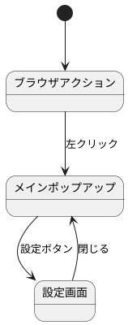
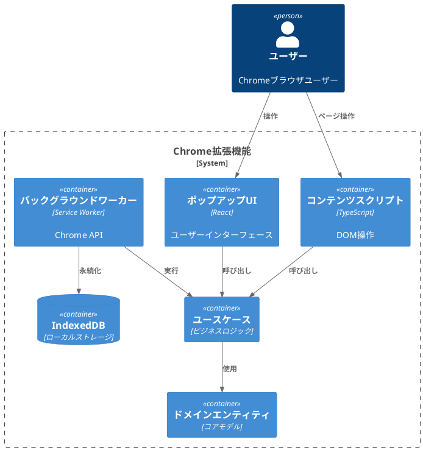
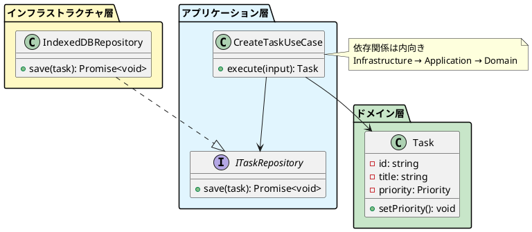
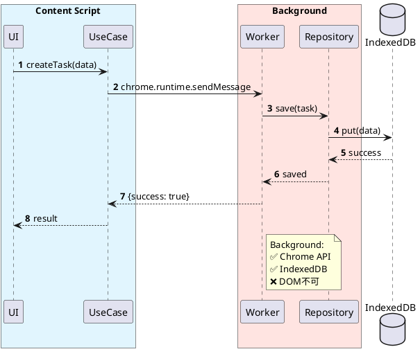

# Chrome拡張機能開発ドキュメント完全ガイド
## WXTフレームワーク + Clean Architecture + AI支援開発

**バージョン:** 1.0.0  
**最終更新:** 2025-11-09

---

## 目次

1. [はじめに](#はじめに)
2. [主要な調査結果](#主要な調査結果)
3. [推奨ドキュメント階層](#推奨ドキュメント階層)
4. [要件定義ドキュメント](#要件定義ドキュメント)
5. [基本設計ドキュメント](#基本設計ドキュメント)
6. [画面仕様ドキュメント](#画面仕様ドキュメント)
7. [Chrome拡張機能アーキテクチャ制約](#chrome拡張機能アーキテクチャ制約)
8. [PlantUML図パターン](#plantuml図パターン)
9. [AI支援開発のための記述方法](#ai支援開発のための記述方法)
10. [日本の設計ドキュメント実践](#日本の設計ドキュメント実践)
11. [VSCodeワークフロー統合](#vscodeワークフロー統合)
12. [テストドキュメント戦略](#テストドキュメント戦略)
13. [トレーサビリティ管理](#トレーサビリティ管理)
14. [スプレッドシート移行](#スプレッドシート移行)
15. [実装チェックリスト](#実装チェックリスト)
16. [まとめと推奨事項](#まとめと推奨事項)

---

# はじめに

本ドキュメントは、WXTフレームワークとClean Architectureを使用したChrome拡張機能開発における、要件定義から実装までの包括的なドキュメント作成ガイドです。AIコーディングツール（Claude Code、Cursor等）が効果的に活用できる形式で設計されています。

## 対象読者

- Chrome拡張機能を開発する個人開発者
- WXTフレームワークを使用するプロジェクト
- Clean Architectureを採用するチーム
- AI支援開発ツールを活用したい開発者
- ポートフォリオ目的で高品質なドキュメントを作成したい方

## 本ガイドの使い方

1. **プロジェクト開始時**: [推奨ドキュメント階層](#推奨ドキュメント階層)を参照してディレクトリ構造を作成
2. **要件定義フェーズ**: [要件定義ドキュメント](#要件定義ドキュメント)のテンプレートを使用
3. **設計フェーズ**: [基本設計ドキュメント](#基本設計ドキュメント)と[画面仕様](#画面仕様ドキュメント)を作成
4. **実装フェーズ**: [AI支援開発のための記述方法](#ai支援開発のための記述方法)を参照しながら詳細化
5. **レビュー・納品**: [スプレッドシート移行](#スプレッドシート移行)でExcel形式に変換

---

# 主要な調査結果

WXTフレームワークとClean Architectureで構築されたChrome拡張機能の設計ドキュメントには、従来のソフトウェア設計ドキュメントでは見落とされがちな**ブラウザ固有の制約を明示的に文書化**する必要があります。

## 最も重要な発見

バックグラウンドサービスワーカーとコンテンツスクリプトが根本的に異なる機能を持っているという点です。

### background.tsの特性
- ✅ 完全なChrome APIアクセス
- ✅ IndexedDBアクセス
- ✅ ネットワークリクエスト（CORS制限なし）
- ❌ DOMアクセス不可
- ❌ window/documentオブジェクトなし
- ❌ localStorage不可
- ⚠️ 30秒非アクティブで終了

### content.tsの特性
- ✅ DOMアクセス
- ✅ IndexedDBアクセス
- ✅ chrome.storage API
- ❌ ほとんどのChrome API制限
- ❌ ページJavaScript変数アクセス不可（isolated world）
- ⚠️ ページのCSPに従う

Claude CodeのようなAIコーディングツールが正しい実装を生成するためには、設計ドキュメントで**どの層がどの操作を処理するか、そしてその理由を明示的に記述**する必要があります。

## 最適なドキュメント形式

**構造のためのMarkdownとアーキテクチャ図のためのPlantUMLを組み合わせ**、コードと一緒にバージョン管理に保存するアプローチです。

**利点:**
- ✅ AIツールがコンテキストとして解析可能
- ✅ 人間の可読性も維持
- ✅ バージョン管理でdiff確認可能
- ✅ VSCode内で完結
- ✅ スプレッドシート移行も容易

## 日本のソフトウェアエンジニアリング実践の活用

日本のソフトウェアエンジニアリング実践では、包括的なテーブルベースの仕様書（基本設計書）が重視されており、これはChrome拡張機能ドキュメントのニーズに適しています。

**特に有効な要素:**
- 権限マトリクステーブル
- 制約一覧テーブル
- 機能一覧表
- 画面項目定義表
- データベーステーブル定義
- 更新履歴と承認フロー

---

# 推奨ドキュメント階層

## 完全なディレクトリ構造

```
project-root/
├── docs/
│   ├── requirements/                          # 要件定義（上位抽象度）
│   │   ├── 01-business-requirements.md       # ビジネス要求
│   │   ├── 02-functional-requirements.md     # 機能要件
│   │   ├── 03-non-functional-requirements.md # 非機能要件
│   │   ├── 04-user-stories.md                # ユーザーストーリー
│   │   ├── 05-use-cases.md                   # ユースケース
│   │   ├── 06-chrome-specific-requirements.md # Chrome拡張機能固有要件
│   │   └── diagrams/
│   │       ├── use-case-diagram.puml         # ユースケース図
│   │       ├── user-journey.puml             # ユーザージャーニー
│   │       └── context-diagram.puml          # コンテキスト図
│   │
│   ├── design/                                # 基本設計書
│   │   ├── 00-overview.md                     # システム概要と技術スタック
│   │   ├── 01-architecture.md                 # Clean Architecture + Chrome拡張機能マッピング
│   │   ├── 02-domain-layer.md                 # エンティティ、値オブジェクト、ビジネスルール
│   │   ├── 03-application-layer.md            # ユースケースとオーケストレーション
│   │   ├── 04-interface-adapters.md           # コントローラー、プレゼンター、ゲートウェイ
│   │   ├── 05-infrastructure.md               # Chrome API、IndexedDB、外部サービス
│   │   ├── 06-entrypoints.md                  # WXTエントリーポイント設定
│   │   ├── 07-data-schema.md                  # IndexedDBスキーマとマイグレーション
│   │   ├── 08-constraints-matrix.md           # Chrome拡張機能制約リファレンス
│   │   ├── adr/                               # アーキテクチャ決定記録
│   │   │   ├── 001-use-clean-architecture.md
│   │   │   ├── 002-wxt-framework.md
│   │   │   └── 003-indexeddb-storage.md
│   │   └── screens/                           # 画面仕様（基本設計の一部）
│   │       ├── 00-screen-list.md             # 画面一覧とナビゲーション
│   │       ├── popup/
│   │       │   ├── main-popup.md             # メインポップアップ画面仕様
│   │       │   └── components.md             # ポップアップ共通コンポーネント
│   │       ├── options/
│   │       │   ├── settings.md               # 設定画面仕様
│   │       │   └── about.md                  # About画面仕様
│   │       ├── content/
│   │       │   ├── overlay-ui.md             # コンテンツスクリプトオーバーレイUI
│   │       │   └── inline-widget.md          # インライン挿入ウィジェット
│   │       ├── sidepanel/
│   │       │   └── main-panel.md             # サイドパネル仕様
│   │       └── components/
│   │           ├── common-components.md      # 共通UIコンポーネント
│   │           └── forms.md                  # フォームコンポーネント
│   │
│   ├── diagrams/                              # アーキテクチャ図
│   │   ├── architecture-overview.puml
│   │   ├── domain-model.puml
│   │   ├── sequence-flows.puml
│   │   ├── layer-boundary.puml
│   │   └── data-schema.puml
│   │
│   ├── mockups/                               # 画面モックアップ・ワイヤーフレーム
│   │   ├── popup/
│   │   ├── options/
│   │   └── content/
│   │
│   ├── api/                                   # API仕様（外部連携がある場合）
│   │   ├── external-api-spec.md
│   │   └── chrome-api-usage.md
│   │
│   └── traceability/                          # トレーサビリティマトリクス
│       └── requirements-to-implementation.md  # 要件→設計→実装の対応表
│
├── .cursorrules                               # Cursor AI設定
├── .clinerules                                # Cline AI設定
└── README.md
```

## ディレクトリ構成の設計原則

### 1. 抽象度による階層化

```
要件定義（WHY・WHAT）
    ↓ なぜ作るのか、何を作るのか
基本設計（WHAT・HOW）
    ↓ どのように実現するか
詳細設計・実装（HOW）
    ↓ 具体的なコード
```

### 2. 関心の分離

- **requirements/**: ビジネス視点、ユーザー視点
- **design/**: 技術視点、アーキテクチャ視点
- **diagrams/**: 視覚的表現
- **traceability/**: 横断的な追跡

### 3. AI支援開発への最適化

- 自己完結型のドキュメント
- 明確なファイル命名規則
- コンテキスト参照が容易な構造

## ドキュメント作成順序

### Phase 0: プロジェクト初期化（Day 1）
```bash
mkdir -p docs/{requirements/diagrams,design/{adr,screens/{popup,options,content,sidepanel,components}},diagrams,mockups,api,traceability}
touch README.md
```

### Phase 1: 要件定義（Week 1-2）
1. `requirements/01-business-requirements.md`
2. `requirements/02-functional-requirements.md`
3. `requirements/04-user-stories.md`
4. `requirements/03-non-functional-requirements.md`
5. `requirements/05-use-cases.md`
6. `requirements/06-chrome-specific-requirements.md`

### Phase 2: 基本設計（Week 3-4）
1. `design/00-overview.md`
2. `design/01-architecture.md`
3. `design/08-constraints-matrix.md`
4. `design/screens/00-screen-list.md`
5. 主要画面仕様

### Phase 3: 詳細設計（Week 5-6）
1. `design/02-domain-layer.md`
2. `design/03-application-layer.md`
3. `design/04-interface-adapters.md`
4. `design/05-infrastructure.md`
5. `design/06-entrypoints.md`
6. `design/07-data-schema.md`

### Phase 4: トレーサビリティ（Week 7）
1. `traceability/requirements-to-implementation.md`
2. ADR作成

---

# 要件定義ドキュメント

要件定義は基本設計より上位の抽象度で、「なぜこの拡張機能を作るのか」「何ができる必要があるか」を明確にします。

## 1. ビジネス要求定義書（01-business-requirements.md）

### テンプレート構成

```markdown
# ビジネス要求定義書

## プロジェクト概要

### プロジェクト名
[Chrome拡張機能の名称]

### 目的
[この拡張機能を開発する目的]

### ステークホルダー
| ステークホルダー | 役割 | 期待する価値 |
|----------------|------|-------------|
| エンドユーザー | 利用者 | 作業効率の向上 |
| 開発者 | 作成者 | ポートフォリオ、技術習得 |

## ビジネス目標

### 成功指標（KPI）
| 指標 | 目標値 | 測定方法 |
|-----|-------|---------|
| 月間アクティブユーザー | 1,000 | Google Analytics |
| 週間利用頻度 | 週3回以上 | 拡張機能内トラッキング |

## ターゲットユーザー

### プライマリペルソナ
**名前:** 田中太郎（仮名）
**属性:** フロントエンド開発者、28歳、中級〜上級
**課題:** 複数ツール間の切り替えに時間がかかる
**期待:** ブラウザ上で作業を完結できる

## スコープ

### 対象範囲（In Scope）
- タスクCRUD操作
- 優先度管理
- 期限設定と通知

### 対象外（Out of Scope）
- Firefox対応（Phase 2で検討）
- クラウド同期

## 制約条件

### 技術的制約
- Chrome Manifest V3準拠
- Chrome最新版から2つ前のバージョンまでサポート
- オフライン動作は限定的

### 法的・コンプライアンス制約
- ユーザーデータは全てローカルに保存（GDPR準拠）
- Chrome Web Storeポリシー準拠
```

## 2. 機能要件定義書（02-functional-requirements.md）

### テンプレート構成

```markdown
# 機能要件定義書

## 機能一覧

| 機能ID | 機能名 | 優先度 | 実装フェーズ |
|-------|--------|--------|------------|
| F-001 | タスク管理 | 必須 | Phase 1 |
| F-002 | データ管理 | 必須 | Phase 1 |
| F-003 | 通知機能 | 必須 | Phase 1 |

## 詳細機能要件

### F-001: タスク管理機能

#### F-001-1: タスク作成

**入力:**
| 項目 | 型 | 必須/任意 | 制約 |
|-----|----|---------|----|
| タスク名 | string | 必須 | 1-100文字 |
| 優先度 | enum | 任意 | high/medium/low |

**処理フロー:**
1. ユーザーが「新規タスク」ボタンをクリック
2. タスク作成モーダルを表示
3. ユーザーが情報を入力
4. バリデーション実行
5. IndexedDBに保存
6. UI更新

**ビジネスルール:**
- タスク名は必須
- 優先度デフォルトは「中」
- 期限は現在日時以降のみ

**受け入れ基準:**
- [ ] タスク名のみで作成可能
- [ ] 作成後すぐに一覧に表示
- [ ] 作成時間が200ms以内

**要件トレーサビリティ:**
- ユーザーストーリー: US-001
- 画面: SCR-P01
- 実装ファイル: `src/application/usecases/CreateTaskUseCase.ts`
```

## 3. 非機能要件定義書（03-non-functional-requirements.md）

### テンプレート構成

```markdown
# 非機能要件定義書

## パフォーマンス要件

### レスポンス時間
| 操作 | 目標時間 | 最大許容時間 |
|-----|---------|------------|
| ポップアップ表示 | 100ms | 200ms |
| タスク作成 | 50ms | 100ms |

### リソース使用量
| リソース | 目標値 | 最大許容値 |
|---------|-------|----------|
| メモリ使用量 | 50MB | 100MB |
| IndexedDB使用量 | 5MB | 10MB |

## セキュリティ要件

### データ保護
- 保存データ: すべてローカル
- 外部送信: なし
- アクセス制御: 拡張機能内のみ

### 権限管理
| 権限 | 必要性 | セキュリティ影響 |
|-----|-------|---------------|
| storage | 必須 | 低 |
| notifications | 必須 | 低 |

## ユーザビリティ要件

### アクセシビリティ
- WCAG 2.1 Level AA準拠
- キーボード操作のみで全機能利用可能
- スクリーンリーダー対応

### 多言語対応
- 初期リリース: 日本語、英語
- chrome.i18n APIを使用
```

## 4. ユーザーストーリー（04-user-stories.md）

### テンプレート

```markdown
# ユーザーストーリー

## テンプレート
```
As a [ユーザーの役割]
I want to [やりたいこと]
So that [達成したい目的/得られる価値]
```

## Epic 1: タスク管理

### US-001: タスクを素早く作成したい

**As a** 開発者  
**I want to** ブラウザ上でワンクリックでタスクを作成する  
**So that** 作業中断を最小限にしてタスクを記録できる

**受け入れ基準:**
- [ ] ポップアップからタスク名だけで作成可能
- [ ] 作成後すぐに一覧に表示される
- [ ] 作成時間が200ms以内

**優先度:** 高  
**ストーリーポイント:** 5  
**関連:** F-001-1, UC-001, SCR-P01
```

## 5. ユースケース定義書（05-use-cases.md）

### テンプレート

```markdown
# ユースケース定義書

## UC-001: タスク作成

**概要:** ユーザーが新しいタスクを作成する

**アクター:** ユーザー

**事前条件:**
- 拡張機能がインストールされている
- ポップアップが開かれている

**基本フロー:**
1. ユーザーがポップアップを開く
2. 「新規タスク」ボタンをクリック
3. タスク作成モーダルを表示
4. タスク情報を入力
5. バリデーション実行
6. IndexedDBに保存
7. UI更新

**代替フロー:**
- A1: バリデーションエラー → エラーメッセージ表示
- A2: ストレージ容量超過 → 警告表示

**例外フロー:**
- E1: IndexedDBエラー → エラーログ記録、再試行促進
```

## 6. Chrome拡張機能固有要件（06-chrome-specific-requirements.md）

### テンプレート

```markdown
# Chrome拡張機能固有要件

## Manifest V3要件

### 必須設定
```json
{
  "manifest_version": 3,
  "permissions": ["storage", "notifications"],
  "action": {
    "default_popup": "popup.html"
  }
}
```

## 権限要求の正当化

### storage
**目的:** タスクデータの永続化  
**ユーザーへの説明:** 「タスクデータを保存するために必要です」

### notifications
**目的:** タスク期限通知  
**ユーザーへの説明:** 「タスクの期限が近づいた際に通知します」

## コンテキスト別の制約

### Background Service Worker
**制約:**
- 30秒間非アクティブで終了
- DOM/windowアクセス不可

**設計への影響:**
- chrome.storage.local使用
- chrome.alarms使用

### Content Scripts
**制約:**
- Isolated worldで実行
- 制限されたChrome API

**設計への影響:**
- DOM操作のみ
- Chrome API操作はbackgroundにメッセージ
```

---

# 基本設計ドキュメント

基本設計はClean Architectureの各層とChrome拡張機能の実行コンテキストをマッピングし、技術的な実現方法を定義します。

## 1. システム概要（00-overview.md）

### 必須要素

```markdown
# システム概要

## 拡張機能概要
**名称:** [拡張機能名]  
**バージョン:** 1.0.0  
**Manifest:** V3  

## 技術スタック
- フレームワーク: WXT 0.17.x
- 言語: TypeScript 5.x (strict mode)
- UI: React 18.x
- ストレージ: IndexedDB, chrome.storage
- テスト: Jest, Puppeteer

## アーキテクチャ
- Clean Architecture
- Domain-Driven Design
- CQRS (Command Query Responsibility Segregation)

## 開発環境
- Node.js: 20.x
- パッケージマネージャー: pnpm
- エディタ: VSCode
```

## 2. アーキテクチャマッピング（01-architecture.md）

### 層からコンテキストへのマッピング

```markdown
# アーキテクチャ

## Clean Architecture + Chrome拡張機能マッピング

| Clean Architecture層 | Background.ts | Content.ts | Popup/Options |
|-------------------------|---------------|------------|---------------|
| Domain（エンティティ） | ✅ 共有 | ✅ 共有 | ✅ 共有 |
| Application（ユースケース） | ✅ 共有 | ✅ 共有 | ✅ 共有 |
| Interface Adapters | ✅ ChromeAdapter | ✅ DOMAdapter | ✅ UIAdapter |
| Infrastructure | ✅ StorageImpl、APIImpl | ✅ ContentAPIImpl | ✅ UIStorageImpl |

## 依存関係ルール
依存関係は内向きに流れる:
- Infrastructure → Application → Domain
- 逆方向の依存は禁止（依存性逆転の原則）
```

## 3. ドメイン層（02-domain-layer.md）

### テンプレート

```markdown
# ドメイン層設計

## エンティティ

### Task Entity
```typescript
interface TaskProps {
  id: string;
  title: string;
  description: string;
  priority: Priority;
  status: TaskStatus;
  dueDate?: Date;
  createdAt: Date;
  updatedAt: Date;
}

class Task extends Entity<TaskProps> {
  // ビジネスルール
  setPriority(priority: Priority): void {
    if (this.props.status === 'completed' && priority === 'low') {
      throw new DomainError('完了タスクを低優先度にできません');
    }
    this.props.priority = priority;
  }
}
```

## 値オブジェクト

### Priority Value Object
```typescript
type PriorityValue = 'high' | 'medium' | 'low';

class Priority extends ValueObject<PriorityValue> {
  toNumber(): number {
    const map = { high: 3, medium: 2, low: 1 };
    return map[this.value];
  }
}
```

## ビジネスルール
1. 完了タスクは低優先度に変更不可
2. タスク名は必須
3. 期限は現在日時以降のみ
```

## 4. アプリケーション層（03-application-layer.md）

### テンプレート

```markdown
# アプリケーション層設計

## ユースケース

### CreateTaskUseCase
```typescript
interface CreateTaskInput {
  title: string;
  description?: string;
  priority?: Priority;
  dueDate?: Date;
}

class CreateTaskUseCase {
  constructor(
    private taskRepository: ITaskRepository,
    private notificationService: INotificationService
  ) {}
  
  async execute(input: CreateTaskInput): Promise<Task> {
    // 1. エンティティ生成
    const task = Task.create(input);
    
    // 2. 保存
    await this.taskRepository.save(task);
    
    // 3. 通知
    await this.notificationService.notify('タスクを作成しました');
    
    return task;
  }
}
```

## リポジトリインターフェース

### ITaskRepository
```typescript
interface ITaskRepository {
  save(task: Task): Promise<void>;
  findById(id: string): Promise<Task | null>;
  findAll(): Promise<Task[]>;
  delete(id: string): Promise<void>;
}
```
```

## 5. インターフェースアダプター層（04-interface-adapters.md）

### テンプレート

```markdown
# インターフェースアダプター層設計

## コントローラー

### TaskMessageController
**実行コンテキスト:** Background Service Worker

```typescript
class TaskMessageController {
  constructor(
    private createTaskUseCase: CreateTaskUseCase
  ) {}
  
  async handleCreateTask(message: CreateTaskMessage): Promise<Response> {
    try {
      const task = await this.createTaskUseCase.execute(message.data);
      return { success: true, task: TaskMapper.toDTO(task) };
    } catch (error) {
      return { success: false, error: error.message };
    }
  }
}
```

## プレゼンター

### TaskListPresenter
**実行コンテキスト:** Content Script, Popup

```typescript
class TaskListPresenter {
  present(tasks: Task[]): TaskViewModel[] {
    return tasks.map(task => ({
      id: task.id,
      title: task.title,
      priorityColor: this.getPriorityColor(task.priority),
      isOverdue: task.dueDate && task.dueDate < new Date()
    }));
  }
}
```
```

## 6. インフラストラクチャ層（05-infrastructure.md）

### テンプレート

```markdown
# インフラストラクチャ層設計

## リポジトリ実装

### IndexedDBTaskRepository
**実行コンテキスト:** Background Service Worker

```typescript
class IndexedDBTaskRepository implements ITaskRepository {
  async save(task: Task): Promise<void> {
    const db = await this.openDB();
    const tx = db.transaction(['tasks'], 'readwrite');
    const store = tx.objectStore('tasks');
    await store.put(TaskMapper.toPersistence(task));
    await tx.complete;
  }
  
  async findById(id: string): Promise<Task | null> {
    const db = await this.openDB();
    const data = await db.get('tasks', id);
    return data ? TaskMapper.toDomain(data) : null;
  }
}
```

## Chrome API実装

### ChromeNotificationService
**実行コンテキスト:** Background Service Worker

```typescript
class ChromeNotificationService implements INotificationService {
  async notify(message: string): Promise<void> {
    await chrome.notifications.create({
      type: 'basic',
      iconUrl: 'icon.png',
      title: 'タスク管理',
      message
    });
  }
}
```
```

## 7. WXTエントリーポイント（06-entrypoints.md）

### テンプレート

```markdown
# WXTエントリーポイント設計

## ファイル構造

```
entrypoints/
├── background.ts              # Background Service Worker
├── content.ts                # Content Script
├── popup/
│   ├── index.html
│   └── main.tsx
└── options/
    ├── index.html
    └── main.tsx
```

## 設定パターン

### background.ts
```typescript
export default defineBackground({
  type: 'module',
  persistent: false,
  
  main() {
    // アクセス可能: すべてのChrome API
    // アクセス不可: DOM、window、document
    // 状態: 30秒で終了、chrome.storageで永続化
    
    chrome.runtime.onMessage.addListener((message, sender, sendResponse) => {
      // メッセージハンドリング
    });
  }
});
```

### content.ts
```typescript
export default defineContentScript({
  matches: ['*://*.example.com/*'],
  runAt: 'document_idle',
  world: 'ISOLATED',
  
  main(ctx) {
    // アクセス可能: DOM、制限されたChrome API
    // アクセス不可: ほとんどのChrome API
    // 通信: chrome.runtime.sendMessageでbackgroundへ
    
    // UI注入
    const container = document.createElement('div');
    document.body.appendChild(container);
  }
});
```
```

## 8. データスキーマ（07-data-schema.md）

### テンプレート

```markdown
# データスキーマ設計

## IndexedDB: TaskDB

### バージョン1（初期スキーマ）

#### tasks オブジェクトストア
```typescript
interface TaskRecord {
  id: string;              // Primary key
  title: string;
  description: string;
  priority: 'high' | 'medium' | 'low';
  status: 'pending' | 'completed';
  dueDate: number | null;  // Unix timestamp
  createdAt: number;
  updatedAt: number;
}
```

**インデックス:**
- `statusIdx`: keyPath 'status'
- `dueDateIdx`: keyPath 'dueDate'

**マイグレーション:**
```typescript
case 0: {
  const taskStore = db.createObjectStore('tasks', { keyPath: 'id' });
  taskStore.createIndex('statusIdx', 'status', { unique: false });
  taskStore.createIndex('dueDateIdx', 'dueDate', { unique: false });
}
```

### バージョン2（優先度インデックス追加）

**変更点:**
- 'tasks'に'priorityIdx'インデックス追加

**マイグレーション:**
```typescript
case 1: {
  const taskStore = transaction.objectStore('tasks');
  taskStore.createIndex('priorityIdx', 'priority', { unique: false });
}
```
```

## 9. 制約マトリクス（08-constraints-matrix.md）

### テンプレート

```markdown
# Chrome拡張機能制約マトリクス

## Background Service Worker制約

| 操作 | 許可 | 制約 | 代替手段 |
|-----------|---------|------------|-------------|
| Chrome API | ✅ | フルアクセス | - |
| DOM操作 | ❌ | window/documentなし | Content Scriptを使用 |
| localStorage | ❌ | Service Worker制限 | chrome.storageを使用 |
| 長時間タイマー | ❌ | 30秒で終了 | chrome.alarmsを使用 |
| グローバル変数 | ❌ | 再起動でリセット | chrome.storageを使用 |

## Content Script制約

| 操作 | 許可 | 制約 | 代替手段 |
|-----------|---------|------------|-------------|
| DOMアクセス | ✅ | フルアクセス | - |
| chrome.tabs | ❌ | API制限 | Backgroundにメッセージ |
| chrome.storage | ✅ | 共有ストレージ | - |
| ページJS変数 | ❌ | Isolated world | window.postMessage |
| CORSバイパス | ❌ | ページCSP従う | Backgroundで fetch |
```

---

# 画面仕様ドキュメント

画面仕様は基本設計の一部として、ユーザーが実際に見る画面/ビュー単位で詳細を文書化します。

## 1. 画面一覧（00-screen-list.md）

### テンプレート

```markdown
# 画面一覧とナビゲーション

## 画面一覧

| 画面ID | 画面名 | タイプ | エントリーポイント | 優先度 |
|-------|--------|-------|------------------|--------|
| SCR-P01 | メインポップアップ | Popup | popup/index.html | 必須 |
| SCR-O01 | 設定画面 | Options | options/index.html | 必須 |
| SCR-C01 | オーバーレイUI | Content | content.ts | 必須 |

## 画面遷移図


```

## 2. ポップアップ画面仕様（popup/main-popup.md）

### テンプレート

```markdown
# メインポップアップ画面仕様

## 画面情報
- 画面ID: SCR-P01
- サイズ: 400x600px（固定）
- エントリーポイント: `entrypoints/popup/index.html`

## ワイヤーフレーム
```
┌────────────────────────┐
│ [ロゴ] タスク管理 [⚙][✕]│ ← ヘッダー
├────────────────────────┤
│ [➕新規] [🔍] [▼フィルタ]│ ← ツールバー
├────────────────────────┤
│ □ タスク1(高) [編集]  │
│ □ タスク2(中) [編集]  │ ← タスクリスト
│ ☑ タスク3(完了) [削除] │
├────────────────────────┤
│ 全3件 v1.0.0          │ ← フッター
└────────────────────────┘
```

## UI要素仕様

### 新規タスクボタン
```typescript
interface NewTaskButton {
  label: '➕ 新規タスク';
  onClick: () => openTaskModal();
  disabled: isStorageFull;
}
```

### タスクアイテム
```typescript
interface TaskItem {
  task: {
    id: string;
    title: string;
    priority: 'high' | 'medium' | 'low';
    completed: boolean;
  };
  onToggle: (id: string) => void;
  onEdit: (id: string) => void;
}
```

## インタラクション

### タスク作成フロー
```
1. ユーザーが「新規タスク」クリック
2. モーダル表示
3. 情報入力
4. バリデーション
5. Backgroundにメッセージ送信
6. UI更新
```

## アクセシビリティ

| キー | 動作 |
|-----|------|
| Tab | フォーカス移動 |
| Enter | 実行 |
| Esc | モーダルを閉じる |
| Ctrl+N | 新規タスク |
```

## 3. 設定画面仕様（options/settings.md）

### テンプレート

```markdown
# 設定画面仕様

## 画面情報
- 画面ID: SCR-O01
- タイプ: Optionsページ（フルページ）
- エントリーポイント: `entrypoints/options/index.html`

## 設定項目

### 一般設定
| 項目 | 種類 | デフォルト |
|-----|------|----------|
| 言語 | ドロップダウン | ブラウザ言語 |
| テーマ | ラジオボタン | ライト |

### 通知設定
| 項目 | 種類 | デフォルト |
|-----|------|----------|
| 通知を有効化 | トグル | ON |
| 期限通知 | ドロップダウン | 1日前 |

## インタラクション

### 設定変更フロー
```
1. ユーザーが設定変更
2. Stateに反映
3. dirtyフラグON
4. 「保存」ボタン有効化
5. 保存クリック
6. chrome.storage.sync.set()
7. 成功トースト表示
```
```

## 4. コンテンツスクリプトUI（content/overlay-ui.md）

### テンプレート

```markdown
# オーバーレイUI仕様

## 画面情報
- 画面ID: SCR-C01
- タイプ: Content Script注入UI
- エントリーポイント: `entrypoints/content.ts`
- 表示対象: `https://example.com/*`

## UIコンポーネント

### フローティングボタン
- 位置: 右下固定
- サイズ: 56x56px
- z-index: 2147483647

### オーバーレイパネル
- 位置: 右下
- サイズ: 320x400px
- Shadow DOM使用（ページCSSの影響を回避）

## 制約事項

### Content Script制約
- Shadow DOM使用必須
- ページJSとはwindow.postMessage経由
- Chrome API操作はBackgroundにメッセージ

### z-index管理
- フローティングボタン: 2147483647
- オーバーレイパネル: 2147483646
```

---

# Chrome拡張機能アーキテクチャ制約

従来のWebアプリケーションには、Chrome拡張機能ほど厳格な実行コンテキストの境界がありません。

## 実行コンテキストの理解

### Background Service Worker

**特性:**
- ✅ 完全なChrome APIアクセス
- ✅ IndexedDB、chrome.storage
- ✅ ネットワークリクエスト（CORS制限なし）
- ❌ DOMアクセス不可
- ❌ window/documentオブジェクトなし
- ❌ localStorage不可
- ⚠️ 30秒非アクティブで終了

**設計への影響:**
- 永続化: chrome.storage.local またはIndexedDB
- 長時間タイマー: chrome.alarms使用
- データはメモリに保持できない（再起動でリセット）

### Content Script

**特性:**
- ✅ DOMアクセス
- ✅ IndexedDB、chrome.storage
- ❌ ほとんどのChrome API制限
- ❌ ページJavaScript変数アクセス不可（isolated world）
- ⚠️ ページのCSPに従う

**設計への影響:**
- DOM操作のみに使用
- Chrome API操作はBackgroundにメッセージ送信
- ページコンテキストとはwindow.postMessage

### Popup / Options

**特性:**
- ✅ 完全なChrome APIアクセス
- ✅ DOMアクセス
- ⚠️ 短命（ポップアップを閉じると終了）

**設計への影響:**
- 状態はchrome.storageで永続化
- 計算結果のキャッシング

## コンテキスト間通信パターン

### Content → Background

```typescript
// Content Script
const response = await chrome.runtime.sendMessage({
  type: 'CREATE_TASK',
  data: { title: 'タスク' }
});

// Background
chrome.runtime.onMessage.addListener((message, sender, sendResponse) => {
  if (message.type === 'CREATE_TASK') {
    // 処理
    sendResponse({ success: true });
    return true; // 非同期レスポンス
  }
});
```

### Background → Content

```typescript
// Background
await chrome.tabs.sendMessage(tabId, {
  type: 'UPDATE_UI',
  data: { tasks }
});

// Content Script
chrome.runtime.onMessage.addListener((message) => {
  if (message.type === 'UPDATE_UI') {
    // UI更新
  }
});
```

### Content ↔ Page Context

```typescript
// Content Script → Page
window.postMessage({
  type: 'FROM_EXTENSION',
  data: {}
}, '*');

// Page → Content Script
window.addEventListener('message', (event) => {
  if (event.data.type === 'FROM_PAGE') {
    // 処理
  }
});
```

---

# PlantUML図パターン

テキストドキュメントを補完する視覚的表現を作成するためにPlantUMLを使用します。

## アーキテクチャ概要図



## 層境界図



## シーケンス図



---

# AI支援開発のための記述方法

Claude Code等のAIツールはドキュメントをコンテキストウィンドウとして解析するため、構造が重要です。

## 自己完結型セクションの書き方

各セクションは独立して理解可能である必要があります。

**悪い例（外部コンテキストに依存）:**
```markdown
### データ保存
タスクデータをIndexedDBに保存します。
```

**良い例（自己完結型）:**
```markdown
### データ保存

**実行コンテキスト:** Background Service Worker  
**理由:** データの一元管理とトランザクション制御

**制約:**
- Background Service Workerは30秒で終了
- localStorage不可、chrome.storage.local使用

**実装場所:** `src/infrastructure/repositories/IndexedDBTaskRepository.ts`

**通信フロー:**
```
Content Script (UI)
  ↓ chrome.runtime.sendMessage
Background Service Worker
  ↓ IndexedDB操作
データ保存完了
  ↓ レスポンス
Content Script (UI更新)
```
```

## 明示的な制約ドキュメント

AIツールは明示的な「可能/不可能」ステートメントから利益を得ます。

```markdown
### Content Script通信パターン

**できないこと:**
❌ `chrome.tabs.query()`を直接呼び出せない
❌ `chrome.storage.local.set()`を直接呼び出せない
❌ CORSバイパスされたリクエスト不可
❌ ページJavaScriptのグローバル変数アクセス不可

**代わりにすべきこと:**
✅ Chrome API操作はBackgroundにメッセージ送信
✅ `chrome.runtime.sendMessage()`を使用
✅ ページコンテキスト通信は`window.postMessage()`

**パターン例:**
```typescript
// ❌ 誤り
chrome.tabs.query({ active: true }, tabs => {});

// ✅ 正しい
const response = await chrome.runtime.sendMessage({
  type: 'GET_ACTIVE_TAB_INFO'
});
```
```

## 機能仕様テンプレート

AIツールが機械的に従えるテンプレートを使用します。

```markdown
## 機能: [機能名]

### ビジネスコンテキスト
[なぜこの機能が必要か]

### Clean Architecture層の変更

#### ドメイン層
**新規エンティティ:**
- EntityName: [説明]

#### アプリケーション層
**新規ユースケース:**
- UseCaseName
  - **実装ファイル:** `src/application/usecases/UseCaseName.ts`
  - **依存関係:** [リポジトリ/サービス]

#### インフラストラクチャ層
**Chromeコンテキスト:** [Background/Content/Both]

**新規実装:**
- RepositoryImpl
  - **ファイル:** `src/infrastructure/repositories/RepositoryImpl.ts`
  - **コンテキスト:** background
  - **使用API:** [Chrome API一覧]

**制約:**
- [Chrome拡張機能固有の制限]

### データスキーマ変更

**IndexedDBバージョン:** [インクリメント]

**マイグレーション:**
```typescript
case previousVersion: {
  const store = db.createObjectStore('NewStore', {
    keyPath: 'id'
  });
}
```

### テストケース
- [ ] ユニットテスト
- [ ] 統合テスト
- [ ] E2Eテスト
```

## AIツール統合設定（.cursorrules）

```markdown
# Chrome拡張機能設計ドキュメントコンテキスト

## プロジェクトタイプ
WXT framework Chrome extension with Clean Architecture

## Chrome拡張機能実行コンテキスト
- **Background Service Worker:** Full Chrome API, no DOM, terminates after 30s
- **Content Scripts:** DOM access, limited Chrome APIs, must message background
- **Popup/Options:** Full Chrome API + DOM, short-lived

## コード生成ルール
1. コードがどのChromeコンテキストで実行されるか確認
2. Content Scriptでchrome.tabs使用禁止
3. BackgroundからDOM操作禁止
4. localStorage禁止、chrome.storage使用
5. Background timersはchrome.alarms使用
6. クロスコンテキスト通信はchrome.runtime.sendMessage

## 参照ファイル
@docs/design/08-constraints-matrix.md
@docs/design/01-architecture.md
@docs/diagrams/architecture-overview.puml
```

---

# 日本の設計ドキュメント実践

日本のソフトウェアエンジニアリング実践（基本設計書アプローチ）の有効な要素を活用します。

## 制約仕様テーブル（日本式）

### 拡張機能権限一覧

| 権限名 | 必要性 | 使用箇所 | 理由 |
|-------------------|------------------|---------------|-----------------|
| storage | 必須 | Background、Content | ユーザー設定とキャッシュの保存 |
| tabs | 必須 | Background | アクティブタブ情報の取得 |
| activeTab | 必須 | Background | タブへのメッセージ送信 |
| https://*.example.com/* | 必須 | Content | 特定サイトでのコンテンツスクリプト実行 |

### Chrome API制約マトリクス

| API名 | Background | Content | Popup | 制約事項 |
|------|-----------|---------|-------|---------|
| chrome.tabs | ✅ | ❌ | ✅ | Content scriptからは使用不可 |
| chrome.storage | ✅ | ✅ | ✅ | 全コンテキストで使用可能 |
| chrome.alarms | ✅ | ❌ | ❌ | Backgroundのみ |
| DOM API | ❌ | ✅ | ✅ | Backgroundでは使用不可 |

## 更新履歴と承認フロー

```markdown
## 更新履歴

| バージョン | 更新日 | 更新者 | 更新内容 | 承認者 |
|----------|--------|--------|---------|--------|
| 1.0 | 2024-11-01 | 山田太郎 | 初版作成 | 佐藤花子 |
| 1.1 | 2024-11-08 | 山田太郎 | IndexedDBスキーマ追加 | 佐藤花子 |

## 承認フロー
- 作成者: [名前]
- レビュアー: [名前]
- 承認者: [名前]
- 最終承認日: [日付]
```

---

# VSCodeワークフロー統合

PlantUMLプレビューとAIツール統合のために最適な設計ドキュメントワークフローのためにVSCodeを設定します。

## VSCode拡張機能と設定

### 必要な拡張機能
- PlantUML (jebbs.plantuml)
- Markdown All in One
- Markdown Preview Enhanced（オプション）

### VSCode settings.json

```json
{
  "plantuml.server": "http://localhost:8080",
  "plantuml.render": "PlantUMLServer",
  "plantuml.exportOutDir": "docs/diagrams/exports",
  "plantuml.exportFormat": "svg",
  "plantuml.exportSubFolder": false,
  "markdown.extension.toc.levels": "2..6",
  "files.associations": {
    "*.md": "markdown",
    "*.puml": "plantuml"
  }
}
```

### PlantUMLサーバー起動（Docker）

```bash
docker run -d -p 8080:8080 plantuml/plantuml-server:jetty
```

### ワークフロー

1. VSCodeで.pumlファイルを編集
2. Alt+D (Windows/Linux) または Option+D (Mac) でプレビュー
3. SVGにエクスポート
4. Markdownで参照: ``

---

# テストドキュメント戦略

AI支援テスト生成のために明示的なテストケース分類で複数レベルでテストを文書化します。

## テストピラミッド

```
            /\
           /E2E\          少数、遅い、完全なブラウザ自動化
          /------\
         /統合テ\         中程度、層の相互作用をテスト
        /--------\
       /ユニット\        多数、高速、純粋なビジネスロジック
      /----------\
```

## テストドキュメント構造

```markdown
## テスト戦略

### ドメイン層テスト
**配置:** `tests/domain/`
**焦点:** 純粋なビジネスロジック
**モック:** なし

```typescript
describe('Task Entity', () => {
  it('必須フィールドを検証する', () => {});
  it('ステータス遷移のビジネスルールを強制する', () => {});
});
```

### アプリケーション層テスト
**配置:** `tests/application/`
**焦点:** ユースケースのオーケストレーション
**モック:** リポジトリとサービスインターフェース

```typescript
describe('CreateTaskUseCase', () => {
  let mockRepository: jest.Mocked<ITaskRepository>;
  
  beforeEach(() => {
    mockRepository = createMockRepository();
  });
  
  it('タスクを作成し通知を送信する', async () => {});
});
```

### Chrome拡張機能テスト

**Background Script:**
```typescript
global.chrome = {
  runtime: { sendMessage: jest.fn() },
  storage: { local: { get: jest.fn(), set: jest.fn() } }
} as any;

describe('Background Worker', () => {
  it('コンテンツスクリプトからのメッセージを処理する', () => {});
});
```

**E2Eテスト:**
```typescript
import puppeteer from 'puppeteer';

describe('Extension E2E', () => {
  let browser: puppeteer.Browser;
  
  beforeAll(async () => {
    browser = await puppeteer.launch({
      args: [`--load-extension=${extensionPath}`]
    });
  });
  
  it('完全なユーザーワークフローを完了する', async () => {});
});
```
```

---

# トレーサビリティ管理

要件から設計、実装への追跡可能性を確保します。

## 要件トレーサビリティマトリクス

### ビジネス要求 → 機能要件

| ビジネス要求ID | 機能要件ID | 関連度 |
|--------------|-----------|-------|
| BR-001: 作業効率化 | F-001, F-002, F-003 | 高 |

### 機能要件 → ユーザーストーリー

| 機能要件ID | ユーザーストーリーID | 実装優先度 |
|-----------|-------------------|----------|
| F-001: タスク管理 | US-001, US-002, US-003 | Phase 1 |

### ユースケース → 画面仕様

| ユースケースID | 画面ID | 実装コンポーネント |
|--------------|--------|------------------|
| UC-001: タスク作成 | SCR-P01 | TaskModal.tsx |

### 機能要件 → 設計

| 機能要件ID | ドメイン層 | アプリケーション層 | インフラ層 |
|-----------|----------|-----------------|----------|
| F-001 | Task Entity | CreateTaskUseCase | IndexedDBRepository |

---

# スプレッドシート移行

Markdownは最適ですが、日本のビジネス慣行ではExcel成果物が必要な場合があります。

## Markdown to Excel変換

### Pandocを使用

```bash
pandoc design.md -o design.xlsx
```

### Pythonスクリプト

```python
import pandas as pd
import re

def extract_markdown_table(markdown_text, table_name):
    pattern = rf"## {table_name}.*?\n\n(.*?\n\|.*?\n)\n"
    match = re.search(pattern, markdown_text, re.DOTALL)
    
    if match:
        table_text = match.group(1)
        lines = [line.strip() for line in table_text.split('\n') 
                 if line.strip() and not line.strip().startswith('|--')]
        df = pd.read_csv(pd.compat.StringIO('\n'.join(lines)), 
                        sep='|', skipinitialspace=True)
        df = df.iloc[:, 1:-1]
        return df
    return None

with open('design.md', 'r', encoding='utf-8') as f:
    content = f.read()

tables = {
    'ChromeAPI': extract_markdown_table(content, 'Chrome API制約マトリクス'),
}

with pd.ExcelWriter('design_specs.xlsx', engine='openpyxl') as writer:
    for sheet_name, df in tables.items():
        if df is not None:
            df.to_excel(writer, sheet_name=sheet_name, index=False)
```

## デュアル形式の維持

```json
{
  "scripts": {
    "docs:export": "pandoc docs/design/*.md -o exports/design-spec.docx",
    "docs:tables": "python scripts/extract_tables.py",
    "diagrams:export": "plantuml -tsvg docs/diagrams/*.puml"
  }
}
```

---

# 実装チェックリスト

## 初期セットアップ

- [ ] docs/ディレクトリ構造を作成
- [ ] PlantUMLサーバー（Docker）をセットアップ
- [ ] .cursorrulesファイルを作成
- [ ] README.md作成

## Phase 1: 要件定義（Week 1-2）

- [ ] 01-business-requirements.md作成
- [ ] 02-functional-requirements.md作成
- [ ] 04-user-stories.md作成
- [ ] 03-non-functional-requirements.md作成
- [ ] 05-use-cases.md作成
- [ ] 06-chrome-specific-requirements.md作成

## Phase 2: 基本設計（Week 3-4）

- [ ] 00-overview.md作成
- [ ] 01-architecture.md作成
- [ ] 08-constraints-matrix.md作成
- [ ] architecture-overview.puml作成
- [ ] screens/00-screen-list.md作成
- [ ] 主要画面仕様作成

## Phase 3: 詳細設計（Week 5-6）

- [ ] 02-domain-layer.md作成
- [ ] 03-application-layer.md作成
- [ ] 04-interface-adapters.md作成
- [ ] 05-infrastructure.md作成
- [ ] 06-entrypoints.md作成
- [ ] 07-data-schema.md作成

## Phase 4: トレーサビリティ（Week 7）

- [ ] requirements-to-implementation.md作成
- [ ] ADR作成

## AI統合

- [ ] Claude Codeにコードを生成させてドキュメントをテスト
- [ ] AI生成コードエラーに基づいて制約を改良
- [ ] 機能仕様テンプレートを作成

---

# まとめと推奨事項

Chrome拡張機能のClean Architecture設計ドキュメントには、**実行コンテキスト境界の明示的な文書化**が必要です。

## 重要なポイント

1. **Chrome拡張機能の制約を明示的に文書化する**
   - Background/Content/Popupの違い
   - 各コンテキストでできること/できないこと

2. **AI支援開発を前提としたドキュメント構造**
   - 自己完結型のセクション
   - 明示的な制約と例示
   - `.cursorrules`での参照設定

3. **要件から実装までのトレーサビリティ**
   - 要件ID、ユースケースID、画面IDの紐付け
   - トレーサビリティマトリクスの維持

4. **段階的なドキュメント作成**
   - 要件定義 → 基本設計 → 詳細設計 → 実装
   - 各フェーズで必要十分なドキュメントを作成

5. **日本の設計実践の活用**
   - テーブル形式での仕様記述
   - 更新履歴と承認フロー
   - スプレッドシート移行可能な形式

## 次のステップ

1. プロジェクトのdocs/ディレクトリを作成
2. 要件定義から開始
3. 各テンプレートを埋めていく
4. PlantUML図を作成
5. .cursorrulesを設定
6. AI支援で実装開始

**ドキュメントの品質は、AIツールがそれだけから正しい実装を生成できるかどうかで測定されます。**
