# クラス設計

## 制御フロー

```
┌──────────────────────────────────────────────────────────────────────────┐
│                     frameworks-and-drivers/ (第4層)                      │
│  ┌────────────────────────────────────────────────────────────────────┐ │
│  │ ui/pages/rules/RulesApp.tsx (View)                                 │ │
│  │     - ユーザー操作を受け取る                                         │ │
│  │     - Controllerを呼び出す                                          │ │
│  │     - Presenterからの更新を反映                                      │ │
│  └────────────────────────────────────────────────────────────────────┘ │
└──────────────────────────────────────────────────────────────────────────┘
                                     │
                                     ▼
┌──────────────────────────────────────────────────────────────────────────┐
│                     interface-adapters/ (第3層)                          │
│  ┌──────────────────────────┐    ┌──────────────────────────┐          │
│  │ controllers/rule/        │    │ presenters/rule/         │          │
│  │ ToggleRuleActiveController│    │ ToggleRuleActivePresenter│          │
│  │                          │    │                          │          │
│  │ - ruleIdを受け取る        │    │ - OutputDataを受け取る    │          │
│  │ - InputDataに変換         │    │ - Viewの状態を更新        │          │
│  │ - UseCaseを呼び出す       │    │                          │          │
│  └────────────┬─────────────┘    └──────────▲───────────────┘          │
└───────────────┼──────────────────────────────┼──────────────────────────┘
                │ InputData                    │ OutputData
                ▼                              │
┌──────────────────────────────────────────────────────────────────────────┐
│                   application-business-rules/ (第2層)                    │
│  ┌──────────────────────────────────────────────────────────────────┐   │
│  │ interactors/rule/ToggleRuleActiveInteractor                      │   │
│  │                                                                  │   │
│  │ - InputDataからruleIdを取得                                       │   │
│  │ - Repositoryからルール取得                                         │   │
│  │ - 有効/無効を反転                                                  │   │
│  │ - Repositoryで更新                                                │   │
│  │ - 該当タブをリロード                                               │   │
│  │ - OutputDataを作成してPresenterに渡す                              │   │
│  └──────────────────────────────────────────────────────────────────┘   │
└──────────────────────────────────────────────────────────────────────────┘
                │
                ▼
┌──────────────────────────────────────────────────────────────────────────┐
│                    enterprise-business-rules/ (第1層)                    │
│  ┌──────────────────────────────────────────────────────────────────┐   │
│  │ entities/RewriteRule/RewriteRule.ts                               │   │
│  │                                                                  │   │
│  │ - withActive(): 有効/無効を変更した新しいインスタンスを返す          │   │
│  │ - matchesUrl(): URLがルールのパターンに一致するか判定              │   │
│  │ - fromDTO(): DTOからエンティティを再構築（静的メソッド）             │   │
│  └──────────────────────────────────────────────────────────────────┘   │
└──────────────────────────────────────────────────────────────────────────┘
```

## クラス一覧

| クラス | 層 | 責務 |
|--------|-----|------|
| RewriteRule | enterprise-business-rules | ルールエンティティ。有効/無効状態を持つ。`matchesUrl()`でURLマッチング判定、`fromDTO()`で再構築可能（ADR-001参照） |
| ToggleRuleActiveInputData | application-business-rules | 入力DTO。対象ルールIDを保持 |
| ToggleRuleActiveOutputData | application-business-rules | 出力DTO。更新後のルールを保持 |
| IToggleRuleActiveUseCase | application-business-rules | Input Port。トグル処理のインターフェース |
| IToggleRuleActivePresenter | application-business-rules | Output Port。結果通知のインターフェース |
| ToggleRuleActiveInteractor | application-business-rules | UseCase実装。トグル処理を実行 |
| IRewriteRuleRepository | application-business-rules | Gateway Interface。ルール永続化（Interactorが依存） |
| ITabsGateway | application-business-rules | Gateway Interface。タブ操作（Interactorが依存） |
| ToggleRuleActiveController | interface-adapters | ユーザー入力をInputDataに変換 |
| ToggleRuleActivePresenter | interface-adapters | OutputDataをViewに通知 |
| ChromeRuntimeRewriteRuleRepository | frameworks-and-drivers | IRewriteRuleRepositoryの実装。proxy-service経由でbackgroundと通信（Rules Page用、ADR-002参照） |
| RewriteRuleMessagingService | frameworks-and-drivers | proxy-serviceで定義。Background Scriptで実行されるサービス（ADR-002参照） |
| DexieRewriteRuleRepository | frameworks-and-drivers | IndexedDBデータアクセス。DTO ↔ DBレコード変換（Background Script用、ADR-003参照） |
| ChromeTabsGateway | frameworks-and-drivers | ITabsGatewayの実装。`rule.matchesUrl()`でマッチング判定後、chrome.tabs APIでリロード（ADR-001参照） |
| RewriteRuleDTO | frameworks-and-drivers | メッセージング用DTO。エンティティ全体を表現（ADR-002、ADR-003参照） |
| GetByIdRequestDTO | frameworks-and-drivers | メッセージング用DTO。ルール取得要求 `{ id }`（ADR-002、ADR-003参照） |
| UpdateRuleActiveRequestDTO | frameworks-and-drivers | メッセージング用DTO。トグル更新時の最小データ `{ id, isActive }`（ADR-002、ADR-003参照） |
| ToggleSwitch | frameworks-and-drivers | UIコンポーネント。トグルスイッチ |
| RulesApp | frameworks-and-drivers | View。ルール一覧画面 |

## アーキテクチャ補足

### 責務分離の原則

本設計では以下の責務分離を徹底する：

| コンポーネント | 責務 | 備考 |
|---------------|------|------|
| IRewriteRuleRepository | データ永続化のみ | タブリロード等の副作用を含まない |
| ITabsGateway | タブ操作のみ | 永続化ロジックを含まない |
| Interactor | ワークフロー調整 | Repository更新後にTabsGatewayを呼び出す |

これにより、Repository の update メッセージは純粋なDB操作のみを行い、
タブリロードは Interactor が ITabsGateway を通じて明示的に制御する。

### Chrome拡張機能のコンテキスト分離

> **参照**: [ADR-002: メッセージングに @webext-core/proxy-service を採用](../../../../adr/002-messaging-with-proxy-service.md)
> **参照**: [ADR-003: DB アクセスを messaging 経由に統一し DTO を使用](../../../../adr/003-unified-db-access-via-messaging.md)

Rules Page は技術的には IndexedDB に直接アクセス可能だが、ADR-003 の決定に従い、
すべてのコンテキストから DB アクセスは messaging 経由で Background Script に集約する。

また、ADR-002 に従い、メッセージングではドメインエンティティではなくDTOを送信し、
受信側（ChromeRuntimeRewriteRuleRepository）で RewriteRule エンティティを再構築する。

ADR-002 に従い、メッセージングには @webext-core/proxy-service を使用する。

```
┌─────────────────────────────────────────────────────────────────┐
│ Rules Page (別タブ)                                              │
│  ┌─────────────────────────────────────────────────────────────┐│
│  │ RulesApp → Controller → Interactor                          ││
│  │                              ↓                              ││
│  │              IRewriteRuleRepository                         ││
│  │                              ↓                              ││
│  │              ChromeRuntimeRewriteRuleRepository             ││
│  │              (GetByIdRequestDTO作成 / proxy-service経由 / DTO→Entity再構築) ││
│  │                                                             ││
│  │ Interactor → ITabsGateway → ChromeTabsGateway              ││
│  │              (rule.matchesUrl()判定 → chrome.tabs.reload)   ││
│  └──────────────────────────────┬──────────────────────────────┘│
└─────────────────────────────────┼───────────────────────────────┘
                                  │ proxy-service (DTO)
                                  ▼
┌─────────────────────────────────────────────────────────────────┐
│ Background Script                                                │
│  ┌─────────────────────────────────────────────────────────────┐│
│  │ RewriteRuleMessagingService (proxy-service)                  ││
│  │       ↓                                                     ││
│  │ DexieRewriteRuleRepository (IndexedDB)                      ││
│  └─────────────────────────────────────────────────────────────┘│
└─────────────────────────────────────────────────────────────────┘
```

### ドメインロジックの配置原則

> **参照**: [ADR-001: Clean Architecture Presenter付きパターン採用 - 6. ドメインロジックの配置原則](../../../../adr/001-clean-architecture-with-presenter-pattern.md)

ADR-001 に従い、ドメインエンティティの値を用いた判定・計算は `enterprise-business-rules` 層で実装する。

| ロジック | 配置先 | 実装 |
|---------|--------|------|
| URLパターンマッチング判定 | `enterprise-business-rules` | `RewriteRule.matchesUrl()` |
| 有効/無効状態の反転 | `enterprise-business-rules` | `RewriteRule.withActive()` |
| タブ一覧取得・リロード | `frameworks-and-drivers` | `ChromeTabsGateway`（chrome.tabs API） |

`ChromeTabsGateway.reloadMatchingTabs()` は、タブ一覧を取得後 `rule.matchesUrl()` を呼び出してマッチング判定を行う。

## クラス図

```
┌─────────────────────────────────────────────────────────────────────────────┐
│                       enterprise-business-rules/                            │
│  ┌─────────────────────────────────────────────────────────────────────┐   │
│  │ RewriteRule                                                         │   │
│  │ ─────────────────────────────────────────────────────────────────── │   │
│  │ + withActive(): RewriteRule                                         │   │
│  │ + matchesUrl(url: string): boolean                                  │   │
│  │ + static fromDTO(dto): RewriteRule                                  │   │
│  └─────────────────────────────────────────────────────────────────────┘   │
└─────────────────────────────────────────────────────────────────────────────┘

┌─────────────────────────────────────────────────────────────────────────────┐
│                       application-business-rules/                           │
│                                                                             │
│  ┌─────────────────────┐    ┌──────────────────────┐                       │
│  │ <<interface>>       │    │ <<interface>>        │                       │
│  │ IToggleRuleActive   │    │ IToggleRuleActive    │                       │
│  │ UseCase             │    │ Presenter            │                       │
│  │ ─────────────────── │    │ ────────────────────  │                       │
│  │ + execute(input)    │    │ + present(output)    │                       │
│  └──────────▲──────────┘    └──────────▲───────────┘                       │
│             │                          │                                   │
│             │ implements               │ uses                              │
│             │                          │                                   │
│  ┌──────────┴──────────────────────────┴───────────┐                       │
│  │ ToggleRuleActiveInteractor                      │                       │
│  │ ─────────────────────────────────────────────── │                       │
│  │ - repository: IRewriteRuleRepository            │                       │
│  │ - tabsGateway: ITabsGateway                     │                       │
│  │ - presenter: IToggleRuleActivePresenter         │                       │
│  │ ─────────────────────────────────────────────── │                       │
│  │ + execute(inputData): Promise<void>             │                       │
│  └─────────────────────────────────────────────────┘                       │
│                                                                             │
│  ┌─────────────────────┐    ┌──────────────────────┐                       │
│  │ ToggleRuleActive    │    │ ToggleRuleActive     │                       │
│  │ InputData           │    │ OutputData           │                       │
│  │ ─────────────────── │    │ ────────────────────  │                       │
│  │ + ruleId: number    │    │ + toggledRule: Rule  │                       │
│  └─────────────────────┘    └──────────────────────┘                       │
│                                                                             │
│  ┌─────────────────────────────┐    ┌─────────────────────────────┐        │
│  │ <<interface>>               │    │ <<interface>>               │        │
│  │ IRewriteRuleRepository      │    │ ITabsGateway                │        │
│  │ ─────────────────────────── │    │ ─────────────────────────── │        │
│  │ + getById(id): Promise<Rule>│    │ + reloadMatchingTabs(rule)  │        │
│  │ + update(rule): Promise     │    │                             │        │
│  └─────────────────────────────┘    └─────────────────────────────┘        │
└─────────────────────────────────────────────────────────────────────────────┘

┌─────────────────────────────────────────────────────────────────────────────┐
│                          interface-adapters/                                │
│                                                                             │
│  ┌─────────────────────────────┐    ┌─────────────────────────────┐        │
│  │ ToggleRuleActiveController  │    │ ToggleRuleActivePresenter   │        │
│  │ ─────────────────────────── │    │ ─────────────────────────── │        │
│  │ - useCase: IToggleRule...   │    │ - updateRuleInView: Func    │        │
│  │ ─────────────────────────── │    │ ─────────────────────────── │        │
│  │ + toggleActive(ruleId)      │    │ + present(outputData)       │        │
│  └─────────────────────────────┘    └─────────────────────────────┘        │
└─────────────────────────────────────────────────────────────────────────────┘
```

## クラス図（PlantUML）

```plantuml
@startuml ToggleRuleActiveClassDiagram

skinparam packageStyle rectangle
skinparam linetype ortho

' ===== Layer 3: Interface Adapters =====
package "interface-adapters (第3層)" #LightGreen {
  class ToggleRuleActiveController <<Controller>> {
    - useCase: IToggleRuleActiveUseCase
    + toggleActive(ruleId: number): Promise<void>
  }

  class ToggleRuleActivePresenter <<Presenter>> {
    - updateRuleInView: (rule: RewriteRule) => void
    + present(outputData: ToggleRuleActiveOutputData): void
  }

  ToggleRuleActiveController ..> IToggleRuleActiveUseCase : uses
  ToggleRuleActivePresenter .down.|> IToggleRuleActivePresenter : implements
}

' ===== Layer 2: Application Business Rules =====
package "application-business-rules (第2層)" #LightYellow {
  interface IToggleRuleActiveUseCase <<Input Port>> {
    + execute(inputData: ToggleRuleActiveInputData): Promise<void>
  }

  interface IToggleRuleActivePresenter <<Output Port>> {
    + present(outputData: ToggleRuleActiveOutputData): void
  }

  interface IRewriteRuleRepository <<Gateway Interface>> {
    + getById(id: number): Promise<RewriteRule>
    + update(rule: RewriteRule): Promise<void>
  }

  interface ITabsGateway <<Gateway Interface>> {
    + reloadMatchingTabs(rule: RewriteRule): Promise<void>
  }

  class ToggleRuleActiveInteractor <<Use Case>> {
    - repository: IRewriteRuleRepository
    - tabsGateway: ITabsGateway
    - presenter: IToggleRuleActivePresenter
    + execute(inputData: ToggleRuleActiveInputData): Promise<void>
  }

  class ToggleRuleActiveInputData <<Input Data>> {
    + ruleId: number
  }

  class ToggleRuleActiveOutputData <<Output Data>> {
    + toggledRule: RewriteRule
  }

  ToggleRuleActiveInteractor .up.|> IToggleRuleActiveUseCase : implements
  ToggleRuleActiveInteractor ..> IToggleRuleActivePresenter : uses
  ToggleRuleActiveInteractor ..> IRewriteRuleRepository : uses
  ToggleRuleActiveInteractor ..> ITabsGateway : uses
  ToggleRuleActiveInteractor ..> ToggleRuleActiveInputData : uses
  ToggleRuleActiveInteractor ..> ToggleRuleActiveOutputData : creates
}

' ===== Layer 1: Enterprise Business Rules =====
package "enterprise-business-rules (第1層)" #LightPink {
  class RewriteRule <<Entity>> {
    - id: RuleId
    - urlPattern: UrlPattern
    - isActive: boolean
    + withActive(isActive: boolean): RewriteRule
    + matchesUrl(url: string): boolean
    + {static} fromDTO(dto: RewriteRuleDTO): RewriteRule
  }
}

' ===== Layer 4: Frameworks & Drivers =====
package "frameworks-and-drivers (第4層)" #LightBlue {
  class RulesApp <<View>> {
    + onToggle(ruleId: number): void
  }

  class ChromeTabsGateway <<Gateway>> {
    + reloadMatchingTabs(rule: RewriteRule): Promise<void>
  }

  rectangle "RewriteRule データアクセス（ADR-002, ADR-003）" #LightCyan {
    class ChromeRuntimeRewriteRuleRepository <<Repository>> {
      - messagingService: RewriteRuleMessagingService
      + getById(id: number): Promise<RewriteRule>
      + update(rule: RewriteRule): Promise<void>
    }

    class RewriteRuleMessagingService <<Messaging Service>> {
      + getById(dto: GetByIdRequestDTO): Promise<RewriteRuleDTO>
      + updateActive(dto: UpdateRuleActiveRequestDTO): Promise<void>
    }

    class DexieRewriteRuleRepository <<Repository>> {
      + getById(id: number): Promise<RewriteRuleDTO>
      + updateActive(dto: UpdateRuleActiveRequestDTO): Promise<void>
    }

    class RewriteRuleDTO <<DTO>> {
      + id: number
      + urlPattern: string
      + isActive: boolean
    }

    class GetByIdRequestDTO <<DTO>> {
      + id: number
    }

    class UpdateRuleActiveRequestDTO <<DTO>> {
      + id: number
      + isActive: boolean
    }

    ChromeRuntimeRewriteRuleRepository ..> RewriteRuleMessagingService : uses
    ChromeRuntimeRewriteRuleRepository ..> GetByIdRequestDTO : creates
    ChromeRuntimeRewriteRuleRepository ..> RewriteRuleDTO : receives

    RewriteRuleMessagingService ..> DexieRewriteRuleRepository : delegates
    RewriteRuleMessagingService ..> GetByIdRequestDTO : receives
    RewriteRuleMessagingService ..> UpdateRuleActiveRequestDTO : receives
    RewriteRuleMessagingService ..> RewriteRuleDTO : returns
  }

  RulesApp ..> ToggleRuleActiveController : uses
  RulesApp <.. ToggleRuleActivePresenter : updates

  ChromeRuntimeRewriteRuleRepository .up.|> IRewriteRuleRepository : implements
  ChromeRuntimeRewriteRuleRepository ..> RewriteRule : creates via fromDTO

  ChromeTabsGateway .up.|> ITabsGateway : implements
  ChromeTabsGateway ..> RewriteRule : calls matchesUrl()
}

' ===== Layer Dependencies =====
ToggleRuleActiveInteractor ..> RewriteRule : uses

' ===== Notes =====
note bottom of ChromeTabsGateway
  ADR-001: ドメインロジックの配置原則
  rule.matchesUrl() を呼び出して
  マッチング判定を行う
end note

note bottom of "RewriteRule データアクセス（ADR-002, ADR-003）"
  Rules Page ↔ Background Script 間の
  proxy-service 経由データアクセス
end note

@enduml
```


