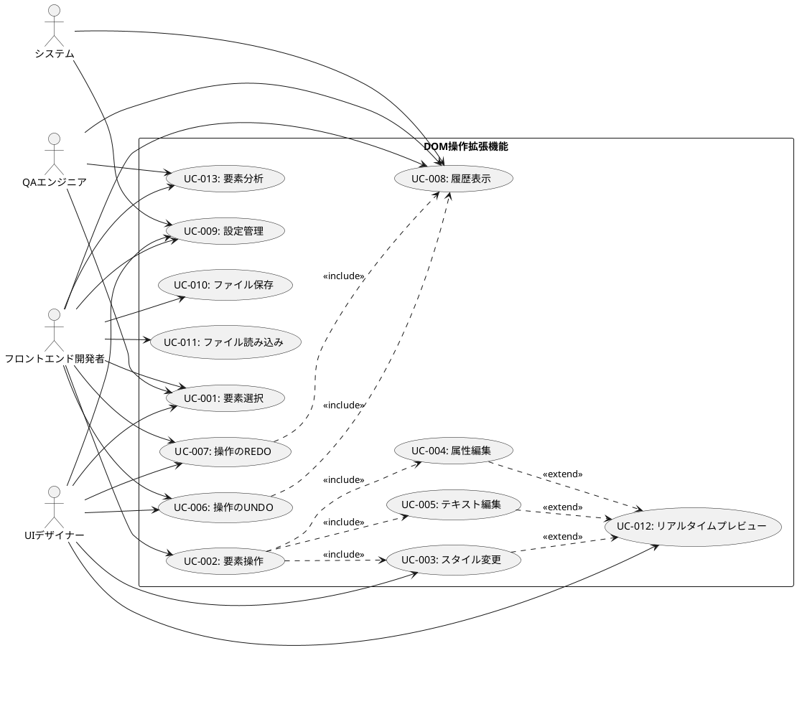

# ユースケース定義書

## ユースケース図



## ユースケース詳細

### UC-001: 要素選択

**概要:** ユーザーがWebページ上のDOM要素を選択する

**アクター:** 
- プライマリ: フロントエンド開発者、UIデザイナー、QAエンジニア
- セカンダリ: なし

**事前条件:**
- Chrome拡張機能がインストールされている
- 対象Webページが表示されている
- 拡張機能が有効化されている

**事後条件:**
- 1つ以上のDOM要素が選択されている
- 選択された要素がハイライト表示されている
- 要素の基本情報が表示されている

**基本フロー:**
1. ユーザーが拡張機能を起動（ブラウザアクション or ショートカット）
2. システムがページに選択モードのオーバーレイを表示
3. ユーザーが要素にマウスをホバー
4. システムがホバー要素をハイライト表示（リアルタイム）
5. ユーザーが要素をクリック
6. システムが要素を選択状態に変更
7. システムが要素の基本情報（タグ名、クラス、ID、属性）を表示
8. システムが選択要素のCSSパスを生成
9. ユーザーが情報パネルで要素詳細を確認

**代替フロー:**

**A1: CSSセレクター入力による選択（ステップ3の代替）**
3a. ユーザーがCSSセレクター入力フィールドに選択式を入力
3b. システムが入力値をリアルタイムでバリデーション
3c. システムがマッチする要素数を表示
3d. ユーザーがEnterキーを押下
3e. システムがマッチした全要素を選択・ハイライト
3f. ステップ7に戻る

**A2: 複数要素選択（ステップ5の代替）**
5a. ユーザーがCtrlキーを押しながら要素をクリック
5b. システムが既存選択を保持しつつ新要素を追加選択
5c. ステップ7に戻る

**例外フロー:**

**E1: iframe要素の選択**
- iframe内要素は同一オリジンの場合のみ選択可能
- 異なるオリジンの場合は警告メッセージ表示

**E2: 非表示要素（display: none）**
- 非表示要素は選択対象外として除外
- ユーザーに選択できない旨を通知

**非機能要件:**
- ホバー応答時間: 16ms以内（60fps維持）
- 選択確定時間: 50ms以内
- 同時選択可能要素数: 500要素まで

**UI要素:**
- ホバー時のハイライト（境界線、背景色変更）
- 選択時のハイライト（より濃い色、選択番号表示）
- 要素情報パネル（タグ名、クラス、ID、属性一覧）
- CSSパス表示エリア
- CSSセレクター入力フィールド

**関連:**
- 機能要件: F-001
- ユーザーストーリー: US-001, US-002, US-003
- 画面仕様: オーバーレイUI、情報パネル

---

### UC-002: 要素操作

**概要:** 選択されたDOM要素のプロパティや内容を操作する

**アクター:**
- プライマリ: フロントエンド開発者、UIデザイナー
- セカンダリ: なし

**事前条件:**
- UC-001により要素が選択されている
- 操作パネルが表示されている

**事後条件:**
- 要素のプロパティまたは内容が変更されている
- 変更が視覚的に確認できる
- 操作履歴に変更が記録されている

**基本フロー:**
1. ユーザーが選択要素の操作パネルを開く
2. システムが操作オプション（スタイル/属性/テキスト）を表示
3. ユーザーが操作種別を選択
4. システムが選択に応じた入力フォームを表示
5. ユーザーがプロパティ名と値を入力
6. システムが入力値をリアルタイムでバリデーション
7. ユーザーが「適用」ボタンをクリック
8. システムが変更前の状態をバックアップ
9. システムがDOM要素に変更を適用
10. システムが変更を操作履歴に記録
11. システムが成功メッセージを表示

**代替フロー:**

**A1: リアルタイムプレビュー使用（ステップ5-7）**
5a. ユーザーがリアルタイムプレビューを有効化
5b. システムが入力値変更を500ms間隔で監視
5c. システムが変更を一時的にDOM要素に適用
5d. ユーザーが入力を完了
5e. ユーザーが確定ボタンをクリック
5f. ステップ8に戻る

**A2: プリセット値選択（ステップ5の代替）**
5a. システムが一般的なプロパティ値の候補を表示
5b. ユーザーが候補から値を選択
5c. システムが選択値を入力フィールドに設定
5d. ステップ6に戻る

**例外フロー:**

**E1: 無効なCSS値（ステップ6）**
6a. システムが無効なCSS値を検出
6b. システムが入力フィールドにエラー表示
6c. ユーザーが値を修正
6d. ステップ6に戻る

**E2: 読み取り専用属性の変更（ステップ9）**
9a. システムが読み取り専用属性への変更を検出
9b. システムが警告ダイアログを表示
9c. ユーザーが操作の続行または中止を選択
9d. 続行の場合はステップ10、中止の場合は終了

**非機能要件:**
- 操作実行時間: 100ms以内
- プレビュー応答時間: 500ms以内
- メモリ使用量: 変更1000件まで履歴保持可能

**関連:**
- 機能要件: F-002
- ユーザーストーリー: US-004, US-005, US-006
- 依存ユースケース: UC-001

---

### UC-003: スタイル変更

**概要:** 選択要素のCSSスタイルを変更する

**アクター:**
- プライマリ: UIデザイナー、フロントエンド開発者

**事前条件:**
- UC-001により要素が選択されている
- スタイル編集モードが選択されている

**事後条件:**
- 要素のCSSスタイルが変更されている
- 変更が即座にページに反映されている

**基本フロー:**
1. ユーザーがスタイル編集パネルを開く
2. システムが現在の要素スタイル一覧を表示
3. システムがよく使用されるCSSプロパティの候補を表示
4. ユーザーがCSSプロパティを選択または入力
5. ユーザーがプロパティ値を入力
6. システムが値の形式をバリデーション
7. システムがstyle属性に変更を適用
8. ユーザーが視覚的な変更を確認
9. 必要に応じてユーザーが値を微調整
10. ユーザーが変更を確定

**代替フロー:**

**A1: カラーピッカー使用（ステップ5の代替）**
5a. プロパティが色指定の場合、システムがカラーピッカーを表示
5b. ユーザーがカラーピッカーで色を選択
5c. システムが選択色をHEX/RGB/HSL形式で入力フィールドに設定

**A2: 単位付き数値入力（ステップ5の代替）**
5a. プロパティが数値+単位の場合、システムが単位選択肢を表示
5b. ユーザーが数値と単位を個別に入力
5c. システムが組み合わせた値を生成

**例外フロー:**

**E1: !important宣言の競合（ステップ7）**
7a. 既存のCSSルールに!importantがある場合
7b. システムが競合を検出・警告表示
7c. ユーザーが!important付きで上書きするか選択
7d. 上書きの場合は!important付きで適用

**非機能要件:**
- 色変更の即座反映: 100ms以内
- CSSプロパティ候補表示: 50ms以内

**UI要素:**
- CSSプロパティ入力フィールド（オートコンプリート）
- プロパティ値入力フィールド
- カラーピッカー
- 単位選択ドロップダウン
- 現在値表示エリア
- プレビューON/OFFトグル

**関連:**
- 機能要件: F-002-1
- ユーザーストーリー: US-004
- 親ユースケース: UC-002

---

### UC-006: 操作のUNDO

**概要:** 最後に実行した操作を取り消す

**アクター:**
- プライマリ: 全ユーザー

**事前条件:**
- 1つ以上の操作が実行済み
- UNDO可能な操作が履歴に存在する

**事後条件:**
- 最後の操作が取り消されている
- DOM要素が操作前の状態に戻っている
- REDO履歴に操作が追加されている

**基本フロー:**
1. ユーザーがUNDOコマンドを実行（Ctrl+Z or UNDOボタン）
2. システムが操作履歴スタックの最新操作を取得
3. システムが操作内容を解析
4. システムが逆操作を実行
   - スタイル変更の場合: 変更前の値に復元
   - 属性変更の場合: 変更前の属性値に復元
   - テキスト変更の場合: 変更前のテキストに復元
5. システムが対象要素のDOMを更新
6. システムが取り消し操作をREDO履歴に追加
7. システムがUNDO履歴から該当操作を削除
8. システムが成功フィードバックを表示

**代替フロー:**

**A1: 複数要素への一括操作のUNDO（ステップ4）**
4a. 操作が複数要素に対するものの場合
4b. システムが全対象要素に対して逆操作を実行
4c. システムが全要素の更新完了を待機
4d. ステップ6に戻る

**A2: グループ操作のUNDO（ステップ2-4）**
2a. 最新操作がグループ操作の場合
2b. システムがグループに含まれる全操作を取得
2c. システムが逆順で各操作の逆処理を実行
2d. ステップ5に戻る

**例外フロー:**

**E1: UNDO履歴が空（ステップ1）**
1a. 操作履歴が空の場合
1b. システムが「操作履歴がありません」メッセージを表示
1c. ユースケース終了

**E2: DOM要素が削除済み（ステップ5）**
5a. 対象要素がページから削除されている場合
5b. システムが要素の不存在を検出
5c. システムがエラーメッセージを表示
5d. 該当操作を履歴から除去

**非機能要件:**
- UNDO実行時間: 50ms以内（単一操作）
- 履歴保持数: 100操作まで
- グループ操作の処理時間: 500ms以内

**UI要素:**
- UNDOボタン（使用可能/不可の状態表示）
- キーボードショートカット（Ctrl+Z）
- 操作確認トーストメッセージ

**関連:**
- 機能要件: F-004-2
- ユーザーストーリー: US-007
- 関連ユースケース: UC-007（REDO）、UC-008（履歴表示）

---

### UC-007: 操作のREDO

**概要:** UNDOで取り消した操作を再実行する

**アクター:**
- プライマリ: 全ユーザー

**事前条件:**
- UNDOが実行済み
- REDO可能な操作が履歴に存在する

**事後条件:**
- 取り消された操作が再実行されている
- DOM要素が操作後の状態に戻っている
- UNDO履歴に操作が追加されている

**基本フロー:**
1. ユーザーがREDOコマンドを実行（Ctrl+Y or REDOボタン）
2. システムがREDO履歴スタックの最新操作を取得
3. システムが操作内容を解析
4. システムが操作を再実行
   - スタイル変更の場合: 変更後の値に設定
   - 属性変更の場合: 変更後の属性値に設定
   - テキスト変更の場合: 変更後のテキストに設定
5. システムが対象要素のDOMを更新
6. システムが再実行操作をUNDO履歴に追加
7. システムがREDO履歴から該当操作を削除
8. システムが成功フィードバックを表示

**例外フロー:**

**E1: REDO履歴が空（ステップ1）**
1a. REDO履歴が空の場合
1b. システムが「やり直す操作がありません」メッセージを表示
1c. ユースケース終了

**E2: 新しい操作による履歴クリア**
- 新しい操作が実行されるとREDO履歴は全てクリア
- REDOボタンが無効化される

**関連:**
- 機能要件: F-004-2
- ユーザーストーリー: US-007
- 関連ユースケース: UC-006（UNDO）、UC-008（履歴表示）

---

### UC-008: 履歴表示

**概要:** 実行された操作の履歴を時系列で表示する

**アクター:**
- プライマリ: フロントエンド開発者、QAエンジニア

**事前条件:**
- 拡張機能が起動している
- 操作履歴パネルが表示されている

**事後条件:**
- 操作履歴が時系列で表示されている
- 各操作の詳細情報が確認できる

**基本フロー:**
1. ユーザーが履歴パネルを開く
2. システムが操作履歴を時系列順（新→古）で表示
3. システムが各操作について以下の情報を表示：
   - タイムスタンプ
   - 操作種別（スタイル/属性/テキスト）
   - 対象要素（セレクター）
   - 変更内容（プロパティ名と値）
4. ユーザーが特定の操作を選択
5. システムが選択操作の詳細情報を表示
6. ユーザーが必要に応じて特定操作時点への復元を実行

**代替フロー:**

**A1: 履歴フィルタリング（ステップ2）**
2a. ユーザーが履歴フィルターを設定
   - 操作種別でのフィルター
   - 対象要素でのフィルター
   - 時間範囲でのフィルター
2b. システムが条件に合致する履歴のみ表示

**A2: 特定時点への復元（ステップ6）**
6a. ユーザーが「この時点に戻る」ボタンをクリック
6b. システムが確認ダイアログを表示
6c. ユーザーが復元を確定
6d. システムが選択時点以降の全操作をUNDO実行
6e. システムが現在状態を更新

**UI要素:**
- 履歴リスト（スクロール可能）
- 操作アイコン（種別により色分け）
- タイムスタンプ表示
- 対象要素セレクター
- 詳細情報パネル
- フィルター入力フィールド
- 復元ボタン

**関連:**
- 機能要件: F-004-3
- ユーザーストーリー: US-008
- 関連ユースケース: UC-006、UC-007

---

### UC-009: 設定管理

**概要:** 拡張機能の動作設定をカスタマイズする

**アクター:**
- プライマリ: 全ユーザー

**事前条件:**
- 拡張機能がインストールされている
- 設定画面が開かれている

**事後条件:**
- ユーザー設定が保存されている
- 新しい設定が拡張機能に適用されている

**基本フロー:**
1. ユーザーが設定画面を開く
2. システムが現在の設定値を表示
3. ユーザーが設定項目を変更：
   - UIテーマ（ライト/ダーク/システム）
   - ハイライト色
   - キーボードショートカット
   - 自動保存設定
   - 履歴保持期間
4. システムが設定値をリアルタイムでバリデーション
5. ユーザーが「保存」ボタンをクリック
6. システムがchrome.storage.syncに設定を保存
7. システムが全コンポーネントに設定変更を通知
8. システムが保存完了メッセージを表示

**代替フロー:**

**A1: 設定のインポート/エクスポート（ステップ3）**
3a. ユーザーが設定ファイルのエクスポートを選択
3b. システムが現在設定をJSONファイルとして保存
3c. または、ユーザーが設定ファイルをインポート選択
3d. システムがファイルを読み込み、設定値を適用

**A2: 設定のリセット（ステップ3）**
3a. ユーザーが「初期値に戻す」ボタンをクリック
3b. システムが確認ダイアログを表示
3c. ユーザーがリセットを確定
3d. システムが全設定を初期値に戻す

**例外フロー:**

**E1: 無効な設定値（ステップ4）**
4a. 設定値がバリデーションに失敗
4b. システムがエラーメッセージを表示
4c. 該当フィールドをハイライト
4d. ユーザーが値を修正

**E2: ストレージ保存失敗（ステップ6）**
6a. chrome.storage.sync が容量上限等で失敗
6b. システムがエラーメッセージを表示
6c. chrome.storage.local へのフォールバック

**設定項目詳細:**

| 設定項目 | 種別 | デフォルト値 | 説明 |
|---------|------|------------|------|
| UIテーマ | 選択 | システム | ライト/ダーク/システム |
| ハイライト色 | カラー | #007acc | 要素選択時の境界線色 |
| 選択音効 | 真偽値 | false | 選択時の音声フィードバック |
| 自動保存 | 真偽値 | true | 操作の自動保存 |
| 履歴保持数 | 数値 | 100 | UNDO履歴の最大保持数 |
| ショートカット | キー組み合わせ | Ctrl+Shift+F | 起動ショートカット |

**関連:**
- 機能要件: F-005
- ユーザーストーリー: US-012

---

### UC-010: ファイル保存

**概要:** 現在の操作セットをファイルに保存する

**アクター:**
- プライマリ: フロントエンド開発者

**事前条件:**
- 1つ以上の操作が実行済み
- 保存可能な操作履歴が存在する

**事後条件:**
- 操作セットがJSONファイルとして保存されている
- ファイルが後で読み込み可能な形式である

**基本フロー:**
1. ユーザーが「操作を保存」ボタンをクリック
2. システムが保存ダイアログを表示
3. ユーザーがファイル名と説明を入力
4. ユーザーが保存対象の操作範囲を選択
   - 全操作履歴
   - 指定時間以降の操作
   - 手動選択した操作
5. システムが選択された操作をJSON形式に変換
6. システムがファイルメタデータを追加
   - バージョン情報
   - 作成日時
   - 説明
   - 対象URL（オプション）
7. ユーザーが保存場所を指定
8. システムがファイルをダウンロード
9. システムが保存完了メッセージを表示

**JSON形式例:**
```json
{
  "version": "1.0.0",
  "createdAt": "2024-11-13T10:00:00Z",
  "title": "ボタンスタイル調整",
  "description": "ボタンの色とサイズを調整",
  "targetUrl": "https://example.com/page1",
  "operations": [
    {
      "id": "op-001",
      "timestamp": "2024-11-13T10:01:00Z",
      "type": "style",
      "selector": ".btn-primary",
      "property": "background-color",
      "oldValue": "#0d6efd",
      "newValue": "#dc3545"
    }
  ]
}
```

**例外フロー:**

**E1: 操作履歴が空（ステップ1）**
1a. 保存可能な操作がない場合
1b. システムが「保存する操作がありません」メッセージを表示

**E2: ファイルサイズ上限超過（ステップ5）**
5a. 操作数が多くファイルサイズが上限を超える場合
5b. システムが警告メッセージを表示
5c. ユーザーが操作範囲を絞り込み

**関連:**
- 機能要件: F-007
- ユーザーストーリー: US-009
- 関連ユースケース: UC-011（ファイル読み込み）

---

### UC-011: ファイル読み込み

**概要:** 保存された操作セットを読み込んで適用する

**アクター:**
- プライマリ: フロントエンド開発者

**事前条件:**
- 有効な操作セットファイルが存在する
- 対象ページが表示されている

**事後条件:**
- 読み込んだ操作が現在のページに適用されている
- 適用結果が視覚的に確認できる

**基本フロー:**
1. ユーザーが「操作を読み込み」ボタンをクリック
2. システムがファイル選択ダイアログを表示
3. ユーザーがJSONファイルを選択
4. システムがファイル内容を読み込み・パース
5. システムがファイル形式とバージョンを検証
6. システムが操作プレビューを表示
   - 適用予定の操作一覧
   - 対象要素の存在確認
   - 競合する既存操作の警告
7. ユーザーが適用する操作を選択（部分適用可能）
8. ユーザーが「適用」ボタンをクリック
9. システムが各操作を順次実行
   - 対象要素の存在確認
   - 操作の実行
   - 結果の記録
10. システムが適用結果を表示
11. システムが適用された操作をUNDO履歴に追加

**代替フロー:**

**A1: 段階適用モード（ステップ9）**
9a. ユーザーが段階適用モードを選択
9b. システムが1操作ずつ実行し、都度確認を求める
9c. ユーザーが各操作の続行/スキップを選択

**A2: URL不一致の場合（ステップ6）**
6a. ファイルの対象URLと現在のURLが不一致
6b. システムが警告ダイアログを表示
6c. ユーザーが適用続行または中止を選択

**例外フロー:**

**E1: ファイル形式エラー（ステップ4）**
4a. JSONファイルが破損または不正形式
4b. システムがエラーメッセージを表示
4c. ファイル選択に戻る

**E2: 対象要素が存在しない（ステップ9）**
9a. 操作対象の要素がページに存在しない
9b. システムが要素不存在を検出
9c. 該当操作をスキップして続行
9d. 結果サマリーでスキップした操作を報告

**E3: 操作実行エラー（ステップ9）**
9a. 操作実行中にエラーが発生
9b. システムが部分適用状態を保持
9c. エラー詳細をユーザーに表示
9d. ユーザーが続行またはUNDOを選択

**UI要素:**
- ファイル選択ダイアログ
- 操作プレビューリスト（チェックボックス付き）
- 対象要素存在確認インジケーター
- 適用プログレスバー
- 結果サマリーダイアログ

**関連:**
- 機能要件: F-007
- ユーザーストーリー: US-009
- 関連ユースケース: UC-010（ファイル保存）

---

### UC-012: リアルタイムプレビュー

**概要:** スタイル変更をリアルタイムでプレビューしながら調整する

**アクター:**
- プライマリ: UIデザイナー

**事前条件:**
- 要素が選択されている
- スタイル編集モードになっている
- リアルタイムプレビュー機能が有効

**事後条件:**
- 最適な値が見つかり確定されている
- または変更が破棄されている

**基本フロー:**
1. ユーザーがリアルタイムプレビューを有効化
2. ユーザーがCSSプロパティ値を入力開始
3. システムが入力値の変更を監視（debounce: 500ms）
4. システムが一時的に変更を要素に適用
5. ユーザーが視覚的な結果を確認
6. ユーザーが値を調整（ステップ2-5を繰り返し）
7. ユーザーが満足する結果を得る
8. ユーザーがEnterキーまたは「確定」ボタンをクリック
9. システムが変更を正式に適用
10. システムが操作を履歴に記録

**代替フロー:**

**A1: 変更の破棄（ステップ8）**
8a. ユーザーがEscキーまたは「キャンセル」ボタンをクリック
8b. システムがプレビュー変更を元に戻す
8c. 操作終了

**A2: 複数プロパティ同時プレビュー（ステップ2-4）**
2a. ユーザーが複数のCSSプロパティを同時編集
2b. システムが全プロパティの変更をバッチで適用
2c. より複雑な視覚効果をリアルタイム確認

**例外フロー:**

**E1: プレビュー適用エラー（ステップ4）**
4a. CSS値が無効でプレビューが適用できない
4b. システムがエラーインジケーターを表示
4c. 前回有効だった状態を維持

**E2: パフォーマンス低下（ステップ4）**
4a. 変更頻度が高すぎてパフォーマンス影響
4b. システムがdebounce時間を動的に延長
4c. ユーザーに遅延についてフィードバック

**非機能要件:**
- プレビュー応答時間: 500ms以内
- 連続入力時のCPU使用率: 30%以下
- メモリ使用量の増加: 10MB以下

**UI要素:**
- リアルタイムプレビューON/OFFトグル
- プレビュー中インジケーター
- 確定/キャンセルボタン
- パフォーマンス警告表示

**関連:**
- 機能要件: F-006
- ユーザーストーリー: US-010, US-011
- 関連ユースケース: UC-003（スタイル変更）

---

### UC-013: 要素分析

**概要:** 選択要素の詳細な状態情報を分析・表示する

**アクター:**
- プライマリ: フロントエンド開発者、QAエンジニア

**事前条件:**
- 要素が選択されている
- 分析パネルが開かれている

**事後条件:**
- 要素の詳細情報が表示されている
- 問題点があれば特定されている

**基本フロー:**
1. ユーザーが分析対象要素を選択
2. ユーザーが「詳細分析」ボタンをクリック
3. システムが要素の包括的な情報を収集：
   - 計算済みスタイル（getComputedStyle）
   - ボックスモデル情報
   - 要素の位置・サイズ
   - z-index情報
   - イベントリスナー一覧
   - アクセシビリティ情報
4. システムが分析結果を整理して表示
5. システムが潜在的な問題を検出・警告：
   - レイアウト問題
   - アクセシビリティ問題
   - パフォーマンス問題
6. ユーザーが各セクションの詳細を確認
7. 必要に応じてユーザーが情報をエクスポート

**代替フロー:**

**A1: 継続監視モード（ステップ3）**
3a. ユーザーが「変更監視」を有効化
3b. システムがMutationObserverで要素変更を監視
3c. 変更を検知すると分析情報を自動更新

**A2: 比較分析（ステップ4）**
4a. ユーザーが「他の要素と比較」を選択
4b. ユーザーが比較対象要素を選択
4c. システムが両要素の差分情報を表示

**分析情報の詳細:**

**基本情報:**
- タグ名、クラス、ID
- 親要素、子要素の情報
- DOM階層での位置

**レイアウト情報:**
- ボックスモデル（margin, border, padding, content）
- 位置（top, left, width, height）
- z-index値と重ね順
- display, position, float値

**視覚情報:**
- 色（text-color, background-color）
- フォント情報
- 境界線・影情報
- 透明度

**アクセシビリティ情報:**
- aria-* 属性
- role属性
- tabindex値
- alt属性（画像の場合）

**パフォーマンス情報:**
- レンダリングレイヤー情報
- reflow/repaintトリガー要素
- GPU合成有無

**UI要素:**
- 分析情報タブ（基本/レイアウト/視覚/アクセシビリティ）
- 問題検出アラート
- 情報エクスポートボタン
- リアルタイム監視トグル

**関連:**
- 機能要件: F-003
- ユーザーストーリー: US-014, US-015

## ユースケース間の依存関係

```
UC-001 (要素選択)
    ↓
UC-002 (要素操作) ← UC-006/UC-007 (UNDO/REDO)
    ↓                     ↑
UC-003 (スタイル変更) → UC-008 (履歴表示)
    ↓
UC-012 (リアルタイムプレビュー)

UC-009 (設定管理) ← 全ユースケースに影響

UC-010 (ファイル保存) ↔ UC-011 (ファイル読み込み)

UC-013 (要素分析) ← UC-001 (要素選択)
```

## パフォーマンス要件サマリー

| ユースケース | 応答時間目標 | 最大許容時間 |
|------------|------------|------------|
| UC-001 | 50ms | 100ms |
| UC-002 | 100ms | 200ms |
| UC-003 | 100ms | 200ms |
| UC-006 | 50ms | 100ms |
| UC-007 | 50ms | 100ms |
| UC-008 | 100ms | 200ms |
| UC-009 | 200ms | 500ms |
| UC-010 | 200ms | 1000ms |
| UC-011 | 500ms | 2000ms |
| UC-012 | 500ms | 1000ms |
| UC-013 | 300ms | 1000ms |